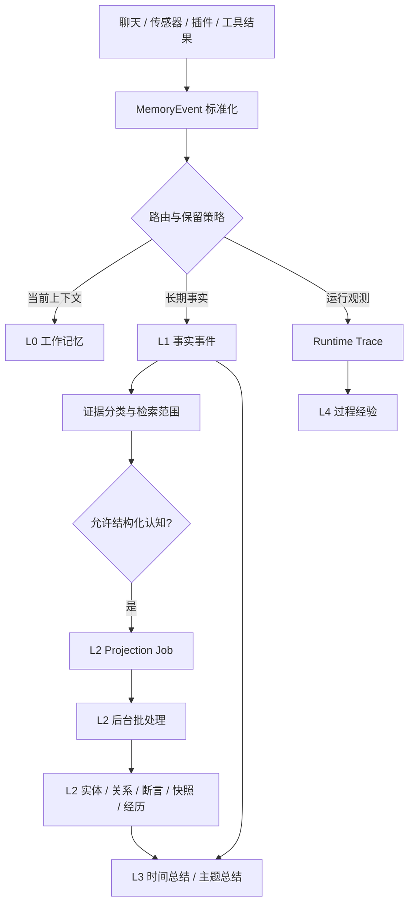
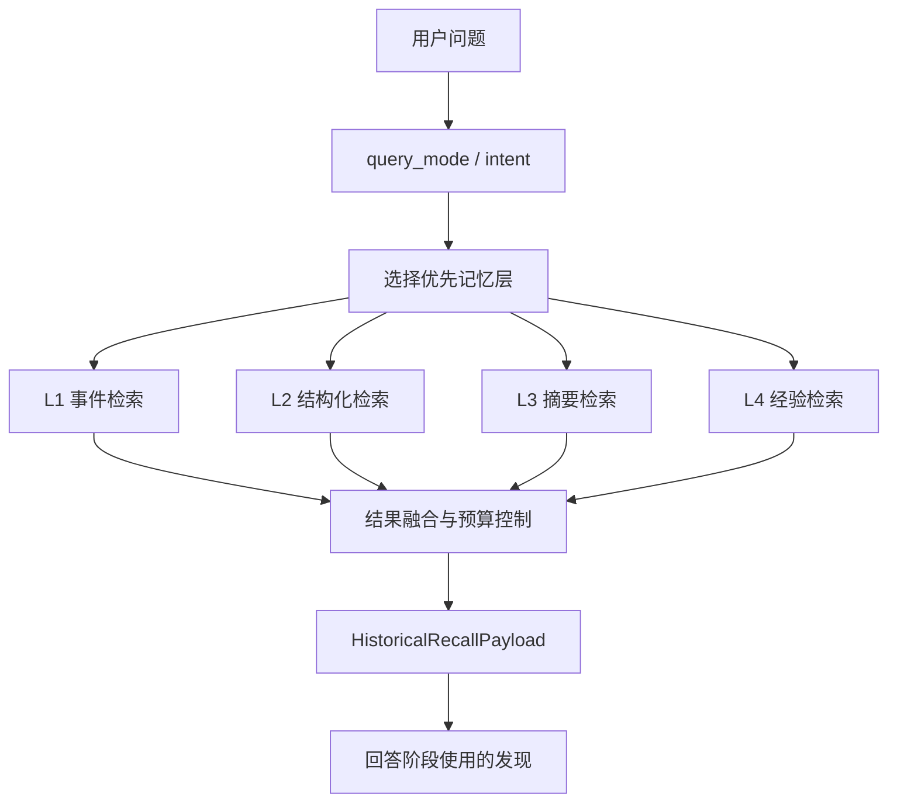

+++
title = 'Magi 记忆系统流程篇：从事件写入到证据检索'
date = 2026-05-15 00:00:00
tags = ["magi", "agent", "memory"]
categories = ["magi"]
draft = true
+++

# 前言

上一篇文章里，我主要写了 Magi 为什么需要一套分层记忆系统：为什么不能把聊天记录、工具日志、浏览历史和传感器数据都粗暴塞进一个向量库；为什么要区分 L0 工作记忆、L1 事实事件、L2 结构化认知、L3 总结反思和 L4 过程经验；以及为什么记忆系统必须处理污染、过期、冲突和成本问题。

但那篇文章更多是在回答“记忆系统应该长什么样”。这一篇想继续往下看一个更工程化的问题：**一条记忆到底是怎么写进去的，又是怎么被检索出来的？**

这听起来像一个实现细节问题，但在长期记忆系统里，它其实非常关键。因为记忆质量不是检索阶段才决定的。写入时有没有标清来源，是否区分用户自述和 AI 回答，是否把运行日志挡在长期事实之外，是否把实体和关系慢慢沉淀出来，都会直接影响后面能不能正确回答问题。

换句话说，Magi 的记忆系统不是“先把文本存起来，以后再搜”。它更像一条证据流水线：写入阶段决定什么东西有资格成为证据，检索阶段决定当前这个问题应该相信哪一部分证据。

这篇文章就围绕这条流水线展开。

# 先看一个看起来很简单的问题

先从一个例子开始, 这也是LongMemEval里的一道例题，简化了一下题目如下：

假设记忆里有三天对话：

```text
第一天：我想用新的高压锅煲汤，有什么专为高压锅设计的食谱吗？
后面主要在讨论高压锅煲汤和食谱。

第二天：我新买了一个空气炸锅，我觉得它很好用，你有什么推荐的食谱吗？
后面主要在讨论空气炸锅食谱。

第三天：我买了一个电饭煲，有什么推荐的食谱吗？
后面主要在讨论电饭煲食谱。
```

然后用户问：

```text
我在买空气炸锅前买了什么厨房家电？
```

这个问题对人来说很自然，答案应该是“高压锅”。但对记忆检索系统来说，它其实一点都不简单。

第一，正确答案所在的第一天对话里，可能完全没有出现“空气炸锅”“买”“厨房家电”这些词。它只说了“新的高压锅”“煲汤”“食谱”。如果检索只靠关键词，这条记忆未必能被召回。

第二，系统需要知道“高压锅”属于“厨房家电”。这是一种语义泛化，不是字面匹配。更细一点说，“新的高压锅”也不等于用户明确说“我买了高压锅”，但在上下文里它很可能是一个刚购买或刚开始使用的家电。

第三，系统还要处理时间顺序。第三天的“电饭煲”也是厨房家电，也明确出现了“买”，但它发生在空气炸锅之后，所以不能作为答案。也就是说，这个问题不是找最相似的文本，而是找“空气炸锅之前出现的厨房家电”。

第四，候选记忆之间还有干扰。三天都在问食谱，语义上都很像。如果系统只问“哪段记忆和食谱、厨房家电最相关”，三条都可能被召回。真正难的是从这些候选里做实体识别、类别归纳、时间比较和排除。

这就是长期记忆检索最麻烦的地方：用户问的常常不是“哪段文本最像这个问题”，而是“过去发生过的一组事情之间，哪一个满足某些隐含条件”。

所以在讲 Magi 的实现之前，我想先把这个例子放到一个评测语境里看。类似的问题并不是个别刁钻 case，而是长期记忆问答里反复出现的基本题型。

目前 Magi 的记忆与检索链路已经接入 LongMemEval。在本地 SQLite 存储、千问 `text-embedding-v3` 向量模型和 `Qwen3.5` 回答模型下，当前总体准确率是 **87.2%**。

| 评测项 | 它在测什么 | 准确率 |
| --- | --- | ---: |
| 总体（Overall） | 所有长期记忆问题混合后的平均表现 | 0.8720 |
| 跨会话记忆（Multi-session） | 答案分散在多个会话里，需要把前后对话接起来 | 0.7444 |
| 时间推理（Temporal reasoning） | 需要判断先后顺序、时间窗口，或“之前/之后”关系 | 0.8947 |
| 知识更新（Knowledge update） | 旧信息被新信息覆盖时，要回答当前有效事实 | 0.8974 |
| 单会话用户事实（Single-session user） | 在一次会话内找出关于用户的具体事实 | 0.9429 |

这个数字不是想说明系统已经把所有问题都解决了。它更像是一个阶段性信号：这条本地长期记忆链路已经不是只停留在架构图上，而是在标准长期记忆问答任务里有了一个可比较的基线。

# 复杂度与本地优先的架构选择

上面的例子说明的是“长期记忆问题本身为什么难”。但 Magi 还有另一层复杂度，来自它的本地优先架构：考虑到记忆数据的隐私性及本地依赖过重的问题，最终只选择SQLite作为底层唯一存储能力。

| 困难 | 云端常见解法 | Magi 的本地解法 |
| --- | --- | --- |
| 向量命中后还要拿到完整事实 | 向量服务直接返回带 metadata 的文档对象 | 原始表保存原始事实，sqlite-vec 保存 chunk 命中；检索后再回表合并成 event |
| 检索时要同时处理时间、来源、证据身份 | 在向量库里做 metadata filter | 先多路召回候选，再回到 SQLite 表做时间、来源和 evidence scope 过滤 |
| 需要实体关系和有限多跳线索 | 使用图数据库或图检索服务 | L2 显式抽取实体、关系、断言，并把 event-entity 链接回写到 L1 |
| 写入不能被 LLM 抽取卡住 | 云端异步任务和队列服务 | 建队列表，将事实写入和LLM抽取任务分离 |
| 摘要、重排、融合不能无限依赖长上下文模型 | 托管 RAG 平台统一编排 | 在本地把 BM25、vector、keyword、RRF、hydrate、rerank 拆开组合 |

从这也可以看出，架构选择是有一点的取舍的，目前的选择换来了隐私、可迁移和桌面端可部署性，但也要求系统自己承担更多检索编排工作。

下面就从写入开始，看一条记忆具体怎么穿过这条流水线。

# 总览：从信号到证据，再从证据到回答

如果只看主链路，Magi 的记忆系统可以简化成这样：



检索时则反过来：



这两张图的核心是同一个原则：写入和检索不是两套互不相干的逻辑。写入时留下的证据身份，会决定检索时能不能被当成事实；写入时抽出来的实体和关系，会决定检索时能不能跨表达方式找到答案。

# 写入第一步：把所有来源变成 MemoryEvent

Magi 面对的数据来源很多：用户聊天、AI 回复、工具调用、任务状态、浏览器历史、日历、媒体播放、终端命令、Git 活动、照片、系统使用情况。它们的原始结构完全不同，不可能让每个来源自己决定怎么写入记忆。

所以第一步是标准化。

不同事件会被翻译成统一的 `MemoryEvent`。可以把它理解成 Magi 记忆系统的入口合同。它不只是包含一段正文，还会带上一组后续处理必须知道的信息：

| 字段 | 作用 |
| --- | --- |
| `event_id` | 事件业务 ID，用于追踪和去重 |
| `timestamp` | 事件实际发生时间 |
| `source` / `source_item_id` | 来源系统和来源侧 ID |
| `memory_domain` | 用户表达、外部活动、运行观测还是系统控制 |
| `ingest_target` | 进入 L0、L1，还是两者都进 |
| `cognition_eligible` | 是否允许进入 L2 结构化认知 |
| `retention_class` | 临时、可压缩还是长期保留 |
| `author_type` / `content_type` | 谁说的、内容是什么类型 |
| `metadata_json` | 插件和来源侧提供的结构化提示 |

这里最重要的是，Magi 不会把所有事件都当成长期记忆。

用户消息通常会进入 L1，并且允许后续认知加工；普通传感器事件也可以进入 L1，但通常是可压缩的；工具执行、运行心跳、worker 进度这类内容更多属于运行观测，不应该默认进入长期用户记忆。

这一步看起来朴素，但它决定了后面的边界。只有当来源、作者、领域、保留策略都被标准化，系统才有可能在后面区分“用户事实”“外部观察”“AI 回答”和“运行日志”。

# L1：先把事实事件稳定写下来

标准化之后，事件会进入统一写入流程。`UnifiedMemoryStore` 会根据 `ingest_target` 和事件属性，把它扇出到不同记忆层。

对于长期事实来说，最关键的是 L1。

L1 的写入是同步完成的。也就是说，基础事件先落到本地 SQLite 里，后面的 L2 抽取、总结和经验蒸馏可以异步发生，但不能影响 L1 保存事实。

L1 的主表是 `fact_events`。它保存的是规范化后的事件行，包括正文、时间、来源、用户、会话、证据分类、检索范围、保留策略等信息。同时，L1 会做几件配套工作：

1. 写入 `fact_events`，并用 `source + event_type + idempotency_key` 做业务去重。
2. 同步更新 FTS5 索引，用于 BM25 全文检索。
3. 初始化 embedding 状态，后续由异步 worker 处理向量化。
4. 如果是聊天相关事件，更新轻量的 chat session projection。

这里要注意，L1 不是普通日志表。普通日志只关心“发生了什么”。L1 更关心“这个发生过的东西以后能不能成为记忆证据”。

所以 L1 写入时不会只保存正文，还会立刻做证据分类。

# 证据治理：同样被保存，不等于同样可信

长期记忆系统最容易出问题的地方，是把所有文本都当成同一种证据。

比如 AI 曾经回答过“你住在西湖旁边的民宿”，这句话可以作为一次对话经历保存下来，但它不能自动变成“用户当前住在西湖旁边”的事实。再比如用户问“我是不是喜欢爵士乐”，这句话也不能被写成“用户喜欢爵士乐”。

所以 Magi 会在 L1 写入时做证据分类。当前实现里，主要有几类：

| 证据类别 | 例子 | 写入和检索倾向 |
| --- | --- | --- |
| `user_self_report` | 用户说“我喜欢猫” | 可以作为事实证据，允许 L2 图谱和断言写入 |
| `external_observation` | 浏览、日历、传感器观察 | 可以作为外部行为证据，但通常不直接变成心理结论 |
| `assistant_tool_grounded` | AI 根据工具结果回答 | 保留对话经历，但不直接写成用户事实 |
| `assistant_freeform` | AI 自由推断或回答 | 对话可追溯，但不能污染事实画像 |
| `assistant_runtime_derivation` | AI 执行过程中的中间派生 | 不进入长期事实认知 |
| `system_runtime` | 心跳、运行状态、系统日志 | 审计或运行观测，不是用户长期记忆 |

分类之后，会映射成具体策略。这个策略会回答几个问题：

- 能不能抽实体？
- 能不能写知识图谱？
- 能不能写用户断言？
- 能不能影响快照？
- 在 L1 检索里属于事实证据、对话证据，还是只适合审计？

这就是为什么 Magi 的检索不是最后才过滤污染。污染防护从写入时就开始了。

例如事实型检索只应该看 `fact_authoritative` 范围里的 L1 事件。AI 自由回答和用户问题本身仍然可以作为对话历史保存，但在回答“我现在住在哪里”“我买空气炸锅前买了什么”这类事实问题时，它们不应该和用户明确陈述、外部观察、结构化事实站在同一个证据池里竞争。

# L2 投影：结构化认知不堵塞写入路径

L1 写入成功之后，如果事件 `cognition_eligible=true`，并且证据策略允许它进入结构化认知，系统会创建一条 L2 projection job。

这里有一个重要取舍：**L2 不在用户写入路径里同步完成。**

原因很简单。L2 要做实体抽取、上下文收集、LLM 结构化、冲突处理、图谱写入、断言合并和快照刷新。如果这些都同步做，用户每说一句话，系统都可能被后台认知加工卡住。

所以 Magi 采用 durable projection queue。L1 事件写成功后，`l2_projection_jobs` 表里会出现一条待处理任务。后台 L2 pipeline 再去 claim 这些任务，把它们标记为 `queued`、`running`，最后变成 `completed` 或 `failed`。

```text
L1 fact_events 写入成功
-> evidence policy 允许 L2 写入
-> l2_projection_jobs.pending
-> L2 worker claim
-> queued
-> running
-> completed / failed / requeue
```

这条队列还有几个作用。

第一，它让 L2 处理变得可恢复。进程重启后，未完成的 projection job 仍然在数据库里。超时的 queued/running job 可以重新回到 pending。

第二，它支持批处理。比如同一个会话、同一个用户、同一个插件 catch-up 里的事件，可以按 batch owner 分桶。达到数量、token 预算或等待时间后，再一起送进 L2 抽取。

第三，它给高频传感器留出了背压边界。浏览历史、媒体播放、Git 活动这类数据可能短时间涌入，L2 不应该被迫一条条实时抽取。

这也是 Magi 写入设计里很重要的分层：L1 先保证事实稳定存在；L2 再用后台 worker 把事实整理成结构化理解。

# L2 抽取：从事件窗口到结构化认知

L2 pipeline 真正开始处理时，输入不一定是一条事件，而可能是一个事件窗口。

它大致会经历这些步骤：

```text
读取 L1 事件
-> 再次做证据策略检查
-> 加载同会话上下文和历史上下文
-> 选择 extraction profile
-> 合并来源侧 structured hints
-> Phase 1：抽实体、事实线索、引用关系
-> 实体解析和 catalog 合并
-> 写入 L1 event-entity 链接
-> Phase 2：结合已有图谱和断言做结构化整合
-> 校验候选关系和断言
-> 冲突仲裁
-> 写入 L2 store
-> 触发 reconcile、snapshot refresh、episode formation
```

这里的 Phase 1 和 Phase 2 分工不一样。

Phase 1 更像“从文本里看见东西”：有哪些实体，哪些对象被提到，哪些事实线索值得保留，哪些引用需要解析。

Phase 2 更像“把新线索放进已有认知里”：这条关系是不是已经存在？这个断言是不是和旧断言冲突？它是一次事实演进，还是一个真正矛盾？需要新增关系、补充证据，还是让旧事实退出当前理解？

例如用户说“我现在不住上海了，搬到嘉兴了”，L2 不应该简单把“用户住在上海”和“用户住在嘉兴”并排放着。更好的处理是：旧事实保留为历史证据，但退出当前理解；新事实成为当前状态，并记录它为什么替代旧事实。

L2 最终会写入几类结构：

| 结构 | 作用 |
| --- | --- |
| `knowledge_graph` | 实体之间的关系，比如用户使用某软件、某创作者属于某平台 |
| `tom_trait_assertions` | 关于实体的状态、偏好、身份、沟通习惯等断言 |
| `entity_facets` | 实体的侧边属性，比如分类、域名、地点等 |
| `tom_snapshots` | 当前仍有效的实体画像和状态汇总 |
| `episodes` | 有时间边界的经历片段 |

这些结构都要带证据。L2 不是凭空生成“用户画像”，而是从 L1 事件中抽取、合并、更新，并能回到支撑它的 event ids。

厨房家电的例子里，理想情况下，L2 会逐步形成这样的结构线索：高压锅、空气炸锅、电饭煲都是厨房家电；空气炸锅有一个明确的购买或新购入线索；高压锅虽然没有“买”这个词，但“新的高压锅”可以作为一个较弱的拥有/新使用线索；电饭煲发生在空气炸锅之后。这样检索时就不完全依赖“空气炸锅前买了什么”这几个字面词。

# L3 和 L4：不是主路径，但会参与检索

写入流程里还有两类派生记忆：L3 和 L4。

L3 是总结反思层。它会从 L1 事件和部分 L2 结果里生成小时、天、周、月等时间窗口总结，也可以生成主题总结、状态变化和任务反思。L3 的存在不是为了替代原始事件，而是为了让长期回顾不用每次都扫描大量 L1 事件。

这里也有一个重要设计：L3 不是把一个时间窗口里的所有事件都塞进 LLM。它会先做 source-aware compaction，按来源统计数量，再分配代表性样本。也就是说，浏览、聊天、Git、媒体等来源不会因为数量差异而完全挤掉彼此。生成摘要时，模型看到的是有覆盖元数据的代表性证据包，而不是完整历史。

L4 是过程经验层。它主要从工具执行和任务流程里学习：某个工具成功率如何，失败模式是什么，某类任务是否有可复用流程，某个工具是否进入熔断状态。它不保存完整执行日志；完整运行细节仍然属于 runtime trace。L4 保存的是面向未来的做事经验。

下一篇如果只讲事实记忆，可以把 L3/L4 放得很轻。但在 Magi 的检索系统里，它们仍然是重要分支：用户问“我上周主要在忙什么”时，L3 会比 L1 更合适；用户问“上次类似问题怎么解决的”时，L4 会比 L2 更合适。

# 检索第一步：先判断问题类型

写入之后，另一半问题就是检索。

Magi 的检索入口通常是 `memory_query`。调用它时，最关键的参数不是 query 本身，而是 `query_mode`。因为不同问题需要相信不同记忆层。

| query_mode | 适合的问题 | 优先层 |
| --- | --- | --- |
| `exact_fact` | 我喜欢什么、某个事实是什么 | L2， fallback 到 L1 |
| `current_state` | 我现在在做什么、当前状态是什么 | L2 当前状态，fallback 到 L1 |
| `episode_recall` | 某天发生了什么、那次经历是什么 | L2 episode + L1 事件 |
| `cross_session` | 跨会话列举或统计 | L2 + L1 |
| `temporal_compare` | 和上周相比有什么变化 | L2 + L1，必要时 L3 |
| `summary` | 总结一段时间 | L3，fallback 到 L1 |
| `activity_summary` | 某类活动总结，比如浏览/音乐/Git | L3，fallback 到 L1 |
| `strategy` | 上次类似任务怎么做 | L4，fallback 到 L1 |

这一步很关键。因为长期记忆检索不是把所有东西放进一个池子里做相似度搜索。用户问“我现在住在哪里”，应该优先查当前状态和事实；用户问“去年那次杭州旅行发生了什么”，应该优先查事件序列和经历片段；用户问“为什么你这样回答”，则应该去看原始对话、证据来源和运行观测。

同一个底层事件，在不同问题里应该有不同身份。助手回答可以用于对话回放，但不能作为用户事实；传感器行为可以作为行为证据，但不能直接升级为用户偏好；摘要可以用于长期回顾，但不能代替底层证据。

# L1 检索：从多条搜索路径召回事件证据

L1 检索负责找原始事件证据。它不是单一路径，而是多路召回后融合。

当前主路径包括：

1. **BM25**：走 FTS5，适合精确词和短语。
2. **Vector**：走 sqlite-vec，适合语义相似。
3. **Keyword**：走 SQL LIKE 和 token 过滤，作为朴素补充。
4. **Temporal BM25**：有时间窗口时，用时间约束提升召回。
5. **Entity expansion**：从已命中的事件沿 event-entity 链接扩展相关事件。
6. **Graph spreading**：在可用时借助 L2 图谱扩展相关实体和事件。

这些路径拿到的都是 event ids。系统会用 RRF，也就是 Reciprocal Rank Fusion，把不同召回路径的排名合起来。

```text
BM25 ids
Vector ids
Keyword ids
Temporal ids
Entity expansion ids
Graph spreading ids
-> RRF fusion
-> fetch full events
-> evidence scope / time / user / source filters
-> rerank
```

这里有几个细节值得展开。

首先，L1 的向量检索命中的是 chunk。长文本会切成多个 chunk 写入向量索引，检索时可能命中其中一段。但回答阶段不能只拿一个 chunk 当事实，所以系统会把 chunk id 折回 event id，再 hydrate 完整事件。

其次，事实型问题会限制 L1 retrieval scope。比如 `exact_fact` 和 `current_state` 会倾向于只看 `fact_authoritative` 范围。这样 AI 自由回答、用户提问本身、运行中间态就不会轻易进入事实候选。

再次，L1 仍然是检索安全网。即使 L2 还没来得及抽取结构化关系，或者某个实体没有被识别出来，L1 也可以通过原始事件召回提供底层证据。

回到厨房家电例子，如果只靠关键词，第一天的“新的高压锅煲汤”可能不好找；如果只靠向量，第三天的“电饭煲食谱”也可能很像问题。但 L1 可以通过时间、事件文本、向量语义和后续实体扩展一起工作，先把可能相关的事件召回来，再交给后面的融合和回答阶段判断。

# L2 检索：从自然语言落到实体、关系和时间

L2 检索处理的是结构化认知。它的目标不是搜一段文本，而是把问题落到实体、关系、断言、快照和经历上。

L2 检索大致分成几步：

```text
自然语言问题
-> 解析 query mode 和 L2 conditions
-> 解析实体
-> 构建 grounding plan
-> 并行查 knowledge / assertions / snapshots / episodes
-> 多通道候选融合
-> 投影成 relationships / assertions / entity cards / episodes
```

`grounding plan` 是这里的核心。它会尽量回答这些问题：

- 查询主体是谁？是用户自己，还是某个显式实体？
- 要找的是关系、偏好、当前状态、经历，还是活动？
- 目标实体类型是什么？人、地点、软件、主题，还是别的？
- 谓词属于哪个 family？比如 preference、activity、profile fact。
- 有没有时间约束？是当前、之前、之后，还是某个窗口内？

然后 L2 会按子域并行检索。

知识图谱这边有三种主要通道：

1. **structured graph**：直接按 subject、predicate、object、time、status 查询 SPO 边。
2. **edge vector**：对图谱边的自然语言描述做语义检索，再用结构条件重新打分。
3. **topology**：处理一些有限多跳模式，比如创作者账号和平台、地点和上级地点。

断言、快照和经历也会分别检索。比如当前状态问题会更看重 assertion 和 snapshot；经历回忆会更看重 episode；偏好和关系问题会更看重 knowledge edge。

最后，L2 会把不同子域的候选统一成 `L2Candidate`，再按 query kind 加权、按时间和结构条件过滤、按证据强度和置信度排序。

这一步可以解决一些单纯向量检索很难稳住的问题。比如“我在买空气炸锅前买了什么厨房家电”，理想情况下可以先以空气炸锅作为时间锚点，再找发生在它之前、类型属于厨房家电的候选实体或事件；同时把发生在之后的电饭煲排除掉。

当然，L2 不是魔法。它依赖前面写入阶段能否抽出足够好的实体、关系和时间线索。如果“新的高压锅”没有被识别为一个可用实体，或者没有和厨房家电类别产生任何结构关联，那么检索仍然可能退回 L1 原始事件。Magi 的设计不是保证每次都能结构化成功，而是让系统有多条路径逐步补证据。

# L3 和 L4 检索：长期回顾和过程经验

L3 检索和 L1 类似，也会使用 BM25、向量和关键词融合。但它检索的是 summary，而不是原始 event。

这适合回答长时间跨度的问题，比如：

- 我上周主要在忙什么？
- 最近浏览主题有什么变化？
- 这段时间我的工作重心是什么？

如果用户问的是宽时间窗口，直接扫 L1 事件会很重，也容易被大量细节淹没。L3 摘要可以先提供阶段轮廓，再在必要时回到 L1 补证据。

L4 检索则更像查经验库。它会看 procedural skills、工具成功率、失败模式、优化提示和熔断状态。用户问“上次这种问题怎么处理的”“之前那套流程是什么”时，L4 比 L1/L2 更贴近问题。

但无论 L3 还是 L4，它们都不是孤立的。L3 要能追溯到 source events，L4 要能追溯到 execution traces。Magi 里更高层的记忆不是为了替代底层事实，而是为了让长期记忆形成层次。

# 结果融合：检索结果不能直接塞进回答

检索完成后，系统会得到一个 `RetrievalPayload`。里面可能包含：

- L0 工作台上下文
- L1 events
- L1 evidence bundles
- L2 entity cards、relationships、assertions、episodes
- L3 reflections
- L4 procedures
- trace 信息

但这些结果不会原样塞进模型上下文。Magi 还会做几层处理。

第一层是去重和 token budget。不同路径可能命中同一个事件、同一个实体、同一条关系。系统需要按层去重，并且在有限上下文预算里保留最有用的证据。

第二层是 evidence bundle 和 timeline summary。L1 事件可能来自多个会话、多个时间点。直接把一堆事件扔给模型，会让模型自己整理时间线。更好的做法是先把它们压缩成更适合回答的证据束和时间摘要。

第三层是 answer-facing projection。原始 payload 会被投影成 `HistoricalRecallPayload`，里面包括：

- `status`：有没有找到可信记忆
- `query_mode`：本轮按什么模式查的
- `summary`：面向回答的简短概括
- `findings`：可引用发现
- `entity_refs` / `asset_refs`：相关实体和资产引用
- `insufficient_evidence`：证据是否不足
- `answering_hints`：回答时不要猜、优先使用直接发现等提示

这一步很重要。因为检索系统负责“找到了什么”，回答系统负责“怎么说”。两者之间需要一个收束层，而不是让模型直接面对数据库结果。

这里还会继续做污染防护。例如事实型问题里，一些像用户问题本身、助手上一轮回答这样的 chat artifact，会从 answer-facing findings 里过滤掉。这样可以避免模型把回音当证据。

最终进入回答阶段的不是“数据库里有什么”，而是“本轮问题可以相信哪些发现”。

# 再回到厨房家电例子

现在可以重新看开头的问题：

```text
我在买空气炸锅前买了什么厨房家电？
```

一个比较理想的 Magi 检索流程会是这样：

1. `query_mode` 选择为事实或时间比较相关模式。
2. 系统识别“空气炸锅”是一个实体，也是时间锚点。
3. L2 尝试查空气炸锅相关事件、关系和时间信息。
4. L1 召回包含“空气炸锅”的第二天事件，确定锚点时间。
5. 检索锚点之前的候选事件和实体。
6. 通过语义或 L2 结构知道“高压锅”属于厨房家电。
7. 排除发生在空气炸锅之后的“电饭煲”。
8. 形成 answer-facing finding：空气炸锅之前出现的新厨房家电是高压锅，但如果证据只来自“新的高压锅”而非明确购买句式，就应该保守表达。

这里最重要的是第 8 步。一个好的记忆系统不应该把弱证据说成强事实。如果系统只看到“新的高压锅”，它可以回答：

> 你在买空气炸锅前提到过一个新的高压锅，应该是高压锅。不过这条证据来自“新的高压锅煲汤”的说法，不是一个明确的购买记录。

这比直接自信地说“你买了高压锅”更诚实。

长期记忆系统的目标不是让 AI 永远显得很确定，而是让它知道自己依据什么、哪里不确定、哪些证据不能越权。

# 为什么不直接让 LLM 读所有候选再判断

有一种很自然的想法是：既然最后还是 LLM 回答，那检索阶段是不是不用这么复杂？把相关记忆多召回一点，让 LLM 自己判断不就好了？

短期看，这个方法确实能跑起来。但长期看会遇到几个问题。

第一，候选池一旦错了，LLM 很难稳定补救。比如事实问题里混入大量 AI 自己以前的回答，模型很容易把更像答案的文本当成事实。

第二，上下文预算有限。长期记忆越多，越不可能把所有可能相关的东西都塞给模型。检索阶段必须先做证据范围控制。

第三，时间和来源约束需要系统性处理。像“之前”“之后”“现在”“上周”“那次”这样的词，如果完全交给 LLM 在一堆文本里临场判断，很容易受文本顺序、召回顺序和摘要表达影响。

第四，桌面端成本不能失控。Magi 不能每次检索都把大量历史交给大模型做长上下文推理。很多事情必须在本地索引、结构化查询和轻量排序阶段先完成。

所以 Magi 的思路是：LLM 参与理解和表达，但底层证据治理、召回范围、结构化约束、时间过滤和结果投影不能全部交给 LLM 临场发挥。

# 写入和检索其实是一件事

回看整条链路，会发现写入和检索是彼此咬合的。

写入时，Magi 把原始信号变成 `MemoryEvent`，标清来源、领域、作者、保留策略和认知资格。这样检索时才能知道哪些东西能当事实，哪些只适合做对话回放或审计。

写入时，Magi 把事件存进 L1，并给它建立 FTS 和向量索引。这样检索时既能按字面找，也能按语义找，还能回到底层事件追溯证据。

写入时，Magi 在 L2 里抽实体、关系、断言、快照和经历。这样检索时才能跨表达方式、跨时间窗口、跨实体关系地找到线索。

写入时，Magi 把长时间窗口压缩成 L3 摘要，把工具经验沉淀成 L4 过程记忆。这样检索时才能回答长期回顾和流程复用问题，而不是永远扫描原始事件。

所以，记忆系统不是一个数据库模块，也不是一个 RAG 插件。它更像一个把时间组织起来的证据系统。

# 最后

Magi 的记忆流程之所以看起来复杂，是因为它同时面对两类约束。

一类是长期记忆问题本身的复杂度：用户的问题经常跨时间、跨表达、跨实体，还会包含隐含类别、反事实排除和证据强弱。

另一类是本地优先架构带来的复杂度：SQLite 足够可靠、轻量、可控，但它不是云向量数据库，也不是图数据库。为了在本地环境里实现长期记忆，系统必须把原始事件、全文索引、向量 chunk、实体链接、知识图谱、摘要和经验层拆开，再在检索时重新组合。

这也是为什么 Magi 没有把记忆设计成“文本进向量库，问题进相似度搜索”。那样的系统可以回答一部分“之前聊过什么”，但很难长期稳定地回答“这些事情之间是什么关系”。

对一个桌面 Agent 来说，记忆不是简单地多存一点历史，而是让系统学会尊重时间、证据和不确定性。

写入阶段，它要知道什么值得留下；检索阶段，它要知道当前问题该相信什么；回答阶段，它还要知道哪些地方不能猜。

这三件事合在一起，才是 Magi 记忆系统真正想做的事。