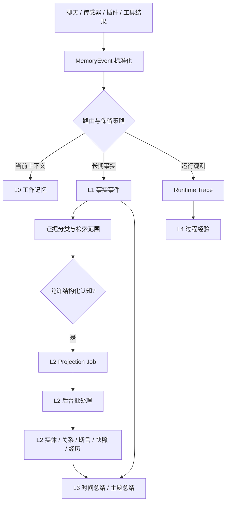
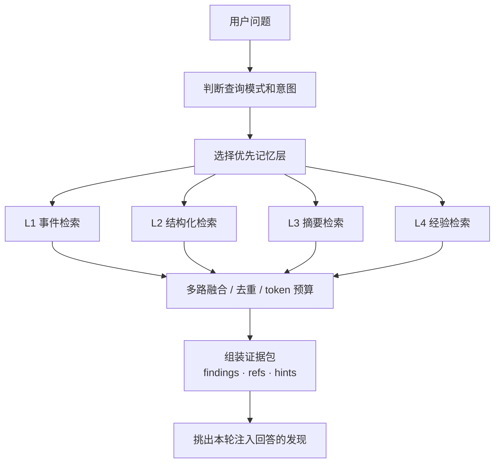
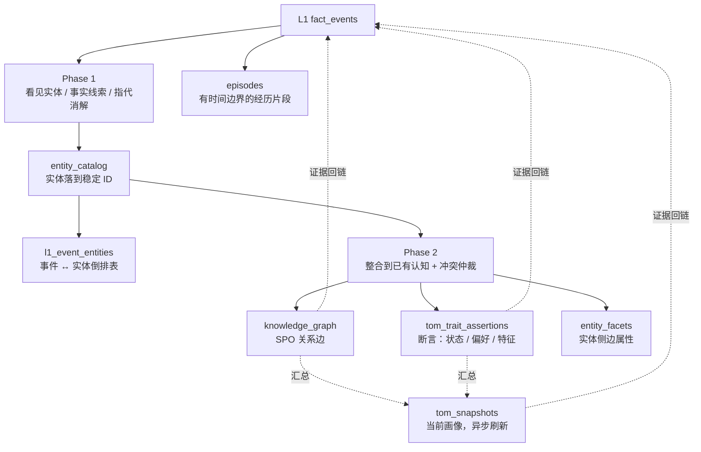

+++
title = 'Magi 记忆系统流程篇：从事件写入到证据检索'
date = 2026-05-15 00:00:00
tags = ["magi", "agent", "memory"]
categories = ["magi"]
draft = true
+++

## TL;DR

> 我在买空气炸锅前买了什么厨房家电？

这是评测基准 LongMemEval 里的一道题。你看一眼大概就能答上来，但要让一个长期记忆系统答对，它得自己想明白：高压锅也算厨房家电、空气炸锅之后买的电饭煲不算数，还得忍住别把 AI 自己之前说过的话当成事实拿回来用。

这篇文章想讲清楚 Magi 是怎么干这件事的：**一条记忆写进来的时候，就在标"以后能不能当证据"；问题来了的时候，就在挑"这一轮该信哪一批"。** 目前这条链路在 LongMemEval 上跑出 87.2%。

## 前言

[上一篇文章](/posts/ai/magi记忆系统/) 里，我主要写了 Magi 为什么需要一套分层记忆系统：为什么不能把聊天记录、工具日志、浏览历史和传感器数据都粗暴塞进一个向量库；为什么要区分 L0 工作记忆、L1 事实事件、L2 结构化认知、L3 总结反思和 L4 过程经验；以及为什么记忆系统必须处理污染、过期、冲突和成本问题。

但那篇文章更多是在回答“记忆系统应该长什么样”。这一篇想继续往下看一个更工程化的问题：**一条记忆到底是怎么写进去的，又是怎么被检索出来的？**

这听起来像一个实现细节问题，但在长期记忆系统里，它其实非常关键。因为记忆质量不是检索阶段才决定的。写入时有没有标清来源，是否区分用户自述和 AI 回答，是否把运行日志挡在长期事实之外，是否把实体和关系慢慢沉淀出来，都会直接影响后面能不能正确回答问题。

换句话说，Magi 的记忆系统不是“先把文本存起来，以后再搜”。它更像一条证据流水线：写入阶段决定什么东西有资格成为证据，检索阶段决定当前这个问题应该相信哪一部分证据。

这篇文章就围绕这条流水线展开。为了让写入和检索不混在一起，下面会先用一个例子说明难点，再分成两条主线：**写入路径负责把证据留下来，检索路径负责在问题出现时选择能信的证据**。最后再回到开头的例子，把整条链路走一遍。

## 记忆系统的难点

### 一个看起来很简单的问题

先从一个例子开始。这也是 LongMemEval 里的一道例题，简化了一下题目如下：

假设记忆里有三天对话：

```text
第一天：我想用新的高压锅煲汤，有什么专为高压锅设计的食谱吗？
后面主要在讨论高压锅煲汤和食谱。

第二天：我新买了一个空气炸锅，我觉得它很好用，你有什么推荐的食谱吗？
后面主要在讨论空气炸锅食谱。

第三天：我买了一个电饭煲，有什么推荐的食谱吗？
后面主要在讨论电饭煲食谱。
```

然后用户问：

```text
我在买空气炸锅前买了什么厨房家电？
```

这个问题对人来说很自然，答案应该是“高压锅”，正确答案就在第一天对话里。但对记忆检索系统来说，它其实一点都不简单。

第一，第一句话完全没有出现“空气炸锅”“买”“厨房家电”这些词。它只说了“新的高压锅”“煲汤”“食谱”。如果检索只靠关键词，这条记忆未必能被召回。

第二，语义上检索系统需要知道“高压锅”属于“厨房家电”。这是一种语义泛化，不是字面匹配。更细一点说，“新的高压锅”也不等于用户明确说“我买了高压锅”，但在上下文里它很可能是一个刚购买或刚开始使用的家电。

第三，系统还要处理时间顺序。第三天的“电饭煲”也是厨房家电，也明确出现了“买”，但它发生在空气炸锅之后，所以不能作为答案。也就是说，这个问题不是找最相似的文本，而是找“空气炸锅之前出现的厨房家电”。

第四，候选记忆之间还有干扰。三天内对话的大部分内容是食谱相关，大量的语义注意力被食谱侵占，靠检索很容易漏过多语义下的小细节。

这就是长期记忆检索最麻烦的地方：用户问的常常不是“哪段文本最像这个问题”，而是“过去发生过的一组事情之间，哪一个满足某些隐含条件”。

所以在讲 Magi 的实现之前，我想先把这个例子放到一个评测语境里看。类似的问题并不是个别刁钻 case，而是长期记忆问答里反复出现的基本题型。

目前 Magi 的记忆与检索链路已经接入 LongMemEval。在本地 SQLite 存储、千问 `text-embedding-v3` 向量模型和 `Qwen3.5` 回答模型下，当前总体准确率是 **87.2%**。

这个数字不是想说明系统已经把所有问题都解决了。它更像是一个阶段性信号：这条本地长期记忆链路已经不是只停留在架构图上，而是在标准长期记忆问答任务里有了一个可比较的基线。

### 复杂度与本地优先的架构选择

上面的例子说明的是“长期记忆问题本身为什么难”。但 Magi 还有另一层复杂度，来自它的**本地优先架构**：考虑到记忆数据的隐私性及本地依赖过重的问题，最终只选择 SQLite 作为底层唯一存储能力。

| 困难 | 云端可用解法 | Magi 的本地解法 |
| --- | --- | --- |
| 向量命中后还要拿到完整事实 | 向量服务直接返回带 metadata 的文档对象 | 原始表、向量表分离，chunk 命中后反查原始表 |
| 检索时要同时处理时间、来源、证据身份 | 在向量库、图数据库里做 metadata filter | 按一定条件分片，召回时扩大数据规模在内存里filter |
| 需要实体关系和有限多跳检索 | 直接上图数据库 | 用关系表模拟图结构，并维护实体与事实的倒排表做多跳检索 |
| 写入不能被 LLM 抽取卡住 | MQ 异步处理 | 建队列表，将事实写入和 LLM 抽取任务分离 |

从这也可以看出，架构选择是有取舍的。目前的选择换来了隐私、可迁移和桌面端可部署性，但也要求系统自己承担更多检索编排工作。

下面就从写入开始，看一条记忆具体怎么穿过这条流水线。后面会保留少量表名、字段名和队列名，但它们只作为工程锚点出现：读者需要知道系统把证据落在哪里、靠什么字段做治理，不需要在这篇文章里读完整 schema。

## 总览：从信号到证据，再从证据到回答

正式开始之前，先快速对一下记忆分层的口径，免得后面读到 L0/L1/L2 这些名字时还要回想：

- **L0 工作记忆**：当前任务/会话的工作上下文，短期注意力。
- **L1 事实事件**：规范化之后、可长期保留、可统一检索的事件底座。
- **L2 结构化认知**：从 L1 事件里抽出来的实体、关系、断言、快照和经历。
- **L3 总结反思**：小时/天/周/月等时间窗口的总结，以及主题、状态、任务反思。
- **L4 过程经验**：工具表现、可复用流程、策略提示和熔断恢复。

这五层为什么会这样长出来、各自要解决什么取舍，[上一篇](/posts/ai/magi记忆系统/) 已经讲过，本篇就不再重复了。如果你是直接从这一篇进来的，建议至少先读一下上一篇的分层介绍部分。

如果只看主链路，Magi 的记忆系统可以简化成这样：



检索时则反过来：



这两张图的核心是同一个原则：写入和检索不是两套互不相干的逻辑。写入时留下的证据身份，会决定检索时能不能被当成事实；写入时抽出来的实体和关系，会决定检索时能不能跨表达方式找到答案。

## 写入路径：先把证据留下来

下面来详细看看一条消息的写入流程是怎么样的。

### 事件标准化

Magi 面对的数据来源很多：用户聊天、AI 回复、工具调用、任务状态、浏览器历史、日历、媒体播放、终端命令、Git 活动、照片、系统使用情况。它们的原始结构完全不同，不可能让每个来源自己决定怎么写入记忆。

所以第一步是标准化。

不同事件会被翻译成统一的 `MemoryEvent`。可以把它理解成 Magi 记忆系统的入口合同。它不只是包含一段正文，还会带上一组后续处理必须知道的信息。这里列的不是完整模型，只是会影响后续写入和检索的关键入口信息：

| 入口信息 | 作用 |
| --- | --- |
| `event_id` | 事件业务 ID，用于追踪和去重 |
| `timestamp` | 事件实际发生时间 |
| `source` / `source_item_id` | 来源系统和来源侧 ID |
| `memory_domain` | 用户表达、外部活动、运行观测还是系统控制，也是后续路由的重要依据 |
| `cognition_eligible` | 是否允许进入 L2 结构化认知 |
| `retention_class` | 临时、可压缩还是长期保留 |
| `author_type` / `content_type` | 谁说的、内容是什么类型 |
| `metadata_json` | 插件和来源侧提供的结构化提示 |

Magi中的记忆事件来源大致分两类：

- **聊天来源**：用户消息、AI 回复、工具调用结果，由对话流程直接产生。
- **插件来源**：浏览器历史、日历、媒体播放、终端命令、Git 活动、照片、系统使用情况等，由各个传感器插件采集并上报。

不管是哪一类来源，最后都要被翻译成同一个 `MemoryEvent`。在这条翻译过程里，来源侧和主仓库各决定了一部分的字段信息：

| 谁来做 | 负责什么 |
| --- | --- |
| 来源侧（聊天 / 插件） | 提供结构化事件：来源 ID、发生时间、活动类型、涉及实体、可选的语义角色提示 |
| 记忆系统 | 标准化：渲染统一正文、生成 `event_id` / `idempotency_key`、判定 `memory_domain` / `cognition_eligible` / `retention_class`、做证据分类、决定路由 |

简单说就是：**来源侧负责"这个记忆是什么"，记忆系统决定"以什么身份进入系统"**。这样浏览器插件不会自己写"用户访问了 A"、音乐插件不会自己写"播放了 B"，事件正文风格不会拼盘化；而证据类别和路由这种全系统口径的判断，也只有一个地方在做，不会跨插件漂移。

举一个真实例子。假设网易云音乐插件检测到我听了一首歌，它上报给记忆系统的 payload 大致长这样：

```json
{
  "source_type": "netease_music",
  "source_item_id": "netease_3381201487_1779005740382",
  "occurred_at": 1779005740.382,
  "activity": {
    "source_code": "netease_music",
    "action_code": "listen_music",
    "object_code": "song"
  },
  "provenance": {
    "track_name": "End Of An Era (Live From Mexico)",
    "artist_name": "Dua Lipa",
    "album_name": "End Of An Era (Live From Mexico)",
    "play_duration_sec": 206
  },
  "entities": [
    { "mention_text": "End Of An Era (Live From Mexico)", "entity_type": "media" },
    { "mention_text": "Dua Lipa", "entity_type": "person" }
  ],
  "tags": ["netease_music", "music", "listening"]
}
```

可以看到，插件只关心"我能告诉系统的事实是什么"：这是网易云上的一次听歌行为、歌曲和歌手叫什么、播了多久、有哪些可识别的实体。它没有自己拼正文，也没有判断这条事件该不该进 L1、属于哪种证据。

记忆系统拿到之后，会把它标准化成下面这条 `MemoryEvent`（节选关键字段）：

```json
{
  "event_id": "01KRTG95DAWGTB1P0TR222FFY7",
  "timestamp": 1779005740.382,
  "event_type": "SENSOR_EVENT",
  "source": "netease_music",
  "source_item_id": "netease_3381201487_1779005740382",
  "idempotency_key": "netease_3381201487_1779005740382",

  "content": "网易云音乐 听歌 在网易云音乐听了 Dua Lipa 的《End Of An Era (Live From Mexico)》，播放了 3 分钟",

  "memory_domain": "external_activity",
  "ingest_target": "l1_only",
  "cognition_eligible": true,
  "retention_class": "compressible",
  "author_type": "external",
  "content_type": "observation",
  "evidence_class": "external_observation",
  "l1_retrieval_scope": "fact_authoritative",

  "metadata_json": {
    "structured_entity_hints": [
      { "mention_text": "Dua Lipa", "entity_type": "person" },
      { "mention_text": "End Of An Era (Live From Mexico)", "entity_type": "media" }
    ],
    "timeline": { "...": "原始结构化字段会原样挂在 metadata 里备查" }
  }
}
```

对照一下，两侧各加了什么就很清楚：

- **正文是记忆系统渲染出来的**："网易云音乐 听歌 在网易云音乐听了 Dua Lipa 的《...》，播放了 3 分钟"这句话不是插件写的，是记忆系统按统一模板从 `activity` + `provenance` 拼出来的。所有插件都走同一套渲染规则，正文风格才能保持一致。
- **去重 key 由记忆系统挑**：插件给了一个稳定的 `source_item_id`，记忆系统直接拿它当 `idempotency_key`，这样同一首歌的同一次播放重传不会写两次。
- **身份是记忆系统判定的**：`memory_domain = external_activity`、`evidence_class = external_observation`、`retention_class = compressible`、`l1_retrieval_scope = fact_authoritative`——这五个标签全部由记忆系统的路由 + 证据分类规则决定，插件无权也无需操心。
- **插件给的提示作为辅助保留**：实体识别提示和原始 timeline 字段被收进 `metadata_json`，L2 后面做实体抽取时可以用它们当 hint，但不会直接当成结论信任。

这套分工的结果是：插件再多、来源再杂，进入 L1 的事件长得永远是同一种格式；而每条事件以什么身份在系统里被使用，由记忆系统一个地方说了算。

这一步看起来朴素，但它决定了后面的边界。只有当来源、作者、领域、保留策略都被标准化，系统才有可能在后面区分“用户事实”“外部观察”“AI 回答”和“运行日志”。

### L1：写入稳定事实事件

标准化之后，事件会进入统一写入流程。`UnifiedMemoryStore` 会根据入口层的路由结果和事件属性，把它扇出到不同记忆层。

对于长期事实来说，最关键的是 L1（事实记忆），他是L2和L3的溯源基础。

L1 的写入是同步完成的。具体来说，L1事件同步落到本地 SQLite 里，后面的 L2 抽取、总结和经验蒸馏异步发生，不会影响 L1 保存事实。

L1 的主表是 `fact_events`。它保存的是规范化后的事件行，包括正文、时间、来源、用户、会话、证据分类、检索范围、保留策略等信息。同时，L1 会做几件配套工作：

1. 写入 `fact_events`，并用 `source + event_type + idempotency_key` 做业务去重。
2. 同步更新 FTS5 索引，用于 BM25 全文检索。
3. 初始化 embedding 状态。将向量任务推到异步队列里由 worker 处理。
4. 如果是聊天相关事件，顺手更新一张会话索引表，记录这个 session 最近一次发生在什么时候、有多少条消息、属于哪个用户。后面按会话维度做检索或展示时，就不用每次都去扫整个 `fact_events`。

当然，L1 不只是普通原始记录表。不是只关心“发生了什么”。L1 更关心“这个发生过的东西以后能不能成为记忆证据”。

所以 L1 写入时不会只保存正文，还会立刻做证据分类。

### 证据治理

长期记忆系统最容易栽跟头的地方，是把所有文本一视同仁地当成证据。

举两个反面例子。AI 之前回答过“你住在西湖旁边的民宿”——这句话作为一次对话经历可以保存下来，但它不能反过来变成“用户当前住在西湖旁边”的事实写进画像。用户问“我是不是喜欢猫”——这是个问题，不是陈述，更不该被当成“用户喜欢猫”的偏好记下来。（这两类污染上一篇有更完整的展开和反例，见 [上一篇的"什么不该成为记忆"](/posts/ai/magi记忆系统/#什么不该成为记忆) 一节。）

要从源头上避开这些坑，Magi 会在 L1 写入时给每条事件打上一个**证据类别**标签。同样是数据库里的一行 `fact_events`，类别不一样，它以后被检索、被当成事实、被拿去抽实体时的待遇也完全不一样。

当前规则路径会产出 8 类（再加一个兜底）：

| 证据类别 | 谁说的、什么场景 | 后续怎么用 |
| --- | --- | --- |
| `user_self_report` | 用户陈述自己的事实，例如“我喜欢猫” | 强证据，允许写入 L2 图谱和断言 |
| `user_question` | 用户在提问，例如“我是不是喜欢爵士乐” | 只算对话历史，不能反过来当成用户事实 |
| `user_request` | 用户在请求或下命令，例如“帮我查一下天气” | 只算任务意图，不写成长期偏好 |
| `external_observation` | 浏览、日历、媒体、终端等传感器观察 | 行为证据可用，不直接推成心理结论 |
| `assistant_tool_grounded` | AI 在工具结果之上给出的回答 | 对话经历保留，不能直接转成用户事实 |
| `assistant_freeform` | AI 没有工具来源的自由回答 | 对话可追溯，不能进入事实画像 |
| `assistant_runtime_derivation` | AI 执行过程中的中间推导 | 不进入长期事实认知 |
| `system_runtime` | 心跳、worker 进度、运行状态 | 留在审计和运行观测里 |

#### 分类怎么做出来

要先把一个工程取舍说在前面：**目前 Magi 用的是规则分类器，不是写入时再请 LLM 临场判断**。

这不是因为规则就一定对，而是因为如果让每条事件都等模型回答一句"这属于哪一类"，写入路径会被严重拖慢，桌面端的 LLM 调用成本也压不住；更麻烦的是同一条事件在不同时刻、不同 prompt 下可能被分成不同类，整个证据治理就立不起来。所以现阶段，写入路径优先要稳定、要快、要可复现，**语义精度上的代价由规则的保守边界 + 后续机制一起补**。

规则分类器输入很少，主要看三个结构化信号加一点点用户文本启发式：

| 输入 | 来源 |
| --- | --- |
| `author_type` | 由事件标准化阶段确定：user / assistant / external / sensor / system |
| `content_type` | 由事件标准化阶段确定：message / tool_result / runtime_derivation / observation 等 |
| `memory_domain` | 由入口层路由确定：user_expression / external_activity / runtime_telemetry 等 |
| 用户文本启发式 | 仅对 user 消息：是否以问号结尾、是否以"什么/请/帮我/can you"等引导词开头、是否以"吗/呢"结尾 |

规则按优先级顺序匹配，第一条命中就出结果。简化后大致是这样：

| 触发条件 | 归类 |
| --- | --- |
| `author = assistant`，`content_type = runtime_derivation` | `assistant_runtime_derivation` |
| `memory_domain = runtime_telemetry` 或 `author = system` | `system_runtime` |
| `author ∈ {external, sensor}` | `external_observation` |
| `author = assistant`，`content_type = tool_result` | `assistant_tool_grounded` |
| `author = user`，文本启发式判为问句 | `user_question` |
| `author = user`，文本启发式判为请求 | `user_request` |
| `author = user`（其他） | `user_self_report` |
| `author = assistant`（其他） | `assistant_freeform` |
| 都没命中 | 兜底归到 `external_observation` |

这里特意做了两个保守取舍。第一，**文本启发式刻意做窄不做宽**：常见的歧义词比如 `is` / `do` / `have` 没有放进问句引导列表，否则一句"I have a cat"会被错判成问句。第二，**兜底归到 `external_observation` 而不是 `user_self_report`**，避免不明来源的事件被直接抬升成用户事实。

**规则分类器不是终态**

要诚实地说：用户的话术千变万化，规则肯定盖不住所有真实场景。下面这几类目前都会落到 `user_self_report` 或 `user_question` 里，治理粒度不够：

- **反讽 / 自嘲**："对，我超爱加班"——字面是自述，实际意思相反。
- **引用 / 转述**："我朋友喜欢露营"——字面是 user 在说自己，但事实主体不是用户。
- **假设 / 反事实**："如果我以后喜欢爵士乐呢"——没问号、没引导词，但显然不是用户偏好。
- **修正 / 纠错**："不对，应该是嘉兴"——字面是陈述，实际是覆盖前一条事实。

后续如果实际数据里这类漏判影响明显，计划在规则层之上加一道**置信度感知的轻量 LLM 分类**：先看规则给出的归类是不是落在明显边缘语义里、置信度是不是足够，只对低置信度的少数事件再请一个快、便宜的小模型细判一次。这样既保留规则路径的稳定和低成本，又给真正难的语义场景留一条精度更高的路。这条路径目前还没上线，文章里写的是阶段性现状，后面有进展会再开一篇专门聊。

分类之后，每个证据类别都会被映射成一组具体策略。策略要回答几件事：

- 能不能抽实体？
- 能不能写知识图谱？
- 能不能写用户断言？
- 能不能影响 ToM 快照？
- 在 L1 检索里属于事实证据、对话证据，还是只适合审计？

最后这一条会落成 `fact_events` 行上的 `l1_retrieval_scope` 字段，明确告诉检索阶段"这条事件能被哪类问题看到"。当前主要有四种范围：

| `l1_retrieval_scope` | 含义 | 哪些证据类别落到这里 |
| --- | --- | --- |
| `fact_authoritative` | 可以作为事实证据，被事实型 / 总结型检索看到 | `user_self_report`、`external_observation` |
| `conversation_only` | 只算对话历史，事实型检索不会捞它 | `assistant_freeform`、`assistant_tool_grounded`、`assistant_runtime_derivation`、`user_question`、`user_request` |
| `audit_only` | 只用于审计追溯，正常检索看不到 | `system_runtime` |
| `source_backlink_only` | 不能独立被召回，只能作为别人的来源被回链引用 | 少数边缘类别 |

有了这个字段，污染防护就在写入那一刻起就生效了，而不是等到检索完才补救。用户问"我现在住在哪里""我买空气炸锅前买了什么"这种事实问题时，系统只去 `fact_authoritative` 范围里找候选；AI 自由回答和用户的提问本身还在数据库里，但被锁在 `conversation_only` 范围里，不会和用户明确的自述抢同一条召回。

### L2 结构化认知：从事件里整理出实体、关系、断言

L1 写完之后，如果这条事件值得继续加工（前面"证据治理"里 `fact_authoritative` 范围内的事件），系统会把它丢进一张 `l2_projection_jobs` 队列表。后台 worker 异步消费，把事实整理成结构化认知——实体抽取、SPO 建边、断言写入、冲突仲裁、snapshot 刷新这些事都在这里完成。

把 L2 推到异步是必要的：这条链路里很多步要调 LLM、要扫历史、要做实体合并，整体可能是几百毫秒到十几秒。挤在用户写入路径上，每说一句话都要等结构化加工。L2 的复杂度由后台慢慢消化，写入只管 L1 落地。

队列状态机这里就不展开了，真正的难点是 worker 拿到任务后做了什么。在展开之前，先看一下 L2 内部最终会沉淀出哪些东西：



L2 内部其实是两条主线。一条把事件文本变成稳定实体（Phase 1 + 实体库 + 倒排表），一条把实体之间的关系和状态整理出来（Phase 2 + 图谱边 + 断言）。中间还有一段冲突仲裁负责让旧事实退场；图谱断言之外的 snapshot、episode、向量化都靠后台异步链路补齐。

这里先约定两个高频用语，免得后面读得别扭：

+ **实体库**指 `entity_catalog` 表，记录系统当前认识的所有实体（每个实体有稳定的 `entity_id`、规范名、别名、类型）；
+ **实体提及**（业内常叫 mention）指 LLM 在事件文本里识别出的一次实体引用，需要后面再决定它对应实体库里哪个实体，或者要不要新建一个。

下面把这条链路从左到右说清楚。

#### Phase 1：从事件里"看见"实体和事实线索

Phase 1 的输入不是单条事件，而是一个 micro-batch——按 `session_id` 或上游传感器给的 `l2_batch_owner` 聚合的一组事件（同会话的多轮对话、同插件 catch-up 里的多条浏览，等等）。这样做有两个好处：让 LLM 在更长上下文里判断"这几句话其实在说同一件事"，以及降低 LLM 调用成本。

prompt 里塞进去的不止 batch 本身，还有四块上下文：

- batch 内事件正文
- 同 session 最近 3 条对话（带 `[USER]` / `[ASSISTANT]` 角色标）
- 跨 session 历史：用一个轻量预查找定位 batch 里"可能在说的实体"，再去这些实体的历史事件里捞最多 3 条（排除当前 session）
- 实体库里最多 30 个已知实体 + 上游插件提供的 `structured_entity_hints`

第三步常会让人疑惑：实体还没抽取出来，怎么去匹配？做法是不依赖 LLM 抽取，而是直接对整段 batch 文本做一次轻量 lookup——SQL `INSTR()` 在实体库里扫规范名和别名的子串命中，再用 batch 文本的 embedding 在实体向量索引里做语义相似度召回。这两路加起来给出一个"猜测的"实体候选池，用它们的名字回 L1 拉历史事件。它的目的不是替代 Phase 1 的实体抽取，而是给 Phase 1 一个"过去可能提过这些实体"的上下文窗口。

塞这么多上下文是因为 Phase 1 的核心任务是消歧和对齐——"那个人"指的是谁、"它"对应已有哪个实体、新提到的游戏是不是实体库里已经存在的那个。没有上下文，LLM 只会提到什么就提取什么，然后造了一堆孤立实体。

LLM 返回三类东西：

- **entities**：从文本里识别出的实体提及，带规整后的名字和 `entity_type`；如果 LLM 觉得能对到 prompt 里给的某个已有实体，就顺手填上对应的 ID
- **fact_claims**：轻量 SPO 三元组雏形，记下 subject、predicate、object 和一段 evidence_text，作为后面 Phase 2 入图谱/断言的候选
- **resolved_refs**：指代消解，"他"、"那个"对应到哪个实体（或者标记为 unresolved）

**entity_type 和 predicate 的"半受控"**

`entity_type` 是受控词表（person、place、software、media、food…），LLM 必须从这套类型里选。`predicate` 优先用核心谓词表 `PREDICATE_REGISTRY`（约 30 个：LIKES、VISITED、USES、LIVES_IN、INTERESTED_IN…），但**允许开放谓词**——只要满足 UPPER_SNAKE_CASE 格式 + 不在低价值黑名单（`ASKED_ABOUT` 这种描述对话行为而非稳定知识的谓词会被拒）。

选半受控而不是严格受控，是因为现实活动太多样。强行让 LLM 只能选 30 个谓词，会逼它把"用户在跑步"这种动作硬塞进 INTERACTED_WITH 之类的通用桶里，反而失真。这里的折中是：核心谓词享受同义归一和合并待遇，开放谓词允许写入，周期性扫描尝试把开放谓词合并到核心 synonym（见后面冲突仲裁和异步链路）。

**实体落到稳定 ID：决策链**

Phase 1 拿到这些实体提及之后，要决定每个提及对应实体库里哪个稳定 `entity_id`，或者新建一个实体。这条链按"先便宜后贵"找答案：

- **直接命中**：先看 LLM 自己有没有在输出里给出 `resolved_id`、当前 session 的缓存里有没有、字面别名能不能精确匹配上（同类型严格匹配，少量配置好的类型之间允许跨界，比如 person ↔ creator）
- **候选池 + LLM 消歧**：上面都没命中，就用字面子串 + 向量召回最多 20 个候选，让 LLM 在这批候选里再做一次批量消歧
- **兜底**：还是没结果，且置信度足够高、实体库里有同名实体 → 复用并加新别名；否则新建一行 `entity_catalog`

置信度太低或没给出 `entity_type` 的提及不会立刻新建实体，只挂证据到 `entity_mentions` 表，等后续证据稳了再绑定。

值得单独点出一句的是：**向量在这条链里只用于候选召回，不直接决定身份**。最终身份是由字面匹配和 LLM 消歧组合判定的，相似度不当评委。这样做的代价是写入路径多一次潜在的 LLM 调用，换来的是不会因为向量"看起来很像"就把两个不同实体合并。实体向量本身也是异步生成的，写入路径不会被向量化拖慢。

**`l1_event_entities`：事件 ↔ 实体的倒排表**

实体解析完之后，每个 `(event_id, entity_id, entity_type, confidence)` 会写进 `l1_event_entities`——这张表在 L1 库里，是后面 L1 检索做多跳的基础。一条事件可以链到多个实体，一个实体可以被多条事件引用。

维护这张表的原因是：本地优先架构没有图数据库，但又需要"从一条事件沿实体跳到相关事件"的能力。L1 检索的 Entity expansion 路径——比如已经命中第二天空气炸锅的事件，想顺着"空气炸锅"这个实体找到第一天提过它的事件——就靠扫这张倒排表。SQL 倒排扫起来比图遍历快、可缓存，还能按置信度过滤。

#### Phase 2：把新线索整合进已有认知

Phase 1 完成时，事件已经被解构成实体 + 线索。但这一步还没回答最关键的问题：这些线索和系统已经知道的东西是什么关系？

Phase 2 是另一次 LLM 调用。除了 Phase 1 的输出，它还会被注入和"当前焦点实体"（用户本人 + Phase 1 已经对到实体库的那些提及）相关的已有图谱边和已有断言，作为参照系。

LLM 看完上下文，给每条新边打一个标签，说明它和已有认知是什么关系：是 `new` 完全新事实、`corroborates` 佐证旧边、`refines` 细化旧边、`contradicts` 和旧边冲突，还是 `evolves`——旧的还在但被替代。这个标签直接决定后面是新建一条边、给老边加证据，还是触发冲突仲裁。

**SPO 入库：稳定身份 + 谓词归一**

为了避免同一关系被反复新建，三元组用一个稳定 ID：

```text
triple_id = uuid5(subject_id : predicate : object_id)
```

同一 SPO 再次出现时直接命中老 triple 做合并：累加观测次数、并入新的证据事件 ID、刷新最近观测时间，置信度走累积式上调——不是简单平均，多次独立确认会逐步抬升，但也不会因为重复几次就被加到过自信。

谓词侧还有一层归一。LLM 出的谓词常有形式变体——LIKE、LIKES、LISTENED_TO 这种——写入前先归到规范名（LIKE → LIKES）。比这更进一步，系统知道 LIKES 和 INTERESTED_IN 属于同一类"偏好"：如果同一对主客体之间已经有这一类的边，新边会复用已有边的谓词，避免"喜欢"在数据库里被写成几种不同的关系。

不直接让 LLM 严格输出规范谓词，是因为模型对近义谓词的偏好其实不稳定，强制约束会让它把不该归并的也归并。让 LLM 自由表达、写入时归一，可控性和召回的折中更稳。

**断言入库：让长期和短期特征不混淆**

图谱边记的是实体之间的关系。**断言**（`tom_trait_assertions`）记的是实体自己的特征或状态——压力偏高、喜欢咖啡、住在嘉兴、最近在赶进度。

断言按 (实体、特征名、目标值) 这组合做合并键。遇到新断言时分三种处理：

- 同值：合并证据，重算置信度
- 不同值 + 短期特征（情绪、压力这类带时效的）：原地改写，旧值作废
- 不同值 + 长期特征（住址、姓名这类）：旧行标"已被取代"，写新行并记录被谁取代

每条断言还有一个状态，反映"它有多稳"：单条证据时是 `tentative`，多条独立证据后升到 `corroborated`，再积累一段时间或被用户明确确认就到 `stable`。退场也分原因——被新值覆盖、TTL 到期、用户主动否定、被新行取代，分别落到不同的退场状态里，方便后面追问"它怎么消失的"。

状态分这么细，是为了让"今天压力大"和"喜欢咖啡"不被一样处理：短期特征过期就自然退场，长期偏好被更新时旧值留作历史。"什么时候算稳了""什么时候该让步"变成数据库里的判定，而不是依赖每次问答时 LLM 现场感觉。

短期断言带 TTL（情绪 12 小时、压力 24 小时、当下心境 2 小时这种数量级），后台 worker 周期扫一遍把过期断言标为 `expired`——"用户上周压力大"不会污染"用户当前状态"，但仍以历史证据存在。

**Fast-track：跳过 Phase 2 LLM**

不是每条事实线索都要走 Phase 2 LLM。如果它主语客体都已经对到稳定实体、谓词又是核心谓词表里的标准词，并且不需要写断言——就可以直接当作图谱边写入，省一次 LLM 调用。

这对浏览历史、媒体播放、Git 活动这种高频但结构清晰的事件很关键：它们绝大多数都能走 fast-track，让 L2 处理速度跟得上写入速度，不至于在传感器爆发时被 LLM 拖住。

**边的向量化**

图谱边的向量也是异步生成的：写入时只标"待向量化"，后台 worker 周期批量补。L2 检索的"哪条关系的语言描述和问题最像"那条通道，查的就是这批向量。写入路径不阻塞向量化。

#### 冲突仲裁：旧事实如何退出当前理解

冲突分两条路处理。

**第一种：规则就能搞定**

同一对主客体之间出现明显的反义谓词——比如对同一对象同时出现"喜欢"和"不喜欢"——写入时一条规则就够：旧边作废，新边接管 active 状态。不用调 LLM。

**第二种：语义反转，规则盖不住**

更多时候没那么直接。比如"我现在不住上海了，搬到嘉兴了"——主语、谓词都没变，只是宾语换了。或者"我以前喜欢爵士，现在更喜欢古典"——同一谓词下宾语在切换。这种情况 Phase 2 输出时会附带一个"冲突提示"，标注冲突类型（状态反转、偏好反转、直接否定等）。

如果提示足够严重，会触发第三次 LLM 调用做仲裁。**这次和前两次不是同一个模型**：Phase 1/2 走的是轻量的"快速分类"档位，负责按 batch 抽实体、归类边，强调便宜和速度——它要能扛住浏览历史、媒体播放这种高频传感器流量，所以默认关推理；仲裁切到带推理的核心模型，看完证据后给一个谨慎的判断。毕竟"用户到底是不是搬家了"这种问题，错判一次当前画像就会被带偏，值得让大模型多想想再下结论。

LLM 拿到的是新旧两边和相关证据，给出两个出口之一：

- **保留旧的，丢弃新的**：系统抽到的"新关系"其实是误读，旧的是对的
- **认定为演进**：旧边/旧断言标记成"已被取代"，写入新边/新断言，并记下被谁取代

把仲裁拆成独立调用，除了模型档位不同，另一个原因是关心点不同——Phase 2 关心"线索整合"，仲裁关心"该让谁退场"。两件事混在一起会让 Phase 2 prompt 变得很重，而且大部分写入根本不需要仲裁。拆开按需触发，路径更干净。

仲裁完后新旧两条记录都还在数据库里。旧的退出当前画像，但仍可以作为历史证据被回忆（"之前是不是住上海"还能答）；只有 active 那条会进当前画像。

#### 异步合并链路：snapshot、episode、reconcile

到这一步 L2 同步路径就结束了。但要让"分散的图谱边和断言"变成可用的整体视图，还需要一组异步任务在后台跑。它们都不在用户写入路径上。

**snapshot 刷新**

每当某个实体新增/修改了图谱边或断言，Phase 2 末尾会把这个实体的 ID 丢进 snapshot 刷新队列。后台 worker 拿到任务后从这个实体当前还有效的断言和边里聚合出一份当前画像（核心特征、偏好、关系拓扑、当前情绪状态等），覆盖写到 `tom_snapshots` 表。

snapshot 默认走异步，是为了避免画像跟着每条事件抖动——如果每写一条边就重算 snapshot，单条还没稳的证据会立刻影响"当前画像"。异步让 snapshot 由更稳定的状态产出。

**episode 形成**

每个 batch 抽取成功后，系统会把这一组事件归到某个 episode（一段有时间边界的经历片段）。归属判断按两个维度：时间够不够接近，实体/话题有没有重叠。如果和最近一个还在累积的 episode 都对得上，就并进去并扩展时间边界；都对不上就开一个新的 episode。

新建的 episode 起步是"候选"状态。后台 maintenance 周期评估它能否升为正式片段：累计事件够多、持续时间够长就提升；过少的会被丢弃；高度重叠的会被合并。这一步主要给 L2 检索的 episode 回忆用——用户问"上次写文章那阵子发生了什么"时，episode 能给出边界和主题摘要。

**实体重整、谓词合并、孤儿清理**

后台维护任务周期性还会跑几件清理工作：

- 合并同名但被拆碎成多条的实体，并把图谱和断言里的引用重写到合并后的实体
- 删除被提及次数太少又长期没人用的孤立实体
- 把开放谓词重写到核心同义词（如果有可合并目标）
- 清理那些指向实体库里已经不存在实体的图谱边（找得回就改写引用，找不回就丢）
- 把过期断言标记为 `expired`

这些动作单独看都不显眼，但长期运行的记忆系统离不开这一层。没有它，几个月之后图谱会越来越脏、同名实体会越分越碎、过期状态会污染当前画像。

---

L2 真正在做的事，比任何一张表的字段描述都要复杂——从原始事件里看见实体、把实体落到稳定 ID、判断新事实和旧事实的关系、给冲突一个解决方案、再异步汇总成可用的当前画像。任何一条结构化结论都能追回到支撑它的 event ids 和 reason chain，这是 L2 区别于"LLM 临场总结一段"的核心。

回到厨房家电的例子。理想情况下，L2 会逐步形成这样的线索：高压锅、空气炸锅、电饭煲都是 `entity_type=appliance` 的实体；空气炸锅和"我新买了"的 fact_claim 之间形成一条 OWNS 边；高压锅那句"新的高压锅"虽然没有"买"这个词，但 Phase 2 仍可能形成一条置信度较低的 OWNS/USES 边；而 L1 那张 `l1_event_entities` 倒排表让系统能从"空气炸锅"这个 entity 跳到第二天的事件，再用时间锚点筛出"之前"的候选。

这条链路不能保证每次都成功——很多事件没法被结构化抽出来（口语化表达、跨多轮的指代、规则盖不住的语义）。但它给系统多了一条路径：纯文本检索回答不上的问题，L2 通过"实体 + 时间 + 关系"还有机会答上来。

### L3 和 L4：写入流程的两条旁路

L3 和 L4 都不在用户写入的主路径上，各自由后台机制按自己的节奏产出。它们存的不是 L1/L2 的复述，而是另外两类长期可复用的产物：**L3 把过去发生的事压成可回顾的总结，L4 把过去的工具调用沉淀成可复用的经验**。

#### L3：定时摘要 + 事件触发洞察

L3 内部其实是两条独立链路。

**时间窗口摘要**由调度器驱动。小时 / 天 / 周 / 月各有一个独立循环，每次跑摘的都是"当前时刻往前 N 秒"的事件——是滑动窗口。

但事件不会被全部塞进 LLM——一个小时里可能有几千条浏览、几条聊天、几条 Git 活动，如果直接喂进去，浏览数据会把对话和代码活动完全淹没。这里使用按来源压缩的策略，规则也很直白：

- 按 L1 事件的 `source` 字段分桶
- 每个来源至少保留 4 条，保证低频来源不会被完全挤掉
- 剩余配额向高频来源倾斜，但做了一次开平方衰减，不让它按比例独占
- 总条数封顶 120

举个例子：过去一小时浏览了 800 条网页 + 聊了 3 句天，最终塞进 LLM 的不是"800 + 3"，而是约 30~50 条代表性浏览 + 3 句聊天全保留。

LLM 走 `MEMORY_SUMMARIZER` 档位，hour 粒度关推理（追求速度），day 及以上开推理（看得更深一层）。

**事件触发型洞察**指状态变化、矛盾消解、长期趋势、任务反思四类。这些**不调 LLM**，全部走规则模板：

- 前三类由 L2 reconcile 完成后回调触发——L2 算完"某条特征状态变了"或"某断言被取代"，规则模板把这事翻译成一条 L3 洞察直接落库
- 任务反思由聊天完成后处理触发，抓取最近 6 条相关 L1 事件作为证据

之所以这四类不调 LLM，是因为输入已经是 L2 算好的结构化结果（断言状态、冲突标记、特征值变化），再过一次语义模型性价比不高。这是个明显的工程取舍：愿意花 LLM 成本的地方（时间窗摘要）多花，不需要 LLM 的地方坚决不调。

所有 L3 写入都通过 `summary_event_links` 回链到支撑它的 L1 事件，结论永远能追回底层证据。

#### L4：每条工具执行同步累积，攒够再提炼

L4 和 L3 不一样——**它的统计部分在 L1 写完之后的同一条 ingest 调用里同步完成**。任何一条 `ActionExecuted` 事件（也就是工具执行）经过 L1 之后，会立刻同步触发三件事：

1. 以 `(工具名, 类别)` 为键更新 `procedural_skills` 行：累加成功/失败次数、刷新平均执行时间、更新连续失败计数
2. 追加一条 `l4_execution_traces`，保存本次输入、输出、耗时、是否成功（每个 skill 最多保留最近 50 条）
3. 熔断检查：连续 3 次失败 → 该 skill 切到 `open` 状态，后续直接拒调；600 秒后进入 `half_open`，2 次成功才回到 `closed`

到这一步，"工具最近表现怎么样"已经是同步算好的事实，不需要任何 LLM。但"它适合什么场景、典型失败模式是什么、参数该怎么调"这种判断没法靠累加计数得出，需要 LLM 看历史 trace 总结。

L4 把这层提炼做成**惰性触发**：每个 skill 维护一个 `pending_trace_count`，攒到 5 条新 trace（这个阈值会随累计执行次数自适应上调），或者熔断刚被打开——就同步触发一次 LLM 调用，从历史 trace 里分层采样最多 20 条（最近的 / 成功的 / 失败的各几条），压成一段策略 JSON 写回 `optimized_prompt`。下次 agent 使用这个工具时，这段策略会作为额外上下文喂给它。

LLM 走 `CONTEXT_COMPACT` 档位（轻量压缩模型，关推理）——本质是"把一堆执行日志浓缩成几条经验"，不需要重型推理。

#### 为什么单独说这两层

虽然 L3/L4 不是写入主路径，但它们决定了检索时能不能答上特定问题：

- 用户问"我上周主要在忙什么"——L3 的周摘要比扫上万条 L1 事件靠谱
- 用户问"上次类似问题怎么处理的"——L4 的工具策略比 L2 的实体关系更对路

它们和 L1/L2 的关系更像"配料"而不是"主菜"：L1/L2 是事实底座，L3/L4 是被事实喂出来的经验沉淀。检索路径会按问题类型决定优先相信哪一层，下一节展开。

## 检索路径：按问题选择可信证据

写入路径解决的是“证据有没有被正确留下来”。检索路径反过来，解决的是“当前这个问题应该相信哪一批证据”。所以它不是把所有记忆放进同一个相似度池里，而是先判断问题类型，再选择优先记忆层和证据范围。

### 第一步：先判断问题类型

写入之后，另一半问题就是检索。

Magi 的检索入口通常是 `memory_query`工具。调用它时，最关键的参数不是 query 本身，而是 `query_mode`，他由LLM在请求工具时直接塞入。因为不同问题需要相信不同记忆层。

| query_mode | 适合的问题 | 优先层 |
| --- | --- | --- |
| `exact_fact` | 我喜欢什么、某个事实是什么 | L2， fallback 到 L1 |
| `current_state` | 我现在在做什么、当前状态是什么 | L2 当前状态，fallback 到 L1 |
| `episode_recall` | 某天发生了什么、那次经历是什么 | L2 episode + L1 事件 |
| `cross_session` | 跨会话列举或统计 | L2 + L1 |
| `temporal_compare` | 和上周相比有什么变化 | L2 + L1，必要时 L3 |
| `summary` | 总结一段时间 | L3，fallback 到 L1 |
| `activity_summary` | 某类活动总结，比如浏览/音乐/Git | L3，fallback 到 L1 |
| `strategy` | 上次类似任务怎么做 | L4，fallback 到 L1 |

这一步很关键。因为长期记忆检索不是把所有东西放进一个池子里做相似度搜索。用户问“我现在住在哪里”，应该优先查当前状态和事实；用户问“去年那次杭州旅行发生了什么”，应该优先查事件序列和经历片段；用户问“为什么你这样回答”，则应该去看原始对话、证据来源和运行观测。

同一个底层事件，在不同问题里应该有不同身份。助手回答可以用于对话回放，但不能作为用户事实；传感器行为可以作为行为证据，但不能直接升级为用户偏好；摘要可以用于长期回顾，但不能代替底层证据。

### L1 检索：从多条搜索路径召回事件证据

L1 检索负责找原始事件证据。它不是单一路径，而是多路召回后融合。

当前主路径包括：

1. **BM25**：走 FTS5，在全库按词项相关度评分。适合精确词、短语和实体名。
2. **Vector**：走 sqlite-vec，按语义相似度召回。
3. **Keyword**：走 SQL LIKE 和 token 过滤，作为兜底补充。
4. **Temporal BM25**：和 BM25 一样走 FTS5，但 SQL 层就把范围限定在时间窗口内再做 BM25 评分。只在问题带时间意图（"上周三浏览了哪些跟咖啡相关的页面"）时启用，和普通 BM25 并行跑。
5. **Entity expansion**：以已命中事件作为种子，沿 `l1_event_entities` 倒排表跳到这些实体的其它相关事件。
6. **Graph spreading**：可用时借助 L2 图谱进一步扩展相关实体和事件。

这里可能要提的一点是，时间型问题为什么不直接砍掉普通 BM25、只跑 Temporal BM25？两个原因：

第一，**并行不增加延迟**。所有路径走 `asyncio.gather`，整体耗时取决于最慢的那一路，加一路不会变慢。所以"多跑一路"的成本本身就接近零。

第二，**RRF 看的是多源同意**。如果某条事件在全库 BM25 和窗口内 BM25 里都排得高，融合分会比"只在窗口里勉强算最像"的事件高一截——前者是"既相关又在时间窗口里"的强证据，后者可能只是窗口里没有更像的了。两路一起跑，强证据被强化，弱证据不会被错抬。

至于普通 BM25 在窗口外的那些高分匹配，最终 fetch 阶段会按时间过滤掉，不会污染结果。

这些多路查询路径拿到的都是 event ids。系统会用 RRF（Reciprocal Rank Fusion）把不同召回路径的排名合起来。

但 RRF 不是"所有路径一视同仁求和"——**每个 `query_mode` 在融合时用的是不同的路径权重**。比如 `exact_fact`（"我喜欢什么"）把 entity 路径调到 1.2、vector 1.0、BM25 只给 0.8——事实型问题相信结构化候选最多；`episode_recall`（"上次写文章那阵子"）反过来给 vector 1.2、entity 只 0.6——找一段连贯片段，向量比图扩展更对路；`event_stream`（"翻翻最近发生了什么"）则直接不让结构化路径参与，纯靠 BM25 + vector + keyword。同一组召回结果，给到 RRF 时被信任的程度按问题类型变化，不是一套配置打天下。

**RRF 之后还有一层 reranker。** 系统不会直接拿 RRF top 当结果，而是把前 20 条取出来再做一轮加减分，目的之一是把"AI 自由回答"这类内容从结果上方往下压。L1 这一层的调整大致是：

- 作者是 user：+0.35（用户原话直接加分）
- 作者是 assistant：-0.10
- 引号短语命中：user 每条 +0.45，assistant 每条只 +0.15
- assistant 内容超 240 字符：按长度再扣，最多 -0.25
- 事件发生时间距离查询时间越近，给一点奖励分

这一层和前面"证据治理"里 `fact_authoritative` 是配套设计：前者在召回阶段就把 AI 自由回答挡在事实候选之外，后者在排序阶段再压一次"即使混进来也别排在前面"。两层一起，AI 自己说的话很难占据答案上方。

这里还有几个细节值得展开。

首先，L1 的向量检索命中的是 chunk。长文本会切成多个 chunk 写入向量索引，检索时可能命中其中一段。但回答阶段不能只拿一个 chunk 当事实，所以系统会把 chunk id 折回 event id，再 hydrate 完整事件。

其次，事实型和长期回顾型问题会限制 L1 retrieval scope。当前实现里，`exact_fact`、`current_state`、`temporal_compare`、`summary`、`activity_summary` 和 `strategy` 这几个 mode 都会把候选限制在 `fact_authoritative` 范围；`episode_recall` 和 `cross_session` 不强约束，因为这两类问题本来就需要把对话和外部观察一起拉进来。这样 AI 自由回答、用户提问本身、运行中间态就不会轻易进入事实候选。

再次，L1 仍然是检索安全网。即使 L2 还没来得及抽取结构化关系，或者某个实体没有被识别出来，L1 也可以通过原始事件召回提供底层证据。

回到厨房家电例子，如果只靠关键词，第一天的“新的高压锅煲汤”可能不好找；如果只靠向量，第三天的“电饭煲食谱”也可能很像问题。但 L1 可以通过时间、事件文本、向量语义和后续实体扩展一起工作，先把可能相关的事件召回来，再交给后面的融合和回答阶段判断。

### L2 检索：从自然语言落到实体、关系和时间

L2 检索处理的是结构化认知。它的目标不是搜一段文本，而是把问题落到实体、关系、断言、快照和经历片段上——这些就是 L2 写入阶段沉淀下来的产物。

整体流程比较固定：

```text
自然语言问题
-> 解析 query_mode 和过滤条件
-> 识别问题里涉及的实体
-> 构建 grounding plan（把问题翻译成结构化查询）
-> 按子域并行查图谱 / 断言 / 快照 / 经历
-> 候选融合 + 按问题类型加权
-> 投影成回答需要的格式
```

核心是 **grounding plan** 这一步——本质是"自然语言 → 数据库查询条件"的翻译层。它要回答几个问题让后面有得查：主语是用户还是某个显式实体？要找的是关系、状态、经历还是活动？目标实体类型是什么？谓词属于哪一类（偏好类、行为类、长期事实类）？有没有时间约束？这一步做不好，后面查再多通道也没意义。

**按子域并行查**

grounding plan 拿到结构条件后，L2 把查询分到几个子域并行跑：

- **关系和偏好** → 查 `knowledge_graph` 图谱边
- **当前状态、特征、习惯**这类断言 → 查 `tom_trait_assertions` 和 `tom_snapshots`
- **经历回忆**（"上次写文章那阵子"） → 查 `episodes`

每个子域里的查法也不止一种。以图谱边为例，有三种通道：

1. **结构查**：按主语、谓词、宾语、时间、状态直接 SQL 过滤——已知具体边能不能命中
2. **边语义检索**：每条图谱边都有一段自然语言描述（Phase 2 抽取时留下的 `evidence_text`），把这段描述向量化后做语义相似匹配，召回后再用结构条件重新打分——适合"哪种关系和问题最像"这种模糊查询
3. **多跳关联**：处理"地点-上级地点"等多跳模式，比如想从某个 X 账号回到背后的真人

为什么要三通道？因为同一个问题往往多种走法都有意义。"用户喜欢什么咖啡"既可以是结构查（已知 predicate=LIKES、object_type=food），也可以是语义查（用户表达不一定用"喜欢"这个词），还可能要走多跳（如果某咖啡牌子是某连锁的子品牌）。三路独立给候选再合并，比单路深挖更稳。

**融合 + 反例**

不同子域的候选会被合并成统一的结构化结果。和 L1 一样，融合阶段按当前 `query_mode` 重新加权（前面 mode-specific 权重那张表在 L2 也同理），按时间和结构条件过滤掉明显不符的，最后按证据强度和置信度排序。

回到"空气炸锅"那个例子。理想情况下，L2 检索能这样工作：先以空气炸锅作为时间锚点（一条 OWNS/USES 边的 `last_observed_at`），再找在那之前发生的、类型属于厨房家电的候选实体或事件；同时把发生在之后的电饭煲排除掉。整条查询不依赖"前后"这个字面词，而是依赖图谱里的实体类型、关系和时间字段。

但 L2 不是魔法——它依赖 L2 写入阶段能否抽出足够好的实体、关系和时间线索。如果"新的高压锅"没有被识别成一个可用实体，或者没有和厨房家电类别产生关联，检索就退回 L1 原始事件兜底。Magi 的设计不是保证每次都能结构化成功，而是让系统有多条路径逐步补证据。

### L3 检索：在阶段摘要里找上下文

L3 检索的对象不是原始事件，而是 L3 写入阶段沉淀下来的三种 summary：

- **temporal**：时间窗口摘要（小时 / 天 / 周……）
- **thematic**：按主题聚合的摘要
- **insight**：事件触发的洞察（趋势变化、状态切换、冲突解决、任务复盘）

走的也是三路 RRF，和 L1 同结构——BM25 + 向量 + 关键词并行召回再融合。但 L3 这层有一个特别的设计值得拎出来说。

**`summary_type` 硬过滤，`summary_category` 软加权**

`summary_type` 就是上面那三类，是受控词表。调用方明确指定要 `temporal` 就不该返回 `insight`，所以这一层走 SQL where 硬过滤。

但 `summary_category`（比如 `browser_activity`、`task_reflection` 这种二级标签）就不一样了：解析查询意图的 chat LLM 可能分错类，比如把游戏相关问题分成 `browser_activity`。如果这一层也硬过滤，整条 L3 路径会被一次错判打死，强迫回退到更嘈杂的 L1。

所以 L3 选了软加权方案：召回时不按 category 过滤，所有候选都进；融合后给命中目标 category 的结果乘 1.8 的 boost，同时把 fetch_k 放大 1.5 倍保住召回量。意图分类对了能浮上去，分类错了也不至于全军覆没。

**真正能解决的问题**

L3 适合回答"上周在忙什么""最近浏览主题有什么变化""这段时间工作重心是什么"这种宽窗口问题。直接扫 L1 事件会很重，也容易被大量细节淹没；L3 摘要先给阶段轮廓，必要时再下钻——每条 summary 都带 `source_event_ids` 字段记录覆盖了哪些原始事件，回 L1 补证据是顺路的事。

### L4 检索：在经验库里找处理方式

L4 检索的是 `procedural_skills` 表——工具技能库，每条记录包含某个工具或工作流的成功率、失败模式、优化提示和熔断状态。

和 L1/L2/L3 不同，L4 当前实现只走两路 RRF：**BM25 + 关键词**，向量路径明确禁用。

原因很直接：`procedural_skills` 表很小（典型 <1000 行，每个工具/工作流一行），双路召回已经能扫到全部候选；而向量路径每次查询都要重新算 embedding，成本/收益不划算。同时经验库要找的是稳定的流程和工具表现，关键词命中比语义相似更可靠——用户问"上次这种问题怎么处理的""之前那套流程是什么"时，需要的不是"语义最像"，而是"工具名和场景能对上"。

无论 L3 还是 L4，它们都不是孤立的：L3 通过 `source_event_ids` 追溯到 L1 原始事件，L4 通过 `l4_execution_traces` 追溯到具体一次工具调用。更高层的记忆不是为了替代底层事实，而是为了让长期记忆形成层次，需要细节时随时能下钻。

### 结果融合：检索结果不能直接塞进回答

检索完成后，系统会先得到一份原始检索结果。里面可能包含：

- L0 工作台上下文
- L1 events
- L1 evidence bundles
- L2 entity cards、relationships、assertions、episodes
- L3 reflections
- L4 procedures
- trace 信息

但这些结果不会原样塞进模型上下文。Magi 还会做几层处理。

第一层是去重和 token budget。不同路径可能命中同一个事件、同一个实体、同一条关系。系统需要按层去重，并且在有限上下文预算里保留最有用的证据。

第二层是 evidence bundle 和 timeline summary。L1 事件可能来自多个会话、多个时间点。直接把一堆事件扔给模型，会让模型自己整理时间线。更好的做法是先把它们压缩成更适合回答的证据束和时间摘要。

第三层是面向回答的投影。原始检索结果会被整理成回答阶段使用的证据包，里面包括：

- `status`：有没有找到可信记忆
- `query_mode`：本轮按什么模式查的
- `summary`：面向回答的简短概括
- `findings`：可引用发现
- `entity_refs` / `asset_refs`：相关实体和资产引用
- `insufficient_evidence`：证据是否不足
- `answering_hints`：回答时不要猜、优先使用直接发现等提示

这一步很重要。因为检索系统负责“找到了什么”，回答系统负责“怎么说”。两者之间需要一个收束层，而不是让模型直接面对数据库结果。

这里还会继续做污染防护。例如事实型问题里，一些像用户问题本身、助手上一轮回答这样的 chat artifact，会从 answer-facing findings 里过滤掉。这样可以避免模型把回音当证据。

最终进入回答阶段的不是“数据库里有什么”，而是“本轮问题可以相信哪些发现”。

## 把开头例子走完整一遍

现在可以重新看开头的问题：

```text
我在买空气炸锅前买了什么厨房家电？
```

一个比较理想的 Magi 检索流程会是这样：

1. `query_mode` 选择为事实或时间比较相关模式。
2. 系统识别“空气炸锅”是一个实体，也是时间锚点。
3. L2 尝试查空气炸锅相关事件、关系和时间信息。
4. L1 召回包含“空气炸锅”的第二天事件，确定锚点时间。
5. 检索锚点之前的候选事件和实体。
6. 通过语义或 L2 结构知道“高压锅”属于厨房家电。
7. 排除发生在空气炸锅之后的“电饭煲”。
8. 形成 answer-facing finding：空气炸锅之前出现的新厨房家电是高压锅，但如果证据只来自“新的高压锅”而非明确购买句式，就应该保守表达。

这里最重要的是第 8 步。一个好的记忆系统不应该把弱证据说成强事实。如果系统只看到“新的高压锅”，它可以回答：

> 你在买空气炸锅前提到过一个新的高压锅，应该是高压锅。不过这条证据来自“新的高压锅煲汤”的说法，不是一个明确的购买记录。

这比直接自信地说“你买了高压锅”更诚实。

长期记忆系统的目标不是让 AI 永远显得很确定，而是让它知道自己依据什么、哪里不确定、哪些证据不能越权。

## 一个常见反问：为什么不直接让 LLM 判断

有一种很自然的想法是：既然最后还是 LLM 回答，那检索阶段是不是不用这么复杂？把相关记忆多召回一点，让 LLM 自己判断不就好了？

短期看，这个方法确实能跑起来。但长期看会遇到几个问题。

第一，候选池一旦错了，LLM 很难稳定补救。比如事实问题里混入大量 AI 自己以前的回答，模型很容易把更像答案的文本当成事实。

第二，上下文预算有限。长期记忆越多，越不可能把所有可能相关的东西都塞给模型。检索阶段必须先做证据范围控制。

第三，时间和来源约束需要系统性处理。像“之前”“之后”“现在”“上周”“那次”这样的词，如果完全交给 LLM 在一堆文本里临场判断，很容易受文本顺序、召回顺序和摘要表达影响。

第四，桌面端成本不能失控。Magi 不能每次检索都把大量历史交给大模型做长上下文推理。很多事情必须在本地索引、结构化查询和轻量排序阶段先完成。

所以 Magi 的思路是：LLM 参与理解和表达，但底层证据治理、召回范围、结构化约束、时间过滤和结果投影不能全部交给 LLM 临场发挥。

## 写入和检索其实是一件事

回看整条链路，会发现写入和检索是彼此咬合的。

写入时，Magi 把原始信号变成 `MemoryEvent`，标清来源、领域、作者、保留策略和认知资格。这样检索时才能知道哪些东西能当事实，哪些只适合做对话回放或审计。

写入时，Magi 把事件存进 L1，并给它建立 FTS 和向量索引。这样检索时既能按字面找，也能按语义找，还能回到底层事件追溯证据。

写入时，Magi 在 L2 里抽实体、关系、断言、快照和经历。这样检索时才能跨表达方式、跨时间窗口、跨实体关系地找到线索。

写入时，Magi 把长时间窗口压缩成 L3 摘要，把工具经验沉淀成 L4 过程记忆。这样检索时才能回答长期回顾和流程复用问题，而不是永远扫描原始事件。

所以，记忆系统不是一个数据库模块，也不是一个 RAG 插件。它更像一个把时间组织起来的证据系统。

## 最后

Magi 的记忆流程之所以看起来复杂，是因为它同时面对两类约束。

一类是长期记忆问题本身的复杂度：用户的问题经常跨时间、跨表达、跨实体，还会包含隐含类别、反事实排除和证据强弱。

另一类是本地优先架构带来的复杂度：SQLite 足够可靠、轻量、可控，但它不是云向量数据库，也不是图数据库。为了在本地环境里实现长期记忆，系统必须把原始事件、全文索引、向量 chunk、实体链接、知识图谱、摘要和经验层拆开，再在检索时重新组合。

这也是为什么 Magi 没有把记忆设计成“文本进向量库，问题进相似度搜索”。那样的系统可以回答一部分“之前聊过什么”，但很难长期稳定地回答“这些事情之间是什么关系”。

对一个桌面 Agent 来说，记忆不是简单地多存一点历史，而是让系统学会尊重时间、证据和不确定性。

写入阶段，它要知道什么值得留下；检索阶段，它要知道当前问题该相信什么；回答阶段，它还要知道哪些地方不能猜。

这三件事合在一起，才是 Magi 记忆系统真正想做的事。