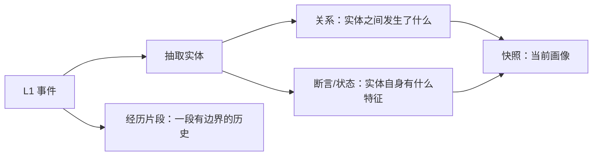
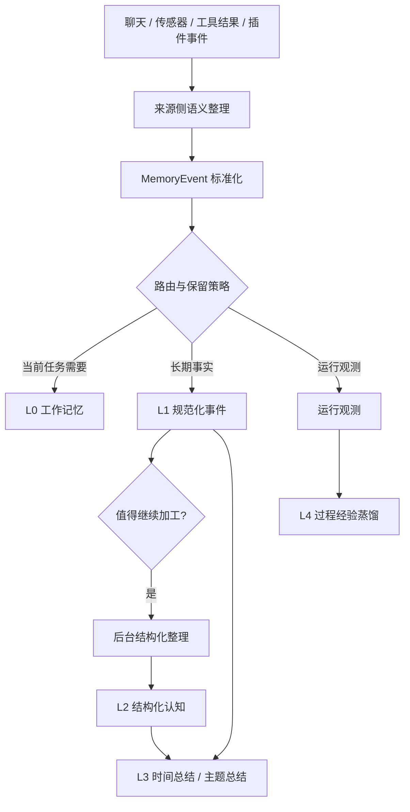

+++
title = 'Magi 记忆系统设计：一个桌面 Agent 的长期记忆构建思路'
date = 2026-05-10 00:00:00
tags = ["magi", "agent", "memory"]
categories = ["magi"]
+++

# 前言

在做 Magi 之前，我对 AI Agent 的记忆系统一直有一种比较矛盾的感觉：一方面，大家都说长期记忆很重要；另一方面，很多所谓的记忆实现，最后看起来又像是“把聊天记录切块丢进向量库”。

这个方案不能说完全没用，尤其在回答“我们之前聊过什么”这类问题时确实有效。但如果把场景放到 Magi 上，问题就变复杂了很多。

Magi 不是一个只活在聊天窗口里的助手。它的目标是作为一个桌面端 Agent，长期观察用户的日常活动，接收来自浏览器、日历、音乐、终端、Git、照片、系统使用情况等传感器的数据，再把这些碎片慢慢沉淀成可以回忆、可以总结、可以解释的长期记忆。

如果用一句更白话的话来概括，这篇文章想回答的是：一个桌面 Agent，应该怎么把聊天、浏览、日历、终端、Git 这些零散活动，整理成可回忆、可追溯、不会自我污染的长期记忆。

Magi 现在的答案不是把所有内容都塞进一个向量库，而是按不同生命周期拆成几层：当前上下文、事实事件、结构化理解、阶段总结和过程经验。后面的内容，基本都在解释这套分层为什么会这样长出来。

这就导致 Magi 的记忆系统需要解决的不只是“如何让模型记住用户说过的话”，而是：

1. 海量的本地活动数据应该怎么进入系统？
2. 哪些数据只是噪声，哪些数据值得留下？
3. 用户说的话、模型说的话、工具查到的事实、系统运行日志之间应该怎么区分？
4. 当数据越来越多时，如何避免成本爆炸？
5. 当记忆被用于回答问题时，如何知道它为什么得出这个结论？

本文会尝试从设计背景、需求、规模估算、分层模型、写入过程、污染防护、检索流程、维护策略和 Benchmark 这几个方面，系统梳理一下 Magi 记忆系统目前的设计思路。

# 为什么需要一个记忆系统

如果只把 Agent 当作一个问答工具，那么记忆系统的重要性其实没有那么高。很多场景下，把最近几轮对话塞进上下文，再加一点 RAG，就已经能解决大部分问题。

但 Magi 面对的是另一类问题。

它不只是在某一刻回答一个问题，而是在长时间里陪伴用户完成工作、生活和自我回顾。它可能今天看到你在调试一个项目，明天看到你在查某个技术文档，周末看到你整理照片，下个月又发现你反复回到同一个主题上。

这些信息单独看都很小，甚至有些无聊。但当时间跨度拉长后，它们会形成另一种价值：

- 我最近主要在忙什么？
- 我这一周的注意力被哪些事情占据？
- 我是不是反复卡在同一个问题上？
- 我最近对哪些主题产生了持续兴趣？
- 我上次处理类似问题时用了什么方法？
- 过去一段时间里，我的生活和工作状态发生了什么变化？

这些问题不是单次聊天记录能回答的，也不是单个外部数据源能回答的。它们需要一个跨来源、跨时间、可压缩、可追溯的记忆系统。

从用户视角看，Magi 的记忆系统不只是为了让 Agent “更懂你”。我更希望它能帮助用户回到自己的生活里：把日常碎片重新组织起来，把被工具和信息流冲散的注意力还原成可回顾的时间线，让用户知道自己最近到底经历了什么。

这点和普通的知识库不太一样。知识库关注的是资料，记忆系统关注的是**我和世界发生过什么关系**。

## Magi 对记忆系统的需求

在真正设计之前，先列一下 Magi 对记忆系统的核心需求：

| 需求     | 必要性 | 说明                                                                |
| -------- | ------ | ------------------------------------------------------------------- |
| 本地优先 | 必须   | 桌面端会接触大量个人活动数据，默认上传到云端不可接受                |
| 多源接入 | 必须   | 聊天、浏览、日历、媒体、终端、Git、照片、系统活动都可能成为记忆来源 |
| 长期存储 | 必须   | 记忆跨度要覆盖天、周、月甚至年，而不是最近几轮对话                  |
| 二次加工 | 必须   | 需要从原始事件中抽取实体、关系、状态、偏好和经历片段，形成结构化认知 |
| 可解释   | 必须   | 记忆结论需要能追溯到证据，而不是只返回一个模型总结                  |
| 抗污染   | 必须   | 不能把模型猜测、检索回声、工具中间状态都写成用户事实                |
| 低成本   | 必须   | 桌面端不能无限调用大模型，也不能无限膨胀向量库                      |
| 可维护   | 很重要 | 需要实体合并、去重、摘要、归档和遗忘机制                            |
| 可扩展   | 很重要 | 传感器类型会持续增加，记忆系统不能为每个来源写一套特殊逻辑          |

这张表基本决定了后面的架构方向：Magi 不能只做一个“对话摘要 + 向量搜索”的轻量模块，它还需要把原始事件进一步加工成可维护、可追溯的结构化认知。因此它需要的是一个生命周期明确的本地记忆系统。

# 为什么不直接使用第三方记忆系统

有了需求之后，当然要先看看有没有成熟方案可以直接用。我主要调研了 mem0、supermemory 和 Hindsight。调研完之后，我觉得不能只看“它能不能存记忆”，还要问三个更实际的问题：

1. **它是什么产品形态？** 是一个库、一个 API 服务，还是一整套需要单独部署的系统？
2. **成本发生在哪里？** 写入时要不要调用大模型？检索时要不要向量化、融合排序、重排？这些成本能不能承受高频写入？
3. **它有没有二次加工能力？** 只是把内容建索引，还是会从事件里抽取事实、实体、关系、状态，并处理矛盾和过期信息？

按这个角度看，几个方案的差异会清楚很多。

mem0 更像是给现有 AI 应用接上一层用户记忆。它的使用体验很直接：应用把对话或事件写进去，系统再用大模型判断哪些内容值得记住，并做事实抽取、结构化和向量化；检索时再按语义相似度、关键词、实体等信号召回相关记忆。

部署上，它可以自托管，但通常也需要 PostgreSQL、向量库、大模型和向量化组件配合。它的成本模型比较明确：写入侧会消耗较多模型调用，检索侧相对可控。对聊天产品来说这很合适，但面对桌面端高频事件，就必须先做筛选和聚合。

supermemory 的定位更偏云端记忆 API。它把记忆、用户画像、文档处理、连接器和检索都封装在一个服务里，接入体验会比较舒服，业务侧不用自己维护太多记忆流水线。但这种封装也意味着很多写入、抽取、更新和遗忘逻辑都在服务内部完成。

对于普通在线产品，这是优点；但对于桌面端 Agent 这种强隐私、本地优先的场景，默认把记忆交给云服务，会让数据边界和可控性变得很难接受。

Hindsight 是这几个里面最接近 Magi 需求的方案。它不只是记录和检索记忆，还会从输入中抽取事实、时间、实体和关系，并通过反思形成新的观察。它的核心不是“把文本存进去再搜出来”，而是试图让 Agent 从经验里形成更稳定的世界事实、经历和心智模型。

但相应地，Hindsight 的运行形态也更像一套独立记忆服务。部署通常依赖 PostgreSQL/pgvector。为了拿到更好的召回质量，还会用到向量化和重排模型。换句话说，Hindsight 的加工能力很强，但接入它也意味着接受它的存储后端、运行进程、记忆模型和调用成本。

所以这几个方案都很有参考价值，只是它们解决问题的切入点不同：

| 方案 | 更像什么 | 加工能力 | 主要代价 |
| ---- | -------- | -------- | -------- |
| mem0 | Agent 里的用户记忆层 | 会做事实抽取、实体关联和混合检索 | 写入侧缺少数据门控，本地需要额外部署数据库 |
| supermemory | 云端记忆 API | 会维护用户画像、处理文档、连接器和记忆检索 | 隐私和可控性边界不可控 |
| Hindsight | 独立 Agent 记忆服务 | 会抽取事实、组织经历、检索并反思 | 本地启动依赖重，接入后会继承它的运行和记忆模型 |

最后我的结论是：这些系统都值得借鉴，但不能直接替代底层设计。真正麻烦的地方不只是“有没有记忆 API”，而是记忆写入之前如何筛选，写入之后如何维护，哪些内容只是原始记录，哪些内容可以成为事实，哪些内容只是模型猜测，以及长期运行时成本如何不失控。

也正是从这些问题出发，后面才逐渐形成了 L0-L4 的分层模型：用不同生命周期的层来分别处理当前工作上下文、长期事实、结构化认知、周期总结和过程经验。

# 需要做一个多大规模的记忆系统

做记忆系统很容易陷入一个误区：先讨论抽象模型，再讨论实现。但对桌面端来说，规模估算应该放在很靠前的位置。

先只看可能进入系统的原始信号，大致会有这些类型：

| 类型 | 每天量级 |
| ---- | ---- |
| AI 对话 | 20 - 300 条消息 |
| 工具调用记录 | 50 - 1000 次 |
| 浏览历史 | 200 - 5000 条 URL |
| 应用使用 | 数千采样点 |
| 终端/Git | 20 - 500 条 |
| 日历/媒体/照片 | 0 - 500 条 |

如果把这些原始信号都当成记忆写进去，哪怕先不算网页正文、工具原始输出、截图、照片缩略图，只按“结构化记录 + 索引”估算，体积也会很快变大。假设每条记录平均 10KB - 30KB，标准使用和高频使用大致是：

| 口径 | 原始记录/天 | 原始记录/年 | 10KB/条 | 30KB/条 |
| ---- | ----: | ----: | ----: | ----: |
| 标准 | 6000 | 219 万 | 约 22GB/年 | 约 66GB/年 |
| 激进 | 10000 | 365 万 | 约 36GB/年 | 约 109GB/年 |

这也是为什么桌面端记忆系统不能把所有信号直接塞进记忆库。它必须先做压缩和总结：工具调用过程留在运行观测里；浏览历史按时间、域名和主题聚合成活动；应用使用采样合成小时级活动块；终端和 Git 记录聚合成项目活动；更旧的事件再通过日总结、周总结或主题总结继续压缩。

经过这层处理后，真正进入长期记忆的“记忆事件”会少很多。粗略估算如下：

| 口径 | 记忆事件/天 | 记忆事件/年 | 10KB/事件 | 30KB/事件 |
| ---- | ----: | ----: | ----: | ----: |
| 标准 | 1200 | 43.8 万 | 约 4.4GB/年 | 约 13GB/年 |
| 激进 | 3000 | 109.5 万 | 约 11GB/年 | 约 33GB/年 |

这个量级已经温和很多，但依然不是可以无限增长的规模。尤其是在桌面端，用户不一定愿意让一个 Agent 默默吃掉几十 GB 磁盘空间。

因此 Magi 的记忆系统需要具备几类能力：

1. 原始信号和记忆事件分离，不能把所有源数据原封不动搬进记忆库。
2. 写入前要有路由和门控，区分哪些内容进入记忆，哪些内容只留在原始来源或运行观测里。
3. 低价值高频信号要允许聚合和降采样，比如把大量浏览记录合成一段主题活动，把应用使用采样合成小时级活动块。
4. 已经沉淀过的旧事件要允许摘要和归档，近期活跃、经常检索、证据强的内容保持热数据，低频旧数据转成冷数据。
5. 长期回顾更多依赖阶段性总结和结构化认知，而不是永远扫描所有原始事件。

# 什么是记忆，什么不是记忆

在说具体的记忆分层之前，需要先划清几个边界。

很多系统里，“记忆”这个词很容易被泛化。聊天记录是记忆，工具调用是记忆，向量库是记忆，模型总结也是记忆。这样说起来很方便，但实现时会变成灾难。

Magi 里有几个明确规则：

1. 完整聊天记录是对话事实源，不等于已经整理好的长期记忆。
2. 工具调用、耗时、错误栈、任务状态属于运行观测，不等于用户记忆。
3. 向量索引、BM25 索引是为了某段记忆检索而建立的结构，不是单独一层记忆。
4. 缓存是可以重建的临时结果，不是长期记忆。
5. 偏好、状态、总结、经验这类派生结论，必须能解释它们来自哪些底层证据。

举几个例子：

- 用户和 AI 之间的对话可以进入记忆系统，但工具调用的完整过程仍然应该留在运行观测里。
- 如果某次工具结果真的有长期价值，也应该通过对话结论或后续总结进入记忆，而不是把参数、耗时、错误栈和原始输出全量塞进去。
- 一个文本向量只是文本索引，不是真实事实。
- 大模型写出的总结如果没有证据链接，就不能成为可信的长期认知。

这部分边界看起来有点繁琐，但它很重要。因为一旦记忆系统开始混淆事实源，后面所有检索、总结、用户纠错都会变得很难处理。

# 存什么记忆

Magi 的记忆模型是按照信息生命周期分层，而不是按照插件或功能分层。下面直接看每一层负责保存什么。

如果先不看 L0-L4 这些名字，可以先把它理解成一条逐步沉淀的链路：离当前任务最近的，是为了把这一轮工作跑顺的工作台上下文；再往后，是值得长期保留、可统一检索和追溯的事实事件；在这些事实之上，系统再继续整理出结构化理解、阶段总结，以及以后还能复用的做事经验。换句话说，记忆分层不是为了把概念说复杂，而是为了把“眼前要用的信息”和“长期要留下的记忆”按生命周期拆开。

## L0：工作台记忆

L0 是当前会话或当前任务的工作上下文。

它更像是 Agent 的“短期注意力”，保存当前目标、当前实体、当前执行策略、临时状态等信息。

记忆内容包括：

- 当前任务目标
- 当前对话正在围绕的实体
- 当前工具执行的临时上下文
- 当前会话的主要摘要

L0 不负责长期回忆。它的目标是让当前任务跑顺，而不是把所有信息都塞进去。

## L1：事件记忆

L1 是整个记忆系统的事实基础。

所有值得进入长期记忆的数据，都需要先被规范化成统一的 `MemoryEvent`。这一步会把不同来源的数据变成同一种可路由、可去重、可检索、可追溯的事件格式。

如果不看实现细节，可以把 `MemoryEvent` 理解成一种统一的事实记录：

- 在什么时间发生
- 来自什么来源
- 发生了什么
- 记忆所属的用户是谁

它还会带上一些系统需要的标记，比如：

- 属于哪类记忆
- 是否值得继续加工
- 应该保留多久
- 以后如何去重和追溯。

这样对话、浏览记录、日历事件和 Git 活动才可以先进入同一条流水线，后面再决定要不要抽取实体、关系、状态或摘要。

L1 会存：

- 对话的原始内容
- 浏览、应用、终端、Git 等传感器聚合后的活动事件
- 可参与后续认知和总结的外部观察

L1 不适合存：

- 心跳、运行状态、工具耗时等运行态信息
- 某一次工具调用的完整参数和原始输出
- 插件内部可重建的临时状态
- 没有直接事实来源的推测性结论

L1 同时支持 BM25 全文检索、关键词匹配和向量检索。长文本会被切成片段建立向量索引，但查询结果最终要折回到完整事件，避免检索时只拿到一个上下文碎片。

## L2：知识记忆

### L2 到底保存什么

L2 是整篇文章里最容易抽象起来的一层，但它想解决的问题其实很直白：如果说 L1 记录的是**发生过什么**，那 L2 处理的就是**这些事情说明了什么**。

它不是原始事实层，而是**有证据支持的解释层**。也就是说，L2 里的结论不是凭空猜出来的一句总结，而是要能回头指出：这条判断是从哪些事件里整理出来的。

换个更白话的说法，L2 做的事有点像把一堆零散记录重新整理成人能理解的结构。比如“最近一直在写某篇文章”这类关系，“最近压力偏高”这类状态线索，或者“那段时间连续改文章最后终于写完了”这类完整经历，都会在这里逐渐成形。

从产品语义上看，L2 主要分成三类：

| 子域                 | 主要内容                       | 用途                                           |
| -------------------- | ------------------------------ | ---------------------------------------------- |
| 语义记忆（Semantic） | 实体、关系、偏好、长期结构     | 回答“我喜欢什么”“我和某个实体是什么关系”       |
| 状态记忆（State）    | 最新状态、版本化事实、状态变更 | 回答“现在是什么情况”“这个事实是否已经变化”     |
| 经历记忆（Episodic） | 有边界的历史经历片段           | 回答“那次发生了什么”“某个活动阶段包含哪些事件” |

### 从 L1 事件到 L2 结构

而从实现视角来看，L2 不是直接保存一段“理解后的文字”，而是先把事件里值得长期追踪的要素抽出来。这里的实体不只指人，也可以是项目、文章、仓库、地点、主题等。后面会出现的关系、断言、快照、经历片段，也都可以先按字面理解：谁和谁有什么关系，某个对象当前有什么状态，一段时间里发生了什么事。只是为了实现稳定，系统才给它们起了更正式的名字。



有了实体之后，L2 会围绕实体保存几类结构：

- **知识图谱边（knowledge edge）**：记录两个实体之间的关系，比如“用户正在写某篇文章”“某篇文章涉及某个主题”。它是典型的 SPO（Subject-Predicate-Object，比如 我-喜欢-杭州）结构，适合回答事实关系，也适合之后沿关系做多跳检索。
- **断言（assertion）**：记录某个实体自身的偏好、状态或特征，比如“用户最近压力偏高”“用户对某段工作感到烦躁”。断言需要带证据、置信度和生命周期，可以变稳定，也可以过期、被替换或被用户否定。
- **快照（snapshot）**：把当前仍然有效的断言和关系汇总成一份当前画像，比如近期关注项目、当前写作状态、当前压力线索。快照是为了快速读取当前理解，不是新的事实来源。
- **经历片段（episode）**：把一段有边界的历史活动组织起来，用来回答“那次发生了什么”。

### 一个例子：事件怎么进入 L2

这几类结构的差别，可以用一个完整例子看出来。假设用户说过这样几段话：

```text
最近在写 Magi 的记忆系统文章，这周一直在改知识记忆这部分，压力有点大。

Magi 记忆系统文章内容有点多啊，尤其是记忆检索的逻辑，有点烦。

记忆系统文章写完了，不那么烦了。
```

这段话进入 L1 时，是 3 条有来源和时间的事件。到了 L2，它可能被拆成几类结构化记录：

- **实体**：用户、Magi 记忆系统文章、知识记忆、记忆检索逻辑。
- **知识图谱边**：用户 -> 正在写 -> Magi 记忆系统文章；Magi 记忆系统文章 -> 涉及 -> 知识记忆；Magi 记忆系统文章 -> 涉及 -> 记忆检索逻辑。用户 -> 完成了 -> Magi 记忆系统文章（同时让“正在写”这条关系退出当前理解）。
- **断言或状态线索**：用户最近压力偏高；用户正在写记忆系统文章；用户的压力有所缓解。
- **快照**：显示为用户已完成记忆系统文章、压力有所缓解。
- **经历片段**：连续修改 Magi 记忆系统文章，最后完成文章，可以成为一段之后能被回忆起来的活动经历。

### 当前理解和历史证据

记忆信息极其容易发生冲突。比如今天说我喜欢猫，明天说我不喜欢猫。对于冲突的情况，Magi 不是把旧记录从数据库里直接覆盖掉，而是保留证据，再通过状态和时效决定什么算**当前理解**。

如果后面又出现同一个 SPO，比如上面的例子中，用户再次说“还在写这篇文章”，原来的图谱边会合并新的证据、增加观察次数，并以多条独立证据逐步抬高置信度的方式更新置信度。也就是说，同一个事实被多次确认，会变得更稳，但不会因为重复出现几次就被简单加到过度自信。

如果新事实和旧事实构成冲突或演进，比如先说“正在写”，后来又说“写完了”，旧证据不会被删掉。当前实现里，系统会把这种情况分成“事实继续演进”和“前后说法矛盾”两类处理：旧关系会从当前有效关系里退出来，被标记为“已被新事实取代”或“存在冲突”，同时记录它是被哪条新关系、哪次矛盾提示影响的。这样它不再代表系统对现在的判断，但仍然可以用于回答“之前是不是在写这篇文章”。

断言这边要更谨慎一些。相同的断言值会合并证据并重新计算置信度；不同的断言值不会无条件覆盖旧值。当前实现里，压力、心情、参与度这类临时状态主要通过状态标记和过期时间退出当前画像；如果出现后续证据，也会被标记为“已被新状态取代”或“不再适合作为当前结论”。这样可以避免用户曾经压力大这个记忆长期污染**用户现在的状态**。

但从更理想的设计看，压力、专注度这类短期状态并不适合完全当作长期断言处理。它们更像一串带时间的状态观察：某一刻压力偏高，后来有所缓解。旧状态应该作为当时的证据保留下来，新状态成为当前画像的一部分，而不是简单理解成两条断言互相矛盾。

时效也很重要。短期状态本来就有很强的时间性：压力可能按天衰减，心情可能按会话或半天衰减，指向具体情景（比如因为突然下雨感到烦躁）的心情变化可能只在几个小时内有效。当前实现会给这些短期状态设置过期时间；到期后，它们不会继续作为“用户现在仍然如此”的依据，但仍然可以作为历史状态被回忆。所以在上面的例子里，“压力有点大”“有点烦”会作为当时的状态证据留下来；“写完了，不那么烦了”会把当前画像推向“任务完成、状态缓解”。

### ToM：把心理理解工程化

心理学里的 ToM，也就是 Theory of Mind，指的是人会根据语言、行为和情境去理解他人的信念、意图、情绪和偏好。比如一个朋友连续几天说很累，我们会自然地判断他最近压力可能比较大；一个人反复提到某个项目，我们也会猜他近期注意力大概被这个项目占据了。

但这不是读心术，而是一种有不确定性的解释。人会误解别人，AI 更容易误解。所以 Magi 不能把任何行为都直接写成心理结论，而是要把“观察到了什么”和“这些观察可能说明什么”分开保存。

这也是为什么 L2 要这样构建：实体让系统知道判断围绕谁或什么；关系记录实体之间发生了什么；断言和状态线索记录偏好、状态或特征；快照只汇总当前仍然有效的理解。它们合在一起，才构成一个受控的用户理解模型。

边界也在这里。用户明确说“我最近压力很大”，系统可以形成一条有证据的状态判断；但浏览器记录显示用户反复访问某个网站，只能说明有行为证据，不能直接推断用户喜欢它，更不能直接写成心理状态。

所以 L2 的一个关键原则是：**所有结构化结论都要带证据**。一个偏好、一个实体关系、一个状态判断，都应该能追溯到 L1 事件或来源提示。也只有这样，系统对用户的理解才不是凭空猜测，而是可以解释、可以修正、可以被用户否定的记忆。

## L3：摘要反思记忆

L3 负责把长时间跨度的 L1/L2 数据压缩成可读、可检索的总结。如果说 L1 保存事件，L2 整理结构化理解，那么 L3 解决的是另一个问题：当时间拉长到一整天、一周、一个月时，系统不能每次都重新翻几千条事件，也不能只靠零散事实回答“最近发生了什么”。

当然，L3 不单是为了成本问题而存在，它的定位也有点像心理学里的记忆和遗忘。人不会把每天发生过的所有细节都等量保存下来。经常被提起、反复出现、和当前目标有关的东西，会在记忆里占据更高权重；很多偶发的小细节，如果后面再也没有被使用或强化，就会慢慢退到背景里，甚至被遗忘。L3 想模拟的正是这种沉淀过程：不是删除历史，而是让长期记忆从“所有碎片”变成“更能代表一段时间的轮廓”。

从使用方式看，L3 主要有三类。

| 类型 | 为什么需要 | 什么时候会用到 |
| ---- | ---------- | -------------- |
| 时间维度的总结摘要 | 把小时、天、周、月里的大量事件压缩成阶段性轮廓，并和上一周期或更早周期对照 | 用户问“这周主要在忙什么”“最近关注了哪些主题”“相比上周有什么变化” |
| 任务总结和反思 | 把一次任务的目标、尝试、决策、卡点和结果沉淀下来 | 用户回到旧项目、复盘某次任务、或遇到相似问题时，需要知道上次怎么处理 |
| 状态及趋势变化 | 把压力、注意力、兴趣、工作节奏等变化从事件流里提炼出来 | 用户问“我最近状态怎么样”“这段时间是不是一直被某件事占据”，或系统需要生成长期回顾 |

时间维度的总结摘要是最基础的一类。比如一天里可能有聊天、浏览、Git 提交、终端命令、音乐和日历事件，单条事件都很碎，但合起来能说明这一天大致被哪些事情占据。L3 会把这些碎片整理成日总结、周总结或月总结，让系统以后不必重新扫描所有原始事件。

不过时间总结不是只看当前这个时间窗口。当前实现里，日总结会参考前一天的摘要，周总结和月总结会带上最近几个同级周期的摘要；更长的窗口还会把下一级摘要当作骨架，比如周总结参考每天的摘要，月总结参考每周的摘要。这样系统就不只是回答“这一周发生了什么”，还可以判断“哪些主题是这周新出现的”“哪些东西从上周延续下来”“哪些关注点正在上升或下降”。

任务总结和反思更偏向“做事经验”。比如用户连续几天修改同一篇文章，期间反复调整 L2 的表达、查证实现细节、写设计文档，最后完成文章。L3 不只是记录“文章写完了”，还应该保留这次任务里发生过哪些关键转折：哪里卡住过、为什么改方向、最后采用了什么表达方式。这样之后用户再写类似技术文章，系统可以回忆起这次过程，而不是只记得一个完成状态。

状态及趋势变化则关注更长时间里的变化。单次“压力有点大”只是一个状态线索，但如果连续几天都围绕同一个项目高强度工作，L3 可以总结出“这段时间注意力主要集中在 Magi 记忆系统上，压力线索有所上升，完成文章后状态有所缓解”。这类总结适合用于周回顾、月回顾，也适合帮助用户发现自己最近的注意力和生活节奏发生了什么变化。

但 L3 也不能变成一段没有来源的模型感想。每份总结都应该知道它覆盖了哪个时间窗口、参考了哪些事件或子摘要，以及哪些内容只是代表性样本。这样它既能压缩细节，又不会把摘要伪装成完整历史。

所以 L3 的价值不只是节省成本，而是让长期记忆形成层次：重要主题被反复强化，低价值细节逐渐淡出当前回忆；但需要追溯时，系统仍然可以回到底层证据。

## L4：工具技能记忆

L4 存的不是“发生了什么”，而是“以后怎么做更好”。

如果把 L3 理解成复盘，L4 更像从复盘和执行轨迹里长出来的“做事习惯”。人做熟一件事之后，不一定能清楚复述每一次尝试的细节，但下一次遇到类似任务，会自然知道先做什么、避开什么、哪些方法更稳。L4 想保存的就是这种过程性经验。

当前实现里，L4 主要从两类结果里学习：一类是工具执行，比如某个工具在某种上下文里成功了还是失败了、耗时如何、错误大概是什么；另一类是任务流程，比如一次任务整体完成或失败后，留下的流程摘要。它不会把所有执行细节都长期塞进记忆，而是围绕一个个可复用技能，保留有限样本、统计倾向和面向未来的建议。

可以把 L4 里的内容拆成几类：

| 类型 | 记住什么 | 下次怎么用 |
| ---- | -------- | ---------- |
| 可复用流程 | 某类任务常见的步骤、顺序和注意点 | 用户说“按上次流程来”，或者系统判断这是相似任务时，可以优先复用这套做法 |
| 工具经验 | 某个工具在不同上下文中的成功率、失败倾向和耗时表现 | 选择工具时，不只看工具是否存在，也看它过去在类似场景里是否稳定 |
| 策略提示 | 多次执行后提炼出的推荐做法、适用场景、避用模式和失败模式 | 让系统下次少重复同样的错误，比如先检查输入、换一种查询方式、或避免某个不稳定路径 |
| 上下文偏好 | 某个工具或流程更适合哪些任务场景 | 同一个工具不一定适合所有问题，L4 会记录它和具体上下文的亲和度 |
| 熔断和恢复 | 连续失败后暂时降低使用意愿，后续成功或等待一段时间后再恢复 | 防止系统在同一个坏路径上反复撞墙，同时给恢复留出空间 |

比如改写记忆模块这样的任务，如果之前的执行过程显示“先读文档，再读实现，最后改代码”比直接凭印象写更可靠，L4 就可以把它沉淀成一种流程经验。下次再做类似任务时，系统不需要重新摸索：它可以优先建议先查源文档和核心代码，再动正文。反过来，如果某个工具在某类上下文里连续失败，L4 也可以提醒“这个路径最近不稳定，先换方案”。

L4 还有一个比较有意思的机制：它不是每发生一次执行就立刻总结一大段经验，而是先积累执行轨迹。等样本达到一定数量，或者某个工具连续失败触发熔断时，再尝试从成功、失败和恢复案例里抽取策略。这样得到的不是单次事件感想，而是更接近“多次尝试之后形成的经验规则”。

这里有一个容易混淆的边界：工具调用的真实历史应该留在运行观测里，L4 里的成功率、尝试次数、策略提示和熔断状态只是面向未来执行的过程性记忆。也就是说，如果要审计某次工具调用用了什么参数、返回了什么错误、耗时多久，应该查运行观测；如果要决定下次用什么工具、按什么流程、要不要避开某个失败路径，可以参考 L4。

所以 L3 和 L4 的区别也很清楚：L3 负责回答“这段时间发生了什么、有什么变化、我们复盘出了什么”；L4 负责回答“下次遇到类似情况，应该怎么做得更好”。

# 什么不该成为记忆

相信许多人读到标题会觉得很奇怪：前面不是已经说过什么不是记忆了吗？这里想聊的是更细的一层：什么东西可以被保存，什么东西又不能被当成“事实证据”。

我们先看一个例子，假设当前数据里有这样几条记忆：

| ID | 内容 |
| ---- | ---- |
| 1 | 和朋友去杭州旅游了，住在西湖旁边的民宿 |
| 2 | 我现在不在上海了，住在嘉兴了，那边的房价物价很低啊 |
| 3 | 我很喜欢杭州，但只是偶尔去玩 |

然后用户进行第一次对话：

```text
User: 我上次去杭州住在哪里？
```

假设极端一点，每次只召回一条记忆。凭直觉看，这次当然应该召回 ID=1。于是 AI 回复：

```text
AI: 你住在西湖旁边的民宿。
```

但如果用户继续问：

```text
User: 我现在住在哪里？
```

这时候你会觉得系统应该召回哪一条？

很自然地，我们会认为应该召回 ID=2。因为 ID=2 才是在说“现在住在哪里”。

但在没有任何处理的情况下，上一轮 AI 的回复已经被当成普通记忆写了进去，事情就会变得很微妙了。新的记忆里多了一条：

| ID | 内容 |
| ---- | ---- |
| 4 | 你住在西湖旁边的民宿。 |

第二次用户问“我现在住在哪里”时，系统表面上是在查记忆，实际上可能召回的是 ID=4。因为它同样包含“住在哪里”这个核心语义，而且比 ID=2 更短、语义更集中、更像一个已经整理好的答案。

问题到这里就不只是“召回错了一条”。上一轮 AI 答案被写回记忆后，会变成下一轮检索的候选证据，这就是一种记忆污染。

它最危险的地方在于：记忆系统看起来在检索记忆，但它召回的其实是 AI 上一轮自己说过的话。只要原始事实、用户问题、AI 答案、工具中间态都混在同一个搜索空间里，向量检索或 BM25 都可能把“更像问题的文本”排到真正事实前面。

最后系统会变成一个回音室：因为它曾经说过用户住在西湖旁边，所以之后越来越容易召回“用户住在西湖旁边”；因为它曾经猜过用户喜欢 A，所以后来越来越确信用户喜欢 A。

这显然不行。

最直觉的方案是：那就别让 AI 回复进入记忆。这个做法确实能挡住一部分回音污染，但它不能作为完整答案。

原因在于，AI 回复本身也有不同价值。它可以是一次对话经历的一部分，可以记录某个任务当时是怎么完成的，也可以在审计时说明系统为什么给出某个回答。如果把所有 AI 回复都丢掉，系统会少掉很多“当时发生过什么”的线索。更重要的是，污染来源也不只有 AI 回复：用户的问题、假设、转述、纠错，以及工具运行中的中间状态，如果不区分语义角色，同样可能进入错误的检索池。

所以关键不是简单地问“AI 回复要不要存”，而是给每条内容标清楚证据身份：它来自哪里，扮演什么角色，能用于哪类问题。

因此 Magi 的证据治理不能只问“这条内容要不要保存”，还要问三件事：

1. 它的来源是什么？
2. 它在语义上是什么角色？
3. 它能进入哪些检索视图，又能不能参与记忆的长期认知写入？

第一层是来源和生成方式。从产品语义上看，真正要区分的是下面这些来源：

| 内容来源 | 例子 | 处理倾向 |
| ---- | ---- | ---- |
| 用户明确说自己的事实 | 用户说“我喜欢猫” | 强证据，可以进入事实画像或状态判断 |
| AI 根据工具结果说出的答案 | AI 根据日历工具回答“15 点有会议” | 不直接当成用户事实，应该回到工具结果或原始来源 |
| AI 自由判断或猜测 | AI 说“你可能更喜欢 A” | 只能作为对话内容保留，不能写成用户事实 |
| AI 运行过程里的中间推导 | AI 临时推断“用户可能在赶进度” | 不写成长期认知，避免中间态污染 |
| 系统运行状态 | 心跳、任务状态、错误日志 | 通常只属于运行观测，不进入用户长期认知 |
| 外部传感器观察 | 浏览、播放、Git、终端等行为记录 | 可以作为行为证据，但不等价于偏好 |

但只按来源分还不够。因为同样是用户说的话，也不一定都是事实。用户可能是在陈述事实，也可能是在提问、下命令、做假设、引用别人，或者一句话里同时混合了好几种语义。

所以更完整的设计里，还需要继续区分用户文本的语义角色：

| 语义角色 | 例子 | 处理方式 |
| ---- | ---- | ---- |
| 自我断言 | “我喜欢猫” | 可以进入事实画像，也可以参与长期认知 |
| 回忆问题 | “你还记得我喜欢什么吗？” | 只能作为对话事件，不能写成用户偏好 |
| 请求或命令 | “帮我查一下天气” | 这是任务意图，不是长期事实 |
| 假设 | “如果我以后喜欢爵士乐呢？” | 不能写成真实偏好 |
| 纠正 | “不是上海，我现在住嘉兴” | 可以更新当前事实，并让旧事实退出当前理解 |
| 转述他人 | “我朋友喜欢露营” | 只能记录朋友相关事实，不能写成用户喜欢露营 |
| 引用或复述 | “你刚才说我住在西湖旁边” | 需要保留来源，不能当成新的事实证据 |
| 混合内容 | “我喜欢杭州，但你刚才说我住在西湖旁边是不对的” | 需要拆分片段，或者保守处理 |

这层分类最后会影响系统去哪儿找记忆。用户问“我现在住在哪里”这种当前事实时，系统应该先去当前事实和状态里找；用户问“上次去杭州发生了什么”时，才适合去完整经历里找；如果是在排查系统为什么给出某个回答，才需要翻 AI 回复、原始事件和运行痕迹。

重点是先确定证据范围，再排序，而不是把所有内容混在一起搜完后再补救。这样用户问“我现在住在哪里”时，系统不会因为上一轮 AI 回复里也出现了“住在哪里”，就把 AI 自己的话当成事实召回。

换句话说，底层事件仍然是稳定事实源，但它不能在所有问题里以同一种方式被搜索。更合理的做法是先标清楚每条内容的来源和角色，再按用途整理出不同的检索材料：有的用于回答事实，有的用于回忆经历，有的只适合排查和调试。

```text
原始事件
-> 标注来源和语义角色
-> 按用途整理成不同检索材料
-> 只在合适的问题里参与召回
```

这里的核心思想是：**写入记忆时要保存证据强度和证据角色，而不是急着保存结论。**

被动行为先作为行为证据留下，偏好可以在查询或后续整理时根据多条证据计算；助手回答可以作为对话经历的一部分保留，但不能自动升级成用户事实。这样系统才不会因为一次偶然行为、一次错误猜测，或者一次被召回的 AI 回复，就永久改变对用户的理解。

# 怎么存入记忆

> **本文重点是阐述 Magi 记忆系统的构建思想。下面的写入和检索逻辑，只会聊主链路，分支链路不会过多展开。**

Magi 的写入过程可以简化成下面这条链路：



这张图想表达的不是每条数据都要从 L0 一路走到 L4，而是写入时先回答三个问题：它来自哪里，应该进入哪一层，之后还能不能继续被加工。只有进入 L1 的内容，才会成为长期记忆的事实底座；L2、L3、L4 则分别在这个底座或运行观测之上，形成结构化理解、阶段总结和过程经验。

换句话说，Magi 的写入不是“把文本保存下来”，而是把不同来源的信号变成有身份、有去向、有生命周期的事件。这一步做对了，后面的检索、总结、纠错和遗忘才有稳定基础。

这里有几个关键设计点。

首先，插件和传感器不应该直接拼一段自然语言塞进 L1。对于外部活动源，插件更适合提供结构化活动和事实描述，再由记忆系统统一渲染成 L1 的正文和向量化文本。

这样做的好处是，不同插件不会各写各的句子格式。否则浏览器插件写“用户访问了 A”，音乐插件写“播放 B”，终端插件写“执行命令 C”，后续检索和总结会变成风格各异的文本拼盘。

标准化也不是抹掉来源差异。恰恰相反，它会把来源、时间、用户、内容和后续处理意图放进同一个事件外壳里，让不同来源能进入同一条流水线，同时仍然保留“这到底是谁说的、从哪里来的、能不能当事实用”。

其次，写入时不会只保存正文，还会带上几类判断信息：

- 这条内容属于用户表达、外部活动、系统运行，还是工具过程。
- 它只是当前任务需要，还是应该进入长期事件层。
- 它是否值得继续加工成实体、关系、状态或总结。
- 它应该长期保留、压缩归档，还是可以丢弃。
- 它如何去重，避免同一条浏览记录或插件事件被反复写入。

最后，更高层的结构化理解不会同步在写入流程里完成。基础事件先写入成功；如果它值得继续加工，系统再把它放进后台队列，后续再按实体、主题、时间窗口或任务上下文分桶抽取和合并。

分桶的意义不只是省成本。它也能让记忆系统看到更连贯的上下文：同一篇文章、同一个项目、同一段时间里的事件被放在一起，系统更容易判断哪些是重复确认，哪些是状态变化，哪些只是一次偶然行为。这样抽出来的实体、关系和状态不会只依赖单条事件，而是更接近一段经历里的稳定线索。

# 怎么检索记忆

写入只是记忆系统的一半，另一半是如何检索。

如果写入解决的是“什么可以成为记忆”，检索解决的就是“当前这个问题应该相信哪一部分记忆”。

在这篇文章的粒度里，我先不展开具体召回及排序逻辑，只把检索主链路拆成三个动作：

- **判断意图**：用户是在问当前事实、经历回忆、阶段总结，还是过程经验。
- **触发召回**：从最合适的记忆层开始找，再沿实体、时间和来源补证据。
- **按需注入**：把召回结果整理成可用发现，再决定哪些进入当前上下文。

## 判断意图

Magi 的检索不是一上来对所有文本做向量搜索，而是先判断用户这次到底在问什么：是问当前事实，回忆某段经历，比较两个时间段，还是想复用上次的做事方法。问题类型不同，先进入的记忆层也不同。

| 用户想问什么 | 先去哪儿找 | 为什么 |
| ---- | ---- | ---- |
| 我现在是什么情况？ | L2 当前状态和事实，再回到 L1 证据 | 当前理解需要最新，也需要能解释来源 |
| 上次发生了什么？ | L1 事件序列 + L2 经历片段 | 需要时间线、原文和经历边界 |
| 这周主要在忙什么？ | L3 时间总结，再补必要的 L1/L2 证据 | 长时间跨度不能每次重扫所有事件 |
| 我是不是长期关注某个主题？ | L2 实体关系 + L3 趋势总结 | 需要跨事件聚合，而不是只看单条记录 |
| 上次类似任务怎么做的？ | L4 过程经验 + L3 任务反思 | 重点不是事实，而是可复用策略 |
| 你为什么这样回答？ | 原始对话、证据来源和运行观测 | 这是审计问题，不能只看整理后的结论 |

## 触发召回

检索主链路可以简化成这样：

```text
用户问题
-> 判断问题意图
-> 选择优先召回入口
-> 触发召回，得到候选记忆
-> 用实体、时间和来源把证据串起来
-> 合并重复证据，降低过期或弱证据权重
-> 形成回答阶段可以使用的发现
```

上面的表格解决的是“先去哪儿找”，不是说只看这一层。真正触发召回时，系统会先从最可能有答案的记忆层进入，再根据问题需要补充底层事件、相关实体、时间窗口或运行观测。

这条链路里最重要的判断，是不要一开始就把所有内容放进同一个搜索池。这点和前面的污染问题是连在一起的。用户问“我现在住在哪里”时，系统应该优先去当前事实和状态里找，再回到底层证据确认；它不应该把历史对话里 AI 曾经说过的一句话，和用户明确表达的当前住址放在同一个搜索池里竞争。否则即使排序算法再复杂，也是在错误的搜索空间里补救。

## 按需注入

检索和提示词注入不是一回事。

记忆系统负责“找到了什么”，上下文系统负责“哪些东西应该进入当前提示词”。普通聊天不能默认把所有相关记忆都塞进去，否则上下文会越来越重，也会把弱相关、过期或不确定的信息过度放大。

当前实现里，这一步大致有三道门。

第一道门是“这一轮要不要查记忆”。如果用户只是普通聊天，系统不应该主动把长期记忆都拉出来；只有当问题明显涉及历史、偏好、人物关系、过去活动、时间段回顾等内容时，才会优先触发记忆查询。

第二道门是“查到以后怎么整理”。记忆查询返回的不是可以原样塞进模型上下文的原始数据库结果，而是会被压缩成更适合回答的结构：有没有找到、用了哪些记忆层、核心摘要是什么、有哪些可引用的发现、是否证据不足、有没有相关资产引用。这样模型看到的是可用证据，而不是一堆未经整理的原始记录。

第三道门是“哪些内容真正进入当前回答”。如果查询结果没有足够证据，系统应该明确告诉模型不要猜；如果查到了结果，也只把与本轮问题有关的摘要、发现和必要证据放进去。比如用户问“我上次在哪里住”，需要的是那次旅行相关的事实和来源；不需要顺手注入一堆最近浏览记录、工具耗时或无关偏好。

所以 Magi 更倾向于显式历史回忆和保守的隐式注入：需要记忆时可以查，但查到不代表一定进入每一轮对话。

# 怎么维护记忆

长期记忆不是写进去就结束了。相反，维护可能比写入更重要。

维护主要分两块：质量维护和成本维护。

## 质量维护

L2 是质量维护的重点，因为它存的是结构化认知。

这里的问题不太像普通数据库里“删几条脏数据”。L2 里存的是实体、关系、状态和经历片段，一旦这些结构长期跑偏，后面的检索和总结都会跟着跑偏。所以质量维护更像是在定期校准系统对用户世界的理解。

### 实体消歧

第一类问题是同一个实体有多个名字。比如 `github`、`github.com`、`GitHub` 可能都在指同一个服务；一篇文章也可能一会儿叫“记忆系统文章”，一会儿叫“Magi 记忆系统设计”。如果这些名字各自变成独立实体，系统之后就很难知道它们其实属于同一件事。

所以实体维护要做的第一件事，是把别名、大小写、域名、简称和上下文线索合在一起判断：哪些应该合并成同一个实体，哪些应该继续分开。合并不是简单按名字相似度做，因为名字相似不代表语义相同。

### 类型实体

第二类问题是同名实体。比如 `夏天` 既可以是一个人的名字，也可以是季节；`苹果` 既可以是水果，也可以是公司。只存一个名字是不够的，系统需要同时知道它的类型。

这也是为什么 L2 抽取实体时，不应该只让模型返回“夏天”这个字符串，而应该尽量返回 `人物:夏天` 或 `季节:夏天` 这样的类型信息。类型会参与后续判断：人物可以有关系、偏好和互动历史；季节更多是时间或情境背景。类型不同，就不应该被合并成同一个实体。

### 谓词消歧

第三类问题是谓词漂移。用户说“我喜欢杭州”“我很爱杭州”“我对杭州挺有好感”，自然语言上都差不多，但如果系统分别存成三种关系，增加了检索成本的同时，也会使检索召回大量相同数据。

所以 L2 需要把相近表达收敛到稳定的关系类型。比如喜欢、喜爱、有好感可以进入同一类偏好关系；看过、读过、浏览过则更像行为记录。这里不能只看词面，还要看关系两端的实体类型和证据来源：浏览过一个网站，不等于喜欢这个网站；关注某个创作者，也不等于和这个人有现实关系。

### 冲突处理

第四类问题是事实会变化。用户以前说“我住在上海”，后来又说“我现在住嘉兴”。这不是把两条记忆简单并列，也不是直接删除旧事实，而是要让旧事实退出当前理解，同时保留它作为历史证据。

类似地，喜欢和讨厌、正在写和已经完成、压力偏高和状态缓解，都需要不同的处理方式。有些是真冲突，有些是时间演进，有些只是短期状态过期。维护系统要尽量区分这些情况：当前回答应该用最新可信事实，历史回忆仍然可以追溯旧事实。

### 结构清理

最后还有一些更工程化但很重要的清理工作。比如某些关系边引用的实体已经不存在了，某些低置信度推断长期没有新证据支持，某些实体长期孤立又没有足够价值，某些关系的向量表示已经过期。这些内容不一定马上造成错误，但长期积累会让图谱越来越脏。

因此 Magi 会周期性做实体合并、关系整理、状态对账、低价值结构清理、关系索引刷新和经历片段合并。换成产品语言说，就是让长期记忆不要只会增长，还要能自我修正、自我收束，避免几年之后变成一团很难解释的历史碎片。

## 成本维护

成本维护解决的不是“少存一点”这么简单，而是让不同价值、不同热度、不同可重建性的内容走不同生命周期。长期记忆如果只会增长，最后一定会变成磁盘、检索延迟和模型上下文的共同负担。

### 预先决定保留策略

同样是一条事件，保留策略应该不一样。用户明确表达的长期偏好、身份信息或重要关系，值得稳定保留；大量浏览、播放、应用使用这类活动记录，更适合先聚合，再按时间窗口压缩；工具耗时、心跳、临时错误这类运行信号，通常只需要留在观测系统里，不应该挤进用户长期记忆。

关键是写入时就要给内容一个大致去向：哪些应该作为长期事实，哪些以后可以压缩成阶段摘要，哪些只保留短期排查价值。这样系统不是等数据爆炸以后再清理，而是一开始就按生命周期组织记忆。

同样，记忆库、聊天内容库、运行时状态库也应该有不同的生命周期，避免所有数据都用同一种成本模型长期保存。

### 用摘要承接长期回顾

L3 摘要是成本维护里很重要的一环。小时、天、周、月等窗口会把大量 L1 事件压缩成可读总结，同时保留证据回链。这样以后做长期回顾时，系统不需要每次重新扫描几百万条原始事件，而是先看阶段总结，再在必要时回到底层证据。

这也更接近人的记忆方式：我们不会完整记住每天所有细节，但会保留“那段时间主要在做什么”“哪些主题反复出现”“状态发生了什么变化”。细节没有立刻消失，只是从默认视野里退到更底层的位置。

### 把索引当成可重建的加速层

向量库、全文索引、向量化状态都不应该变成不可动的黑盒。它们是为了检索更快、更准而存在的加速结构，不是事实本身。

所以当向量模型、维度、分词方式或文本构造方式发生变化时，系统要能知道哪些索引已经过期，并在合适的时候重建。这样长期记忆可以保留稳定事实，而检索结构可以随着模型和实现迭代。

### 忘记不等于简单删除

长期来看，记忆系统一定需要“忘记”的能力。但这里的忘记不只是删掉一条记录，而是一组不同力度的动作：有些内容只是从热数据变成冷数据，有些内容被压缩进摘要，有些弱证据降低权重，有些被用户否定的结论退出当前理解，有些实体或时间范围可以按用户要求彻底移除。

换句话说，成本维护不是为了让系统少记，而是为了让它记得有层次：重要的事实更稳定，旧的细节可追溯，高频噪声不过度占据空间，索引和摘要能随着时间继续整理。

# Benchmark 结果

目前 Magi 的记忆与检索链路已经接入了 LongMemEval。当前这组结果是在本地 SQLite 存储、千问 `text-embedding-v3` 向量模型和 `Qwen3.5` 回答模型下跑出来的。

当前总体准确率是 **87.2%**。

| LongMemEval 类别 | 准确率 | 数量 |
| --- | ---: | ---: |
| Overall | 0.8720 | - |
| Multi-session | 0.7444 | 133 |
| Single-session assistant | 1.0000 | 56 |
| Temporal reasoning | 0.8947 | 133 |
| Knowledge update | 0.8974 | 78 |
| Single-session preference | 0.8667 | 30 |
| Single-session user | 0.9429 | 70 |

这组数据主要说明：当前这条长期记忆与检索评测链路已经有了一个可用的基线，尤其在单会话用户事实、时间推理和知识更新类问题上表现还不错；多会话问题相对更难，也更能暴露长期记忆里跨时间、跨上下文聚合的压力。

不过这个结果还不能被理解成“整个产品已经有 87.2% 的记忆能力”。它评估的是当前记忆与检索评测路径，不包含完整聊天人格、任务执行、插件侧传感器和真实桌面长期运行里的所有变量。对我来说，它更像是一个阶段性信号：这套分层记忆设计不是只停留在架构图上，已经能在标准长期记忆问答任务里跑出一个可比较的结果。

# 未来展望

Magi 的记忆系统目前更像是已经打好了主体框架，但离理想状态还有不少距离。

我大致把后续工作分成三类。

## 产品层

用户需要能看到、理解和修改自己的记忆。

未来需要更好的记忆可视化界面，让用户知道系统记住了什么、为什么这么认为、哪些记忆可以确认、修正或删除。

同时，记忆系统需要增加对历史记忆的批量导入及重建能力，以及多设备间的记忆同步能力。

## 算法层

实体消歧、偏好建模、状态变化识别、污染检测都会长期迭代。

尤其是被动行为到偏好的转换，这里不能简单靠频次。用户经常访问一个网站，可能是喜欢，也可能是工作需要。系统需要保留这种不确定性，而不是急着给出一个自信结论。

## 系统层

本地长期运行会带来很多工程问题：

- 更细粒度的归档策略
- 更稳定的向量重建任务
- 多设备同步时的冲突处理
- 本地向量化 / 重排模型管理
- 记忆数据库迁移和健康检查
- 传感器大规模写入时的背压控制

# 最后

回看 Magi 的记忆系统设计，它其实不是从“我要做一个 RAG 数据库”开始的，而是从一个更朴素的问题开始的：如果一个桌面 Agent 长期陪伴用户，它应该如何保存、理解和回顾用户的生活？

这个问题比看起来要复杂。因为生活数据不是干净的问答对，它里面有噪声、误解、重复、过期信息、模型猜测、工具中间态和各种来源不一致的片段。

所以 Magi 最终选择了一个分层、可追溯、可维护的记忆模型：L1 保存规范化事实，L2 保存证据支持的结构化认知，L3 做长期压缩和反思，L4 沉淀过程经验，同时把聊天事实源、运行观测和缓存都放在各自应该在的位置。

这套系统肯定还会继续变化，但我越来越确定一件事：对本地桌面 Agent 来说，记忆不是一个附属功能，而是整个系统理解用户、尊重用户、帮助用户回顾自己的基础设施。

如果说聊天让 Agent 能“回应此刻”，那么记忆系统要解决的，就是让它有能力认真对待时间。