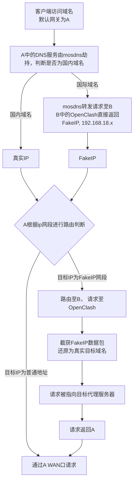

+++
title = '家庭网络设计方案：从理想到实践的两年演进'
date = 2025-08-09 20:09:05
tags = ["home"]
categories = ["home"]
+++

# 前言
早在毕业后的租房时期，我就时常期待拥有自己的家后要如何改造家庭网络。每次看到网上博主分享内网万兆传输、服务器机柜、NAS 阵列等内容，都不禁心生羡慕。2023年新家入住后，我对家庭网络的改造断断续续持续了两年。到了2025年，终于是时候对这段历程做一些总结了。

这篇文章将重点回顾这两年来家庭网络结构的演进过程及背后的思考。

# 房屋结构和网络需求
房屋为精装交付，出于成本考虑，入住时未对结构进行大幅改造（这也为后续网络改造埋下了一些隐患😭）。简略结构如下：

入住前暴露的主要问题有以下几点：

1. 弱电箱嵌入在进门鞋柜内，空间非常有限，难以容纳较多设备，散热也较差。
2. 网口数量不足，无线AP只能放置在客厅，书房存在 WiFi死角。
3. 预埋网线为超五类，虽然短距离可支持万兆，但稳定性不佳。

我对家庭网络能力的主要需求如下：
| 需求              | 必要性 | 备注 |
| ---------        | ----------- | ----------- |
| 全屋透明代理       | ⭐⭐⭐⭐⭐       | 满足全屋代理的同时，需要过滤PT流量/大陆域名请求等
| 内网2.5G速率      | ⭐⭐⭐⭐⭐        | 综合考虑，部署万兆的成本过高，日常使用2.5G已够使用
| 内网穿透          | ⭐⭐⭐⭐          | 游戏联机/家庭相册共享需要
| 支持内网私有域名    | ⭐⭐⭐⭐         | 简化日常内网部署应用的使用
| 网络监控/恢复能力   | ⭐⭐⭐          | 提升故障问题发现率
| 智能家居内网部署  | ⭐⭐              | 提升响应速度并支持离线使用
| 隐私设备子网隔离 | ⭐⭐            | 摄像头、传感器类iot设备屏蔽公网
| 容灾能力          | ⭐             | 减少故障发生后的恢复时间

基于以上的需求，得到以下的初步结论
1. 由于需要全屋透明代理，故需要使用软路由做主路由的方案，这里我选用OpenWrt作为我的软路由系统。（个人不喜欢旁路由模式，不够透明也不够旁🐶）
2. 由于需要全屋2.5G速率，硬件上交换机/AP/设备网口均需要支持2.5G协商速率。（被只支持1G和10G的万兆卡坑过）
3. 由于需要内网穿透+私有域名等需求，需要软路由系统有相关的功能支持.(关注版本功能)
4. 由于需要智能家居内网部署，购买设备时需要关注是否支持 Zigbee / Matter 等协议。

# 2023年：从零搭建，先跑起来

## 物理拓扑
2023年的主题是建设，在入住后不久，我便设计了如下的网络拓扑：

可以看到这里用了不太常见的单臂路由作为主路由连接方案，并不是因为软路由只有一个网口，纯粹是当时考虑如果软路由放在弱电箱内散热不太好。

我的主要网络设备如下：
* 软路由：零刻EQ12(n100/16G)
* 交换机：TP-LINK网管交换机 + 水星非网管交换机
* 无线ap：小米AX7000
* 服务器：X11SCA-F + E2144G + 64G ECC

硬件配置上普普通通，甚至有些富裕。当然，在闲鱼淘的交换机还是带起了后续的一些变化（笑

## 系统架构

系统拓扑如下图所示

### 软路由

我在ESXi上虚拟化运行OpenWrt，主要出于以下考虑：
1. 部署便利：套一层虚拟机便于在更改网络配置时不需要进行物理空间内的布线调整。
2. 容灾能力：ESXi有完善的备份还原机制，通过备份可以快速恢复网络配置。
3. 性能考虑：觉得软路由性能过剩，除了OpenWrt还可以安装其他的系统（这点后来证明并不现实）。
4. 熟悉程度：相比PVE来说对ESXi更熟悉一些

OpenWrt使用了来自恩山的“高大全”版本，后来发现其中大部分功能并未用到，反而偶尔引发卡顿。

HomeAssistant直接部署在软路由中，主要原因一是软路由设备先于服务器购买，出于调教智能家居设备的原因先安装在软路由内。二是HA需要安装HAOS才能安装插件（即必须是虚拟机版本，不能部署在容器内），当时认为TrueNAS的虚拟机能力并没有ESXi好，所以服务器买来后也没有进行迁移（后来发现N100性能根本无法与E-2144G相比😅）

### 服务器

2023年618，我筹备组建第一台服务器，当时我对服务器的主要需求是以下几点：
1. 是一台偏存储的服务器，多盘位存储且支持SAS硬盘。
2. 支持ecc内存。
3. 带核显，支持视频硬解。
4. 支持RAID。
5. 可以装虚拟机/容器。

在淘了比较久的垃圾后，最终选用的配置如下：
* 主板: 超微X11SCA-F
* CPU: Intel E-2144G
* 内存: 三星DDR4 2666 ECC 32G*2 
* 硬盘: 希捷酷鹰4T*4
* 网卡: 迈络思MCX311A
* 机箱: 半人马座
* 电源: 海韵SGX500

这套配置里，最先选择的是机箱，因为家里没有位置放置机柜，想要多盘位又不想装较大的塔式机箱，最终入了半人马的机箱，颜值和扩展相对不错。

CPU上，2144g的性能和能耗较为平衡，且核显有QSV能力，能加速视频编解码，主频3.6睿频4.5也能较好的应付日常的计算工作。

内存上由于心心念念一直想要搞一套ecc内存，这次选用了三星的ddr4 2666的纯ecc内存条(24年还坏了一根😭)。

这套配置有几个小插曲，一是网卡一开始买的浪潮电口X540, 没想到居然不支持2.5G协商速率，害的我又重新买了一块。二是由于机箱比较小，虽然能装atx板，但硬盘接口的位置都被挡住了，没办法后续加装了一块SAS直通卡解决。

在系统上，由于是偏存储的服务器，系统更偏向选择一些具备nas功能的系统，在Unraid/TrueNAS等一众nas系统及linux原生/虚拟机系统的抉择下，我最终选择了以TrueNAS作为我的服务器系统，理由主要是以下几点:
1. 相比Unraid等NAS系统，TrueNAS使用ZFS文件系统，有完善的数据验证、快照、恢复等机制。
2. 相比直接部署linux系统, TrueNAS上有更易上手的RAID管理/监控等能力。
3. 相比部署虚拟机系统，如ESXi或proxmox，由于TrueNAS scale已经支持了虚拟机和容器，我不需要再加一层套娃。

RAID方面，我的4块4T酷鹰组了RAIDZ1(类似RAID5)，实际容量在10T左右，确保在一块坏了的时候能够不丢失数据恢复。

软件服务方面，我部署了以下的服务：
* qBittorrent：PT下载。
* Homepage: 家庭服务仪表盘。
* icloudpd: 同步iCloud照片
* Jellyfin: 媒体服务器。
* TinyMediaManager: 影视元数据刮削。
* PhotoPrism: 照片管理

### 智能家居
作为ios用户，加上购买了AppleTv、HomePod等一些设备，智能家居生态自然选择了Apple的HomeKit。主要设备有:

* 网关: Aqara M1S/HomePod
* 开关: Aqara D1
* 空调控制: 郎宁VRF
* 窗帘电机: Aqara
* 传感器: 小米人体传感器
* 门锁: 小米智能门锁
* 电视: AppleTv

Aqara设备通过网关直接接入HomeKit，小米设备则通过HomeAssistant桥接接入。

# 2024年: 问题浮现与系统优化

## 遇到的问题

2023年的架构基本稳定运行至2024上半年，期间虽然偶尔出现PT流量误走代理、OpenClash卡死等问题，但尚可接受。

然而以上的拓扑存在一个致命的缺陷: **弱电箱中的网管交换机成为单点故障**。一旦损坏，替换过程极为繁琐，需重新配置VLAN，且端口顺序必须与原配置一致。

而就在2024年的5月某天，那台网管交换机突然宕机了，我在重新下单等了2天收到货后开始配置，才发现完全不记得之前的VLAN设置了。当时正值618之际，在每天晚上下班仅有的2个小时内，花了2天才将家庭网络恢复如初。这促使我决心进行网络改造，重点是**稳定性和容灾能力**

## 链路可用性分析

既然要增强系统稳定性及容灾能力，那么首先需要梳理一下目前的网络链路以及相关的可用性需求。

| 链路                      | 可用性需求        | 达到可用时的最少设备           | 达到可用时的最少系统组件 |
| -----------------         | --------        | --------                    |  -------- |
| 国内访问（部分设备）	    |⭐⭐⭐⭐⭐       | 路由器                      | 无
| 无线连接	             |⭐⭐⭐⭐          | 路由器、AP               |无
| 书房有线连接            |⭐⭐⭐⭐          | 路由器、弱电箱到书房网线       |无
| 客厅有线连接	          |⭐⭐⭐⭐          | 路由器、弱电箱到客厅网线       |无
| 国际访问（部分设备）	   |⭐⭐⭐            | 路由器                      |OpenClash
| PC网络	             |⭐⭐⭐           | 路由器、PC                  |无
| 服务器网络              |⭐⭐             | 路由器、服务器               |无
| 智能家居可用            |⭐⭐              | 路由器、交换机、智能家居网关   |HomeAssistant
| 全设备国内访问	      |⭐⭐             | 路由器、交换机、AP          |无
| 全设备国际访问          |⭐⭐             | 软路由设备、交换机、AP       |OpenClash
| 内网穿透               |⭐              |软路由设备                     | 阿里DDNS、域名服务

其次，需要梳理一下网络中可能故障的节点以及其挂了后的影响面。对影响面的评估我分了以下几级：

- 致命: 对网络可用性或完整性产生重大影响，且无法通过备用设备进行快恢。
- 严重: 对网络可用性或完整性产生较大影响，但可以通过备用设备或降级部分功能完成核心功能恢复。
- 一般: 对网络可用性或完整性产生影响，但有备用链路可以使用，或允许接受功能降级的情况。
- 轻微: 有轻微体验影响的情况

先列举一下物理设备可能的故障:
|故障节点                  | 故障影响      |应急措施                          | 监测手段 |
|------------------       | ------      | --------                                          |  -------- |
|书房至弱电箱网线故障        | 致命         | 书房的有线网络失效，需要额外引入书房ap连入客厅ap进行上网   | 无有效手段 |
|客厅至弱电箱网线故障        | 致命         | 无线ap迁移至弱电箱内或书房，无线信号会受影响              | 无有效手段 |
|软路由设备故障             | 严重          | 软路由设备临时替换为普通路由器拨号上网                 | 通过ESXi和OpenWrt探活可知，但实际确认需要线下 |
|弱电箱内交换机故障          | 严重         | 替换备用交换机                                    | 无有效手段(原网管交换机有后台可以探活，但非网管的一般没有) |
|书房交换机故障             |  严重         | 替换备用交换机                                    |  无有效手段(同上) |
|服务器设备故障                 | 严重         | 无通用方案，根据故障情况处理                             | 软路由内部署脚本进行探活 |
|智能家居网关故障            | 严重         | 无应急方案                                            |  HA主动进行的设备探活 |
|无线AP故障                 | 严重        | 替换备用ap                                            |  通过无线ap的端口探活 |

然后是系统组件的可能的故障:
| 故障节点             | 故障影响 | 应急措施                                                    | 监测手段                                                   |
| -------------------- | -------- | -------------------------------------------------------| ---------------------------------------------------------- |
| ESXi故障           | 严重     | 若重启无法失效需要替换为普通路由器拨号上网                        | 通过ESXi管理端口探活                   |
| OpenWrt故障        | 严重     | exsi内通过备份快照快速恢复即可                                 | 通过OpenWrt管理端口探活      |
| TrueNAS故障        | 严重      | 需要重装系统，管理配置通过备份恢复                                | 软路由内部署脚本进行探活              |
| OpenClash故障      | 一般     |  重启或降级                                                   | 通过OpenClash端口探活 |
| HomeAssistant故障  | 一般     |  exsi内通过备份快照快速恢复即可                                   | 通过HA端口探活 |
| DDNS故障          | 轻微       | 重启/手动更新IP   | 无有效手段                                         |

## 物理拓扑的调整
根据上述的可用性优先级，我将物理拓扑图变成了这样:

从物理拓扑上来看，改变不算特别大，仅是将路由器从书房移回了弱电箱，但从稳定性的角度考虑，这一项调整让家庭减少了2个强依赖项，一个就是网管交换机，就算挂了我也可以替换为普通交换机，甚至不用交换机直连客厅AP,也能保证局部的网络可用。另一个就是去除了弱电箱到书房的网线这个强依赖，一旦网线出问题，仅需降级书房的有线网络即可保障部分可用性。

至于软路由的散热问题，一来在这一年的使用过程中，温度还算可控。二来我买了一个usb温控风扇贴着吹进行散热，整体评估放在弱电箱内问题不大。（是吗=。=）

## 系统架构的升级
在系统拓扑方面，改造的东西就相对较多一些了，在聊改造细节之前，我们还是先来看看当下遇到的问题有哪些：

1. 由于OpenClash的性能问题，导致间歇性的断网。
2. 当OpenClash的目标节点异常时没有主动感知，在连不上外网或者速度很慢时才能发现进行切换。
3. PT流量会经过代理服务器导致流量耗尽。
4. 所有数据共用一个磁盘组，PT和重要数据的区分不够，有数据丢失风险，重要数据没有备份机制。
5. 网络的整体监控能力较弱，出现问题无法溯源。
6. 缺少各关键节点的容灾能力。

为了解决以上的问题，系统的拓扑变成了这样：

## 软路由内的调整

由上图所示，软路由内最大的一个改变，就是将OpenClash从拨号的OpenWrt内剥离了出去，并将拨号用的OpenWrt更改为了自编译的精简版本，插件只包含了阿里ddns和mosdns，其中阿里ddns用于内网穿透，而mosdns用做代理分流使用。

首先需要说明一下这样调整后的网络请求顺序，为方便说明，拨号用的OpenWrt简称为A， OpenClash所在的OpenWrt简称B：

如图所示，在这种网络链路下，国内请求不会经过OpenClash，同时为了控制OpenClash影响的CPU和内存范围，我选择在ESXi内单独起了一个虚拟机，用ESXi进行最大CPU和内存的限制，尽可能做到在OpenClash异常时不会耗尽整个路由器资源。至于为什么要再套一层OpenWrt而不是直接部署OpenClash，那是为了后续有其他插件需要安装时也可以从主链路中剥离开。

而在2024年，为什么我还将HomeAssistant部署在软路由内，原因是当时高估了软路由的性能，并且因为担心服务器挂了可能会影响智能家居设备=.=

## 服务器的调整

首先提一下硬件上的调整(上图中没展示出来)，由于需要按资料重要性进行资源隔离，我新增了2块二手12T的氦气盘组了RAID 1阵列，高频读写的PT、影音等数据存在这个阵列内，原先的阵列用来存放家庭照片、数据备份、文档备份等。

然后是服务器内部署的一些应用进行了调整:
+ 移除Jellyfin：由于我没有在外看视频的需求，在家的话不需要在服务器上进行解码，直接传流手机解码即可，最终方案是在手机和电视上安装了infuse作为媒体观看软件。
+ PhotoPrism替换为MTPhotos: PhotoPrism属实难用。
+ 新增 Alist（网盘管理）、Calibre（电子书管理）。
+ 部署Ubuntu虚拟机: 用来部署相关的监控脚本。
+ 计划上会添加上prometheus+grafana作为监控套件，但实际2024年并未添加

在增强稳定性方面，服务器上的脚本担任了绝大多数的任务需求，整个监控体系如下图所示:

其中的脚本都是非常简单的shell脚本，通过http请求对应服务的管理接口，有数据就当有心跳。这里可以看出当时的一个观点：只要不挂都不是大问题（笑）。但这套体系还是有不少的监控盲区和问题，最显而易见的，就是当OpenWrt或者ESXi挂了的时候，push消息根本发不出来（这个问题居然一直到了25年才被反应过来）

# 2025年: 体系化与稳定性建设

## 发现问题

上述调整后的架构完美运行了很长时间，期间没有发生任何大问题，偶尔的clash异常也能在重启后恢复。但没出大问题也就意味着上述的降级容灾措施并没有被实际验证过。

时间来到2025年的夏天，某个周末开始网络会时不时出现卡顿，一开始还以为是PT下载的缘故，由于持续时间不长就没太关注。但慢慢的卡顿频率越来越多，有时候OpenWrt的CPU占用会飙升到100%，排查发现OpenWrt内CPU占用最高的线程是ksoftirqd，ksoftirqd是一个处理软中断的线程，它占CPU高往往是结果而不是原因。深入排查发现在弱电箱内的软路由在正常情况下就烫的厉害，那会不会是因为软路由散热不好导致CPU降频或网卡异常进而触发了软中断爆炸呢，在换了一个更大的散热风扇后，这个情况再没有发生。

这个事件让我看到了2个问题：

1. 现有监控无法捕捉瞬时异常，缺乏历史数据追踪。
2. 软路由的负载过高，需进一步划清设备职责。

这样下来，2025年的改造目标，重点就是：

**建设体系化监控+设备能力单一化**

## 监控体系升级

其实在2024年的规划中，就已经画出了grafana+prometheus的套件组合，但由于prometheus过于原始的配置方式，加上当时认为脚本探活就可以完成家庭网络的监控工作，这2者并没有被使用起来。

回到现在，监控体系还是选择使用grafana+prometheus的组合，毕竟开源解决方案很多。安装后的效果如下。

关于prometheus exporter的选择，目前是这样的:

| 监控节点              |  拉取速度     | 核心关注指标                                      |exporter来源|
|------------------   | ------      | --------                                          | --------          |
|OpenWrt              | 5s          | CPU使用率、内存使用率、load、网络io、活跃连接数                    | OpenWrt软件包内自带         |
|HomeAssistant      | 30s           | 设备电池电量、空调使用时间                                         | HA插件                                                  |
|TrueNAS            | 5s      | CPU使用率、内存使用率、load、磁盘io、网络io|  https://github.com/Supporterino/TrueNAS-graphite-to-prometheus   |
|qBittorrent        | 60s        | 下载/上传速度、做种数                                             |  自建                 |
|OpenClash          | 20s         | 下载/上传速度、流量使用量、活跃连接数、国内/国际ping延时            |  自建                 |

需要提的是为什么没有ESXi的exporter，原因是不想为了监控再装一个vCenter了=。=

## 日志

> 日志及下述单一化的部分在这篇文章写作之时并没有完全调整完成，这里主要说一下我的方案。

既然监控使用了grafana，日志当然使用promtail+loki的配套搭配，但看了文档发现promtail目前已经被弃用了，替代者是alloy，所以整个的日志方案就变成了alloy(日志采集)+loki(日志存储)+grafana(日志看板)的组合拳。

TrueNAS内的日志采集直接部署alloy应用即可，日志基本集中在/var/log目录下，我目前是采集了/var/log/containers/*和/var/log/syslog.log用以监控应用和系统的关键日志。

OpenWrt的日志采集，我决定参考 [github](https://github.com/defanator/openwrt-loki-exporter?tab=readme-ov-file) 的方案在OpenWrt内直接部署日志上报的功能。

ESXi和HomeAssistant暂不接入。

## 设备职责单一化

在软件工程里，KISS原则是一个非常重要的工程实践方法。回看前两年迭代的结构演进，有哪些地方违法了KISS原则呢？

1. 为了减少OpenClash对系统的影响，引入了mosdns进入主链路。
2. 软路由内部署了HomeAssistant。
3. 存储服务器承担了越来越多的计算工作。

要如何解决这3个问题呢，我目前的方案如下：

关于问题1, 当我在2025年再次审视clash的配置时，发现其实clash本身就支持dns分流及按配置绕过内核，引入mosdns似乎并不需要，于是我将2个OpenWrt再次删减为一个，仅使用OpenClash的规则配置进行流量分流，这个方案带来的唯一问题可能CPU会被clash吃满，但这通过监控也可以完成clash自动启停。关于clash的配置，github上的[这个仓库](https://github.com/Aethersailor/Custom_OpenClash_Rules)有非常详尽的教学，可以参考。

关于问题2, 很好解决，我将HomeAssistant从软路由迁移至服务器。

关于问题3，这实际是个成本问题（哈哈）。随着监控和日志系统的完善，我计划观察一段时间服务器使用，如果确实日常计算量很高，可能会考虑增加一台专用计算的设备保障存储设备的稳定性。（比如mac mini）

# 最后

家庭网络的建设是一个持续迭代的过程，从最初的“能用到”到“稳定用”，再到“高效与可观测”，每一个阶段都伴随着新的挑战与解决方案。本文重点分享了设计思路与架构演进，具体技术细节将在后续文章展开。如果你也正在构建家庭网络，希望本文能为你提供一些参考。