+++
title = '代理协议全流程解析'
date = 2026-05-22 11:00:00
tags = ["program"]
categories = ["program"]
draft = true
+++

# 前言

> **声明**：本文为基于公开学术论文（IMC 2020、USENIX Security 2023 / 2024 等）和开源项目讨论的协议技术综述，目标是梳理各代代理协议在网络协议层的设计取舍与演化逻辑，不涉及任何具体配置教程、服务部署或工具推广，仅作网络协议技术研究学习参考。

4月一波大清洗使我用的机场不停的切换协议，加上最近关于[VLESS的漏洞讨论](https://github.com/Anonymous376c1d0cf28/VLESS-cracker)，这让我产生了好奇心，用代理工具十多年了，也没有仔细看过各个代理协议的具体差异。网上目前有的一些博文对协议内容本身的介绍也比较浅，在一通翻阅研究+AI的辅助下，也是写出了本文的内容。

# 进化树

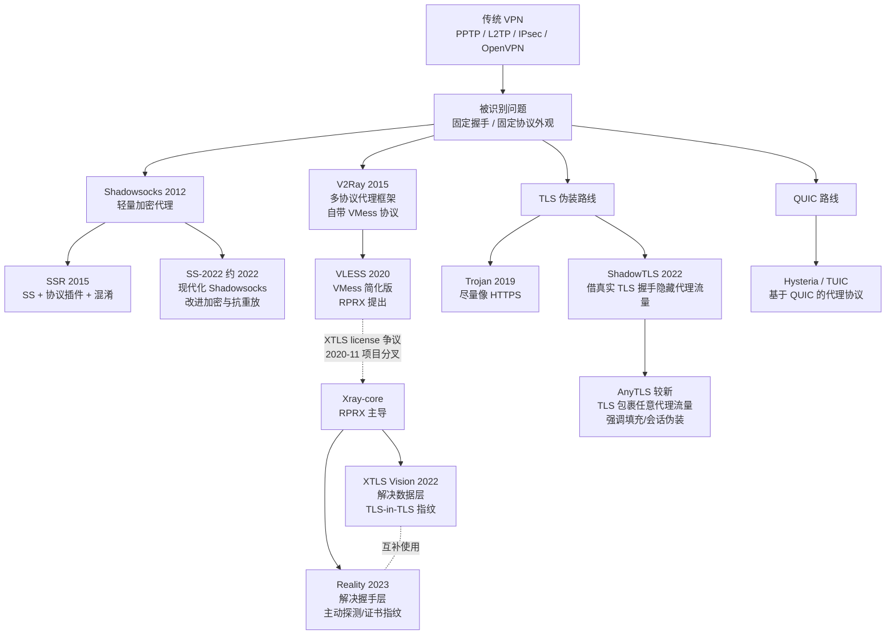

# 代理请求的通用链路

在进入具体协议之前，先建立一个统一的视角。绝大多数代理工具，链路都可以抽象成这四段：

```text
浏览器 / 应用
   |
   v
本地代理客户端（监听 SOCKS5 / HTTP / TUN 等）
   |
   v
远程代理服务器
   |
   v
目标网站
```

不同协议的差别，主要体现在**本地代理客户端到远程代理服务器的连接**长什么样：

- 是 UDP 隧道还是 TCP 流？
- 是裸的密文，还是包在 TLS 里？
- 是不是有协议握手、认证、混淆？
- 流量是不是看起来像普通 HTTPS？

接下来我们按进化树的顺序，依次看每个协议在这条链路上怎么走。

# 传统 VPN

VPN 最早不是为代理穿透设计的，它的本职是在公网上建立一条到企业内网的安全隧道。它的工作方式是在系统里创建一张虚拟网卡，把所有流量路由进加密隧道。

这里不详细描述他的工作机制了，目前不用 VPN 做代理协议的主要原因是 VPN 走单一连接 + 清晰的握手指纹（协议包头 + 固定端口），非常容易被被动 DPI 识别。

# Shadowsocks家族

## Shadowsocks

Shadowsocks 在 2012 年发布。它回到更简单的代理形式：本地监听一个端口，把代理流量加密后转发到远程服务器。

Shadowsocks的代理流程比较简单，通过TCP和代理服务器建立连接后，后续所有请求都走加密发送，相比VPN，Shadowsocks的核心差异在于它取消了握手环节，而且走按需连接的模式（不再是单一TCP长连）

### 工作流程

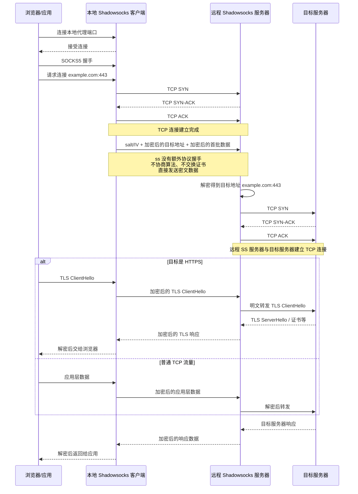

### 问题

Shadowsocks 的实现比较简单，但也因此在被动 DPI 视角下，SS 的所有报文都是一坨什么都不像的随机密文。具体来说，SS 流量在被动观察下有这些非常显眼的特征：

- **首包就是高熵随机字节**。正常的 HTTPS 首包是 TLS ClientHello，HTTP 是 `GET`/`POST`，SSH 开头有版本号字符串。SS 的首包是 `salt + 加密的目标地址`，整体看上去就是"一段没有任何结构的随机数据"。这种"什么都不像"本身就是一种特征。
- **没有任何协议握手**。没有版本号协商、没有证书交换、没有能力协商。一条 TCP 连接建立后立刻进入加密数据传输阶段，这种行为在公网上的合法应用里几乎不存在。
- **包长分布固定**。每个 AEAD chunk 是 `[2 字节长度][16 字节 tag][payload][16 字节 tag]`，连续抓几个包就能看出规律。
- **服务器对任何 TCP 连接都"愿意解密"**。探测方可以主动连过来发一段随机数据，观察服务器的响应模式（是直接关闭、还是等超时、还是回错误）来推断这是不是一个 SS 服务器——这就是**主动探测**。
- **流量汇聚**。一个境外 IP 上，长期出现来自同一个客户端的、大量"看起来不像什么"的高熵 TCP 连接。从被动观察者视角看就是一个非常异常的流量画像。

总结起来，SS 在被动 DPI 面前主要暴露了两个核心问题：

1. **被动 DPI 一眼能识别**——流量不像任何已知协议。
2. **主动探测无法防御**——服务器对任意 TCP 连接都会尝试解密，行为差异容易暴露身份。

后续的 SSR、V2Ray、Trojan、ShadowTLS 等协议，本质上都是在不同方向上解决这两个问题：是该给流量"加一层伪装"（SSR 的 obfs），还是该把流量"塞进一个真协议里"（Trojan 的真 HTTPS、ShadowTLS 的真 TLS 握手）。

## ShadowsocksR

ShadowsocksR（SSR）是 2015 年从 SS 分叉出来的版本，目标是增强抗识别能力。

SSR 的思路是在 SS 的加密代理上增加了2层包装，分别对应这两个问题：

```text
明文 -> protocol 包装 -> 加密 -> obfs 混淆 -> 网络
       ↑                          ↑
       抗主动探测、抗重放          骗过 DPI 的首包识别
```

### obfs：让流量看起来像别的协议

`obfs`（obfuscation 的缩写，"混淆"）解决的是 SS 暴露在**被动 DPI** 下的问题——让流量看起来像 HTTP 或 TLS，从而触发 DPI 的"这是合法 Web 流量"判断。

这里说的"装"不是加密，加密是另一回事。obfs 不动数据的安全性，只动数据的**外观字节**。常见的几种：

- `plain`：什么都不做，等同原版 SS
- `http_simple` / `http_post`：把首包伪装成 HTTP `GET` / `POST` 请求
- `tls1.2_ticket_auth`：整条连接都包在 TLS Record 里，长度还做随机化

具体的协议清单和实现见 [SSR 协议插件文档](https://github.com/shadowsocksrr/shadowsocks-rss/blob/master/ssr.md) 与 [shadowsocksr-native 源码](https://github.com/ShadowsocksR-Live/shadowsocksr-native/tree/master/src/obfs)。

但 obfs 这条路有个根本局限：**它伪装的是协议的字节外壳，不是协议的真实行为**。

以最强的 `tls1.2_ticket_auth` 为例，它是用 C 代码硬拼字节让流量"长得像"TLS，但**没有真 TLS 库在背后跑**——没有真的密钥协商、没有真证书、没有 ALPN、TLS 版本写死 1.2、ClientHello 的 cipher suites 是固定模板（导致 JA3 指纹全球独一无二）。识别方后来识别它走的就是"握手字节像 TLS、但应用层行为完全不像"。

要让流量"是" TLS 而不是"像" TLS，就得引入真 TLS 库——那是后来 Trojan 和 ShadowTLS 走的路。

### protocol：让服务器拒绝未知客户端请求

protocol 解决的是 SS 暴露的另一个核心问题——**主动探测**。

原版 SS 服务器在收到 TCP 连接后会**对任何到达的数据都尝试解密**。这种主动配合在不同输入下会表现出可观察的行为差异（关闭时机、TCP 状态等），让探测方能反向确认这是不是 SS。SSR protocol 层就是为了应对这类已经在发生的主动探测而设计的，后来 IMC 2020 论文<sup>[\[1\]](#ref-1)</sup>系统地归纳了其中 7 种探测手段（5 种重放 + 2 种随机长度），从学术上印证了原版 SS 在这条攻击面上的脆弱性。

SSR protocol 层的核心思路：**把服务器从"配合"改成"先验身份"**——客户端在数据前加一段认证头，服务器先校验认证头，校验通过才走正常处理路径，校验不过就保持沉默。

认证头里包含几个关键字段：

- **HMAC**：用预共享密码派生的密钥算，没密码算不出
- **utc_time**：防长期重放（录一年前的流量再放，时间戳早过期）
- **client_id + connection_id**：防短期重放（刚录的流量立刻回放，组合已用过）
- **uid**：用户 ID，区分同一服务器上的不同用户（机场单端口多用户的实现）

完整的认证头结构相当复杂，包括嵌套的 AES blob、三层 HMAC、随机填充等，详见源码 [src/obfs/auth.c](https://github.com/ShadowsocksR-Live/shadowsocksr-native/blob/master/src/obfs/auth.c) 和 [src/obfs/auth_chain.c](https://github.com/ShadowsocksR-Live/shadowsocksr-native/blob/master/src/obfs/auth_chain.c)。

需要强调的是，认证不是**只在首包做一次**——首包是重认证，包含 `utc_time` / `client_id` / `connection_id` / `uid` 这些全局身份信息；之后每一个数据包都有一份轻量 HMAC + 自增的 `recv_id` 序号校验，HMAC 密钥是 `user_key + recv_id`，每包都不一样。这意味着：篡改任何一字节会让当前包 HMAC 失败、丢包或重排会让 `recv_id` 对不上、录制后重放也会因为序号已经超出而失败——三种攻击都会触发跟首包认证失败一样的处理路径（按下面的协议派别有不同行为）。

值得提的一点是，不同的protocol协议在校验失败时的行为完全不同——这直接决定了它们对主动探测的防御能力：

| Protocol | 校验失败时行为 | 抗主动探测 |
|---|---|---|
| `auth_sha1_v4` | 立刻关闭连接 | 弱（关闭时有指纹） |
| `auth_aes128_md5` / `auth_aes128_sha1` | 降级到原版 SS 处理路径（为兼容原版客户端） | 几乎等同原版 SS |
| `auth_chain_a/b/c` | 挂连接不响应、不主动断 | 强（看起来像普通沉默端口） |

auth_chain_* 那种"挂着不响应"的处理在探测器视角看，服务器表现得像一个普通的"在 listen 但没业务"的端口。这种端口在公网多得是（防火墙后的内部服务、honey pot 等），审查方不能把所有这种端口都封，因此抓不到 SSR 服务器的指纹。

这种机制在网络攻防里叫 **Tarpit**（焦油坑）——故意让 TCP 连接挂在 ESTABLISHED 状态消耗探测者的资源。代价是服务端自己也得维持这些半死连接，理论上遇到大规模并发探测会更快耗尽 fd；不过实际部署中有 socket idle timeout 和 OS keepalive 兜底，正常运维不会出问题。

我感觉这也是 SSR 后期教程都推荐 `auth_chain_a` 而不是 `auth_aes128_sha1` 的主要原因（当然还有原因是auth_chain_a支持包长随机化和自带RC4加密，但和主动探测的防御比感觉还是差一些）。

### 完整流程

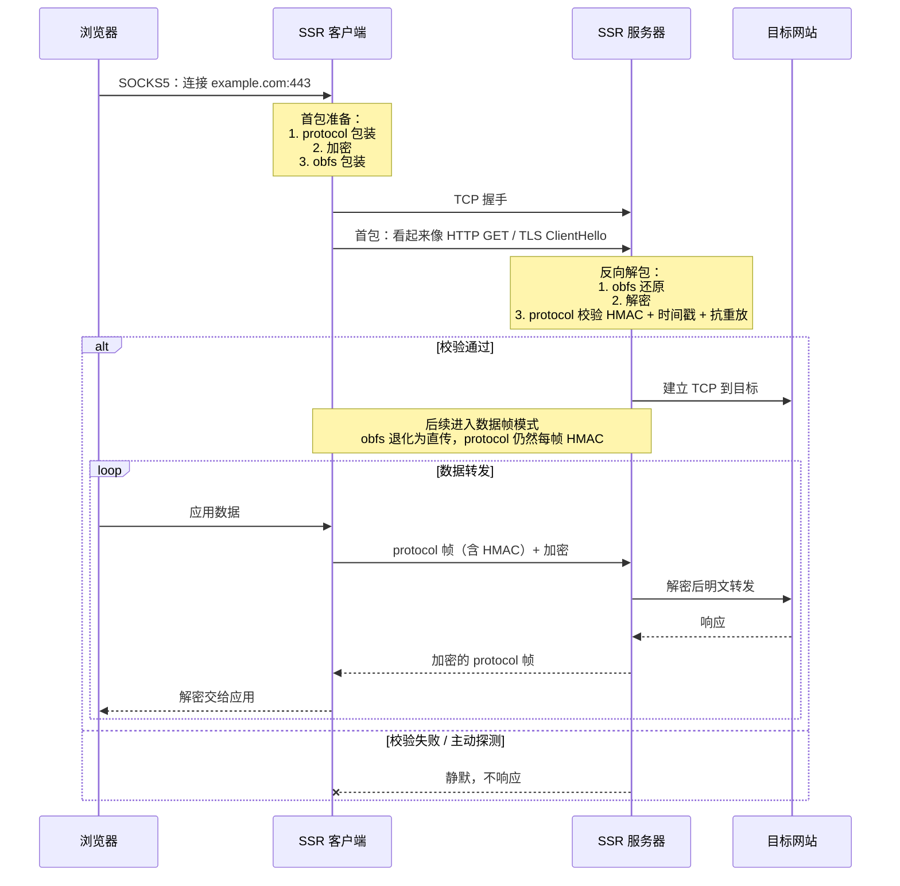

在2026年的现在来看，SSR 走的是 **在 SS 上打补丁** 的路线，而同时期出现的 V2Ray 走的是 **重新设计协议 + 传输层伪装** 的路线。后来的演化证明，**协议无关 + 真实 TLS 隧道** 比 **在协议里塞混淆** 更有生命力——这也是为什么 SSR 在 2020 年之后逐渐淡出主流。

SSR 社区后期也意识到这条路走不通——在原版作者破娃删库退场后，接手做 C 版重构的 [shadowsocksr-native](https://github.com/ShadowsocksR-Live/shadowsocksr-native) 维护者实验性地在项目里加了 `SSRoT`（SSR over TLS）模式：让客户端先用真 TLS 连到一个监听 443 端口的服务器，再在 TLS 隧道里跑 SSR 流量。但这个模式启用后会强制把 obfs/protocol 都关掉——因为外层真 TLS 已经替代了它们的功能。

后来同一作者干脆把这套思路抽出来做了独立项目 [overtls](https://github.com/ShadowsocksR-Live/overtls)，砍掉 SSR/SS 只保留 over-TLS。这个演化路径本身就是个有趣的注脚：**SSR 这条"贴补丁"的路最终被它自己的维护者用一个"重新设计"的项目终结了**——而 overtls 的设计思路（真 TLS 隧道 + 简化协议）跟同期的 Trojan、ShadowTLS 已经基本同构。

## Shadowsocks 2022

Shadowsocks 2022（SS-2022，对应规范 SIP022<sup>[\[4\]](#ref-4)</sup>）发布于 2022 年。它和 SSR 解决的是同一类问题——原版 SS 的密码学缺陷 + 抗探测能力差，但改进的层面完全不同：

- **SSR**: SS 协议本身一字没动，在它前后各包一层——`obfs` 在最外层套外壳骗 DPI、`protocol` 在最内层加认证头防探测。原版 SS 客户端只要不开这两层还能跟 SSR 服务器互通。
- **SS-2022**: 直接动 SS 协议格式本身——请求头结构、KDF、密钥规范全重做，跟原版 SS 客户端不再互通，但主流程（基于 PSK 的 AEAD 流式代理）完全继承自 SS。

由于SS-2022的主流程跟原版 SS 没什么区别（仍然是 TCP 握手 + 加密 payload 直连目标），所以不再单画图了，重点看协议层修了哪些原版的问题：

**问题 1：nonce 复用 → AEAD 崩溃**

> **问题**：原版 SS 的 AEAD nonce 从 0 递增，如果服务器重启后 RNG 熵不足、两条连接拿到相同的 salt，session key 就相同、nonce 又都从 0 开始——同密钥同 nonce 加密两条不同消息，GCM 直接被打穿。
>
> **方案**：salt 加入 60 秒去重缓存 + 用 BLAKE3 派生 session key 时绑定 salt 和 timestamp。

**问题 2：重放可被用作主动探测**

> **问题**：原版 SS 服务器对任意 TCP 流都尝试解密。审查方录下合法流量、几小时后回放——服务器正常解密、正常响应——这本身就是 SS 服务器的强指纹。
>
> **方案**：请求头强制带 8 字节 timestamp（±30 秒窗口）+ salt 60 秒去重 + 响应必须回显 request_salt。相当于把 SSR protocol 层的三道防线集成进核心协议。

> **更进一步**：2022-05 的破坏性改动把 type + timestamp + length 移到一个独立的 fixed-length header chunk（共 27 字节，刚好 ≤ 一个 TCP segment）。**服务器一次 read 就能判断包是否合法**，不合法立刻关连接，不用像旧协议那样"无限读直到能解密"——杜绝了"一字节一字节投喂、观察服务器关连接时机"的探测攻击，顺便堵了"打开大量空连接耗尽服务器"的 DDoS。规范甚至规定了关连接要用 SO_LINGER=0 强制 RST 或 shutdown(SHUT_WR) 假装 FIN，避免暴露"读了多少字节"这个侧信道。

**问题 3：密码弱 + KDF 过时**

> **问题**：原版 password 是任意字符串，用 EVP_BytesToKey（基于 MD5、无 salt）派生密钥，但MD5 早被打穿，弱口令直接被字典爆破。
>
> **方案**：禁用 EVP_BytesToKey，PSK 必须是 base64 编码的真随机字节。

**问题 4：请求格式不统一**

> **问题**：原版格式是 [salt][AEAD(目标地址 + payload)]，目标地址和 payload 黏一起、无显式 length、没扩展位置。
>
> **方案**：拆成 salt + fixed-length header + variable-length header + payload chunks，每段独立 AEAD 封装。新增 type 字段显式标记消息方向（防"请求当响应回放"的消息混用攻击），padding 字段强制存在（防"客户端先连后发"的首包大小指纹）。

其实可以看到 2022 最大的改动就是修了一堆的密码学问题，但流量在数据层面仍然是"高熵随机字节"，审查方不还是能识别吗？

**是的，审查系统仍然能识别裸跑的 SS-2022 流量**。USENIX Security 2023 那篇 [《How the Great Firewall of China Detects and Blocks Fully Encrypted Traffic》](https://www.usenix.org/conference/usenixsecurity23/presentation/wu-mingshi)<sup>[\[2\]](#ref-2)</sup>就专门研究了这件事——论文实测的检测目标**不是某个具体协议**，而是"前 N 字节熵接近 1 的 TCP 流"，这是个**协议无关的特征**。SS、SS-2022、裸跑 Trojan、VMess、Hysteria 全部中招。所以 SS-2022 单独裸跑在审查严格的网络环境基本活不下去。

那 SS-2022 这一堆改进还有什么意义？意义在于：**SS-2022 解决的是"加密协议层"的问题，不是"流量外观层"的问题**——这是两类完全不同的问题：

| 层 | 解决什么 | SS-2022 改了什么 | 谁来解决"流量外观"？ |
|---|---|---|---|
| 加密协议层 | nonce 复用、重放探测、弱密码、消息混用、按字节探测 | ✅ 全部 | — |
| 流量外观层 | 让流量看起来像 HTTPS / Web 流量，逃过熵分析和包长统计 | ❌ 没改 | 伪装层（ShadowTLS、v2ray-plugin 等） |

所以实际部署中，SS-2022 一般不单独使用。在国内能上的机场，SS-2022 节点基本都是这样配的：

```text
┌─────────────────────────────────────────────────┐
│  ShadowTLS / v2ray-plugin (websocket-tls)        │  ← 外层伪装：真 TLS 握手 + Web 流量外观
├─────────────────────────────────────────────────┤
│              Shadowsocks 2022                    │  ← 内层加密：抗重放、抗探测、强密码学
└─────────────────────────────────────────────────┘
```

被动观察者看到的是：真 TLS 1.3 握手、合法证书、正常 Web 流量模式。内层那个"全随机字节流"根本看不到，被外层 TLS 包了一层。

这种"加密协议 + 伪装层"分离的架构思想，跟后面要讲的 V2Ray 多协议框架是同一种品味，也是 SS 家族在 2026 年的现在仍然活跃的根本原因。后面讲的 Trojan、Reality 走的是**另一条路**——协议本身就是真 HTTPS / 借用真实 TLS 服务器，不分层、一体化。两条路都活到了今天，各有适用场景，构成了现代抗审查代理协议的两大流派。

# V2Ray / Xray 家族

这一家族需要先区分一下各自名称和其来源，之前看这个就迷迷糊糊的

| 名称 | 性质 | 说明 |
|---|---|---|
| V2Ray | 软件项目 | 2015 年起步的多协议代理框架。2019 年作者退场后由 V2Fly 社区接手维护，仓库改名 [v2fly-core](https://github.com/v2fly/v2ray-core) |
| Xray | 软件项目 | 2020 年 11 月从 v2fly-core 分叉出来的项目[Xray-core](https://github.com/XTLS/Xray-core)。项目分叉源于一次[开源社区治理事件](https://github.com/v2ray/v2ray-core/issues/2789) |
| VMess | 协议 | V2Ray 自带的代理协议 |
| VLESS | 协议 | VMess 去加密简化版协议 |
| XTLS | 协议扩展 | 通过拦截内层TLS加密，以减少 TLS-in-TLS 的性能损耗，同时减少 TLS-in-TLS 指纹 |
| XTLS Vision / Reality | 协议扩展 | XTLS 进化版 + 借真实 TLS 握手机制（2023），这两个是真正在 Xray 项目里原生诞生的 |

V2Ray / Xray 家族真正的核心贡献不是某个具体协议，而是把"协议"和"传输层"解耦的框架式设计——这两层是**正交**的，可以任意组合：

- **协议层**（认证 + 封装目标地址 + body 字节格式）：VMess、VLESS、Shadowsocks、Trojan 等都能作为 inbound/outbound
- **传输层**（怎么把这些字节运过公网，决定被动观察者视角下的流量外观）：TCP、WebSocket、gRPC、HTTPUpgrade、xhttp、mKCP、QUIC 等可以自由组合

不同传输层在被动观察者视角下完全不一样：

| 传输层 | 被动观察者看到的样子 | 典型用法 |
|---|---|---|
| TCP（裸） | 高熵随机字节流 | 已被证实高风险，仅内网/调试 |
| WebSocket + TLS | TLS 握手 → HTTP Upgrade: websocket → 加密帧 | 经典方案，**可走 CDN**（Cloudflare 等） |
| gRPC + TLS | TLS 握手 → HTTP/2 双向流 + protobuf 帧 | 看起来像 RPC 服务，CDN 友好 |
| HTTPUpgrade | TLS 握手 → HTTP Upgrade，但不进 WS 帧协议 | WS 的轻量替代（2024 出） |
| xhttp | TLS 握手 → 多种 HTTP 模式（packet-up / stream-up / stream-one） | Xray 2024 新出，统一 HTTP 系传输 |
| mKCP | UDP + V2Ray 自有可靠传输头 | 高丢包网络，无伪装 |
| QUIC | UDP + QUIC 握手 | 现代但部分网络环境会针对性干预 |

任何"协议 × 传输层"的组合都能拼出来——常见的有：

- VMess + WS + TLS + CDN：经典机场配置
- VLESS + Reality：2023+ 主流抗审查
- VLESS + gRPC + TLS：走 HTTP/2 长流
- Trojan + TCP + TLS：最早的"伪装成 HTTPS"路线
- Shadowsocks(SS-2022) + WS + TLS：V2Ray 框架内的 SS 也能这么搭

> 因此下面 VMess / VLESS / XTLS-Reality 各小节的 工作流程 图都**只画协议层逻辑**——图里"通过 transport 发送"那一行实际上对应上表中任一种载体，差异不再展开。

家族内部的演化主线：**协议本身越做越简单（VMess → VLESS 砍掉了一大半），伪装机制越做越深（裸 TCP → WS+TLS → Reality）**——把"加密"职责交给外层 TLS、"伪装"职责交给真实大站点的握手，协议本身退化到只负责认证和路由。这跟前面 SS-2022 章节末尾讲的"加密协议 + 伪装层分离"是同一种品味，只是 V2Ray 家族走得更远。

下面分别看 VMess、VLESS、XTLS / Reality 的演化过程。

## VMess

VMess 是 V2Ray 最早的自有协议（2015），使用 UUID 作为用户标识。
由于目前在跑的 VMess 基本都是 AEAD 版，下面以 VMess AEAD 为准描述工作流程（参照 [Xray-core/proxy/vmess/aead](https://github.com/XTLS/Xray-core/tree/main/proxy/vmess/aead)）。

### 工作流程

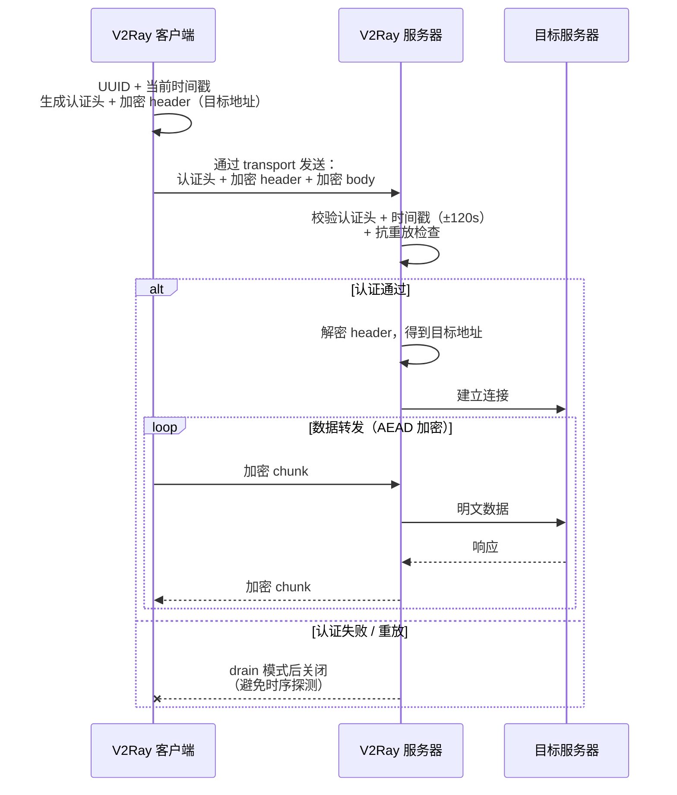

几个值得拎出来的实现细节：

- **抗重放**：除了 ±120s 时间戳窗口，还有一份长度 120 秒的 ReplayFilter，同一个 AuthID 在窗口内只能用一次，重放包直接拒绝。
- **body 加密三选一**：AES-128-GCM（默认，有 AES-NI 时性能最佳）、ChaCha20-Poly1305（ARM 嵌入式更友好）、None（明文，配合外层 TLS 时不再重复加密——这正是后来 VLESS 把"内层不加密"做成默认的思路源头）。
- **失败时不立即关连接**：服务端收到无法解开的 AuthID 时，不会立刻 RST，而是进入"drain"读完一段随机字节再关。这是为了对抗"用响应时序判断协议类型"的探测——和 SSR auth_chain_a 的 Tarpit 思路一致。

VMess 协议层做的事其实很朴素：**UUID + 时间戳的双因子认证**让一台服务器能同时服务多个用户（机场分发的基础），再把 SS 时代那种裸 AEAD payload 做得更结构化（版本号、命令字、地址类型等扩展字段）。

> 这里有一个小插曲，为什么一直说的是VMess AEAD，而不是VMess原版？ 是因为原版在 2020 年 5 月被一个 PoC 直接打穿[v2ray-core#2523](https://github.com/v2ray/v2ray-core/issues/2523)，攻击者只要 16 次重放探测就能精确判定服务身份。有严重的暴露风险。

> 顺带说一个相关但不属于 VMess 协议的插曲：跟 #2523 同一周，[v2ray/discussion#704](https://github.com/v2ray/discussion/issues/704) 显示 V2Ray 实现的 TLS 库使用了一组特殊 cipher suite，一行 iptables 字符串匹配就能精准封禁所有走 TLS 的 V2Ray 流量，这意味着 VMess+WS+TLS 这种经典套路也跟着翻车。直接修复是改用 Go 标准库 `net/tls` 默认配置；真正用 utls 模拟浏览器 ClientHello 是 2022-12（[PR #2219](https://github.com/v2fly/v2ray-core/pull/2219)）才合并到主线，跨度 2 年半。

就算上面这些具体漏洞都已修上，VMess 协议层本身还有两个内在的设计取舍绕不过去：**时间戳窗口（±120 秒）** 对客户端时钟有要求，机场用户经常因为系统时间不同步连不上；**加密和伪装捆在一起做**——配合外层 TLS 时内层的 AEAD 是纯粹浪费，而单独裸跑则没有任何抗审查能力。

后一个问题正是 VLESS 出现的直接原因——既然外层 TLS 才是抗审查的关键，那把内层加密整个砍掉就是最自然的下一步。RPRX 在 #2523 第二天就立即提出了 [VLESS 提案（#2526）](https://github.com/v2ray/v2ray-core/issues/2526)。下面我们来看看VLESS的方案。

## VLESS

VLESS 是 2020 年提出的VMess 简化版。（[#2636](https://github.com/v2ray/v2ray-core/issues/2636)），直到 2020-11 XTLS license 争议触发项目分叉，Xray-core 才从 v2ray-core 拆出来，把 VLESS 一起带走。今天 VLESS 在 [v2fly/v2ray-core](https://github.com/v2fly/v2ray-core/tree/master/proxy/vless) 和 [XTLS/Xray-core](https://github.com/XTLS/Xray-core/tree/main/proxy/vless) 两边都有实现，字节格式完全一致；只是 XTLS Vision 流控、Reality 抗探测这些后续扩展主要在 Xray 里发展。

核心理念是：**既然外层已经有 TLS，内层加密就是浪费**。VLESS 把 VMess 那套时间戳 + AuthID + ReplayFilter + AEAD 内层加密全部砍掉，协议字节结构直接简化为：

```text
[1 byte]    协议版本（目前 = 0）
[16 byte]   UUID（用户身份）
[1 byte]    Addons 长度 N
[N byte]    Addons（protobuf：Flow string + Seed bytes）
[1 byte]    命令（1=TCP / 2=UDP / 3=Mux）
[variable]  端口 + 地址
[variable]  payload
```

没有时间戳、没有认证哈希、没有 nonce、没有任何加密——身份完全靠 UUID 直接比对，加密和伪装全部交给外层 TLS。

### 工作流程

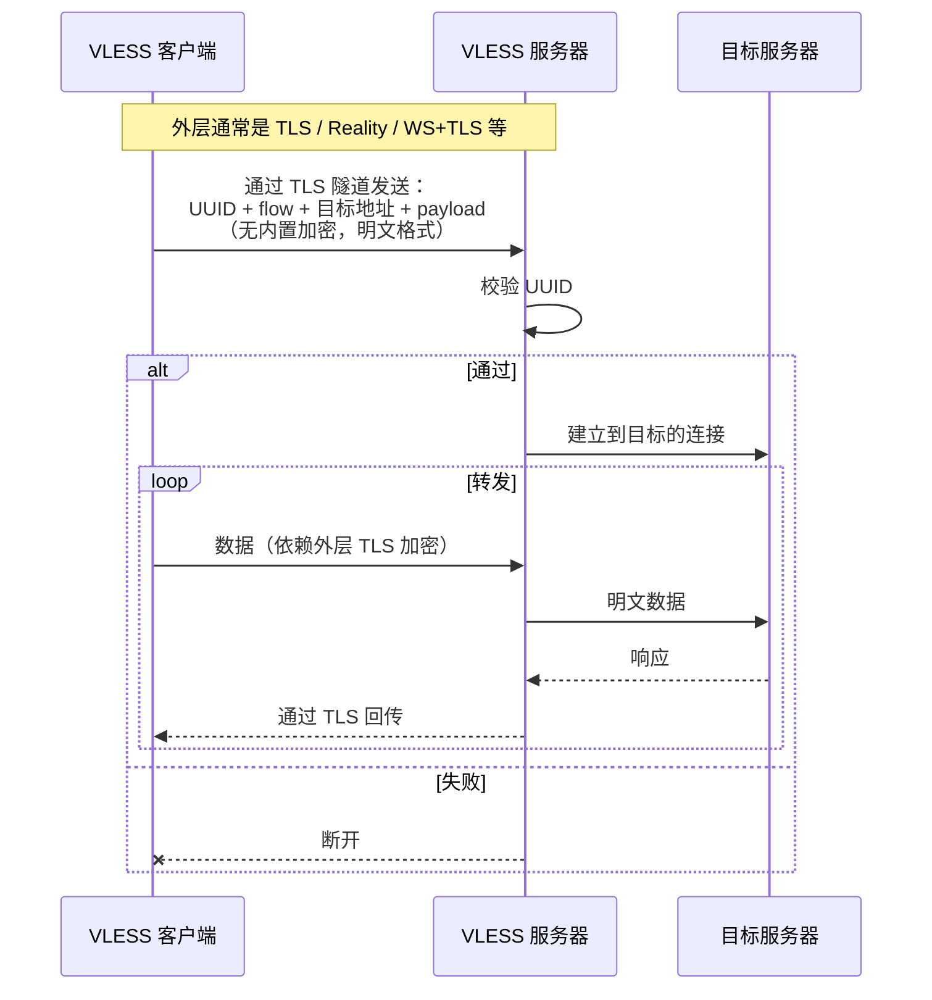

VLESS 的设计哲学是**做减法**。VMess 时代那套内层加密被全部砍掉，这带来了性能的直接提升，故障面也大幅缩窄，再也没有客户端时钟差 120 秒导致连不上这类问题。

但减法做到这种程度也意味着 **VLESS 单独裸跑就是明文** ，目标地址、UUID 全部以明文形式发送在网络上。它必须依赖外层（TLS / Reality / WS+TLS 等）提供加密和伪装，协议本身完全不抗审查，全部责任甩给传输层。

## XTLS / Vision

VLESS 把加密和伪装全部交给外层 TLS，但只有外层 TLS 还不够。理解这一点要先看知道一个具体场景，也就是TLS in TLS是什么。

### TLS-in-TLS 是什么

**当用户用 VLESS+TLS 访问 HTTPS 网站时，流量天然就是两层 TLS**，这里关键点是：浏览器并不知道中间有代理，它仍然在和目标地址（比如 example.com ）做端到端的 TLS 握手（这层叫 TLS-2），用的是 example.com 的真证书；而代理客户端把这条 TLS-2 字节流发送给代理服务器的时候，**自己又包了一层 TLS（这层叫 TLS-1）**，用的是代理服务器自己的证书（通常 Let's Encrypt）。

下面这张图里，**外框就是这层 TLS 的覆盖范围**：

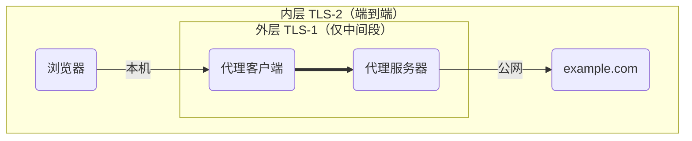

- **外层大框 = 内层 TLS-2**：用 example.com 的真证书加密，是浏览器和 example.com **端到端**的，跨越整条链路（浏览器以为自己在直接访问 example.com）
- **内层小框 = 外层 TLS-1**：用代理服务器自己的证书加密（通常 Let's Encrypt），**只覆盖中间一段**（代理客户端 ↔ 代理服务器）

在这种模式下，数据在公网上就会在内部形成**两层 TLS 嵌套**的结构：

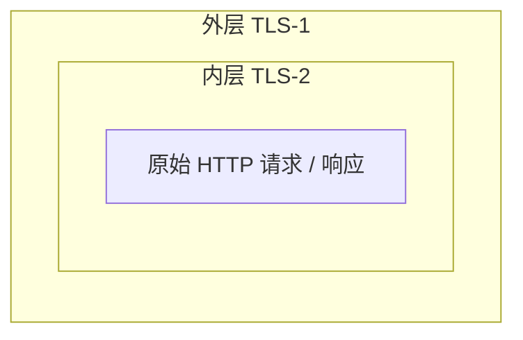

代理服务器只持有自己的私钥，它能拆掉外层 TLS-1，但拆掉后里面还套着一层 TLS-2——它解不开，只能把这层字节原样转发给真正的 example.com。

如果把上面那个嵌套结构展开时序，在"代理客户端 ↔ 代理服务器"这一段抓包看到的请求是这样的：

```text
[TCP 三次握手]
[TLS-1 ClientHello → 代理服务器]    ← 外层 TLS 握手
[TLS-1 ServerHello + Certificate]
[TLS-1 Finished]
─── 外层握手完成，进入数据传输 ───
[TLS-1 Application Data #1]  ← 里面包着 [TLS-2 ClientHello → example.com]
[TLS-1 Application Data #2]  ← 里面包着 [TLS-2 ServerHello + Certificate]
[TLS-1 Application Data #3]  ← 里面包着 [TLS-2 Finished]
[TLS-1 Application Data #4]  ← 里面包着 HTTPS 请求
...
```

注意第二段——**外层 TLS 数据传输的前几个包，内容正好是另一份完整的 TLS 握手**。这就是 "TLS-in-TLS"。

### 为什么 TLS-in-TLS 有指纹

TLS 加密只是把内层数据 + 16 字节 GCM tag 包起来，几乎不改变包大小。这意味着中间人虽然解不出 TLS-1 的明文，但能从外层包大小直接推断内层结构。

内层 TLS-2 握手各个消息的典型大小：

| TLS-2 消息 | 典型大小 |
|---|---|
| ClientHello | 200-500 字节 |
| ServerHello | 100-200 字节 |
| Certificate（真证书） | 1500-4000+ 字节（常被 TCP 分片成多个包） |
| ServerKeyExchange | 200-400 字节 |
| Finished | 50-100 字节 |

外层 TLS-1 加密后包大小只多 16 字节 tag——所以在数据层面看到的外层包大小序列就是：

```text
[~250B]        [~150B]        [~3000B 分片]   [~300B]   [~80B] ...
   ↑             ↑               ↑             ↑        ↑
ClientHello  ServerHello      Certificate       KeyEx  Finished
```

这个 **"中-小-大-中-小" 的包大小序列就是 TLS 握手的特征**——理论上，任何"在加密流的前几个包里出现这种序列"的连接，都可以被判定"这里面套着另一份 TLS"。

真实的 HTTPS 浏览（不通过代理）只有一层 TLS 握手序列，代理流量是**外层 TLS-1 握手序列 + 紧接着内层 TLS-2 握手序列**——两次握手在同一个 TCP 流里相隔很近，这是真实流量从来不会出现的特征。

这条特征被工程社区和学术界分别验证过：

工程社区里，RPRX 2022 年写过一个 30 行 Go 代码的 PoC [Trojan-killer](https://github.com/XTLS/Trojan-killer)，只看 TLS ChangeCipherSpec 之后的上下行字节区间就能从 Trojan 流量里精准识别；

学术侧 USENIX Security 2024 的论文<sup>[\[3\]](#ref-3)</sup>更系统地用机器学习做到 >99% 准确率，覆盖 Trojan / Naive / VLESS+TLS / SS+v2ray-plugin / HTTP-CONNECT-proxy+TLS 等多种协议。

所以 TLS-in-TLS 不是理论问题——它是被工程 PoC 和学术论文双重验证、且已经在真实网络上观察到部分部署的攻击面。这正是 XTLS Vision 这个协议存在的原因。

### XTLS 怎么解决：让"外层不再加密"

XTLS 是 RPRX 2020 年提出的对抗 TLS-in-TLS 的协议扩展，通过 VLESS 的 flow 字段启用。它有几代演进：

| Flow 值 | 时间 | 状态 |
|---|---|---|
| `xtls-rprx-origin` | 2020 | 最早版本，已弃用 |
| `xtls-rprx-direct` | 2020-2022 | 曾是主流，后来发现仍有指纹，已弃用 |
| `xtls-rprx-splice` | Linux 专属 | 用 `splice()` 做零拷贝，已弃用 |
| **`xtls-rprx-vision`** | 2022，RPRX 重新设计 | **当前主流，前面那些都不再推荐** |

**Vision 的核心思路是：握手阶段正常做 TLS-1，握手完成后，数据传输阶段尽量不再叠加外层加密**。具体步骤：

1. **TLS-1 握手必须真做**——握手的 ClientHello / ServerHello 字节有 JA3/JA4 指纹，骗不过去，这一步必须真按 TLS 标准跑
2. **握手完成后检测内层是不是 TLS 流量**（看初始字节是不是 `0x16` TLS Handshake record）：
   - 是（用户访问 HTTPS）：后续数据**复用外层 TLS-1 的 record 容器，但把里面的 AEAD 密文换成内层 TLS-2 的原始 record**（详见下文）
   - 不是（用户访问 HTTP 等明文）：还是用 TLS-1 加密，因为内层是明文
3. **流量整形**——做切包、合并、加 padding 等处理，破坏内层 TLS 握手的固定包大小序列（也就是上面那个"中-小-大-中-小"）

#### 第 2 步具体在做什么

一个 TLS record 在线缆上的结构是：5 字节明文 header（`type | version | length`）+ 不定长 body（通常是 AEAD 密文）。**Vision 改的是 body，不动 header**：

```text
没开 Vision (普通 VLESS+TLS)：

    [外层 TLS-1 header (5B 明文)]
    [外层 TLS-1 AEAD 密文 body]
                                ← 代理服务器持外层会话密钥，解开后得到下面这层：
                                ┌─────────────────────────────────┐
                                │ [内层 TLS-2 header]             │
                                │ [内层 TLS-2 AEAD 密文 body]     │ ← 代理服务器没有 example.com 私钥
                                └─────────────────────────────────┘   解不开，只能原样转发


开了 Vision：

    [外层 TLS-1 header (5B 明文)]   ← 这层壳子保留，否则字节流不像合法 TLS
    [内层 TLS-2 record 原始字节]    ← 直接塞进来，外层不再 AEAD
        │
        └─ 本来就是 example.com 密钥加密的，
           代理服务器从一开始就解不了——所以再加一层外层 AEAD 是冗余的
```

直白地说：客户端到服务器这一段，**应用数据的字节其实就是内层 TLS-2 的密文**——只是外面套了一层 TLS-1 的 5 字节明文壳子，让中间盒看到的字节流仍然是"合法 TLS application_data"的形状。"内层已经端到端加密"这件事让"外层 AEAD"变得多余，Vision 只是把这层多余去掉了。

效果：外层 record body 不再机械等于"内层 + 16 字节 GCM tag"，USENIX 2024 那种基于包长统计的识别方法被显著削弱；同时**代理服务器不再做外层 AEAD 加解密 → 一份 CPU 开销直接省掉**——高带宽场景下尤其明显。

### 工作流程

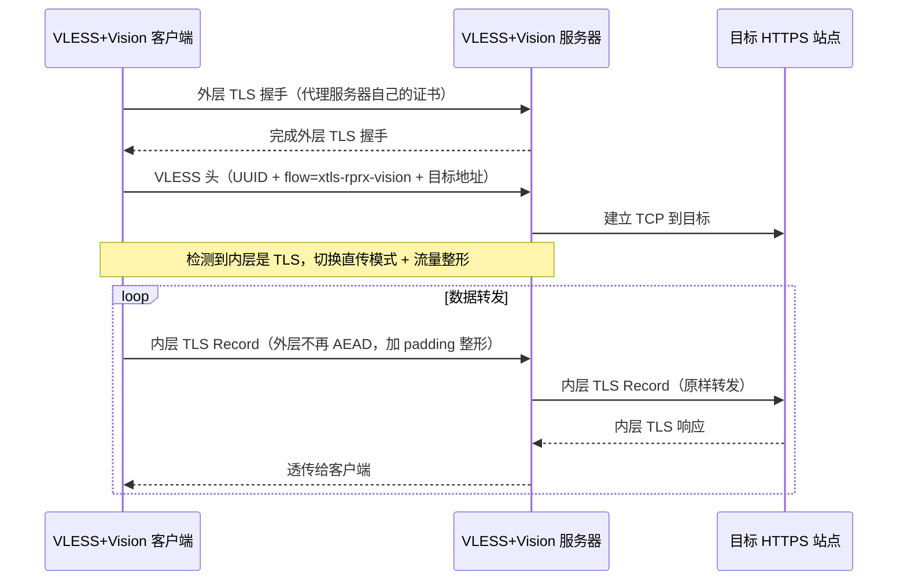

### 协议层的得与失

Vision 解决的是 VLESS+TLS 在**数据层的 TLS-in-TLS 指纹问题**——通过内层 TLS 检测、外层不再加密、流量整形三步，让被动观察者在外层包大小序列上看不到"中-小-大-中-小"这种内层 TLS 握手特征。**性能上还顺带消除了双重 AEAD 加解密的 CPU 开销**。

但 Vision **解决不了握手层**的问题——外层 TLS-1 用的还是代理服务器自己的证书，证书指纹仍可被关联，主动探测仍能看到"这台服务器在跑某个不一定像主流网站的 TLS 服务"。所以 Vision 通常不单独使用，实际部署里几乎都跟下面的 Reality 一起搭配——Reality 处理握手层，Vision 处理数据层。

## Reality

Vision 解决了数据层的指纹，但**握手层**还有两个问题没解决：

1. **证书指纹**：代理服务器需要自己申请证书（Let's Encrypt 或自签），证书的颁发者、有效期、SAN 列表会被审查方收集成指纹，一旦关联到代理用途整个证书就废了
2. **主动探测**：探测器主动连代理服务器的 443 端口，看到的是代理服务器自己的 TLS 响应——只要它跟"普通公网 HTTPS 站点"在 ALPN 协商、密码套件偏好、ServerHello 长度等任何一处行为不同，就是指纹

Reality 是 RPRX 2023 年在 Xray 里推出的协议扩展，从根源上解决这两个问题——**不让代理服务器自己产生 TLS 握手，而是借用真实大网站的 TLS 握手**。它通过 `streamSettings.security = "reality"` 启用，跟 VLESS 协议层的 `flow` 字段是两个独立的配置维度。

核心机制：

- 部署 Reality 时配置一个 `dest`（借用的目标，比如 `www.microsoft.com:443`）
- 客户端 ClientHello 的 SNI 写成 `microsoft.com`，在 ClientHello 的特定字段（SessionId 等）里夹带 Reality 鉴权材料（X25519 公钥 + 时间戳 + shortId）
- 服务器收到后**先校验鉴权字段**：
  - **合法客户端**：服务器在内存里生成一份"伪造的 microsoft.com 证书"——Subject、SAN、有效期等元数据从真实 microsoft.com 证书复制，但用代理服务器的临时私钥重签——完成 TLS 握手后切到代理模式
  - **非法 / 探测**：服务器**透明转发**整个 TLS 握手给真实的 microsoft.com，把对方返回的字节原样转回给客户端——探测器看到的就是 microsoft.com 本人

普通浏览器看到那张"伪造的 microsoft.com 证书"会判定证书不可信，但 Reality 客户端**不做证书验证**——它通过预共享的 publicKey 和 X25519 密钥交换里的鉴权字段验证身份，证书只是让 TLS 握手字节流"看起来正常"用的。

### 工作流程

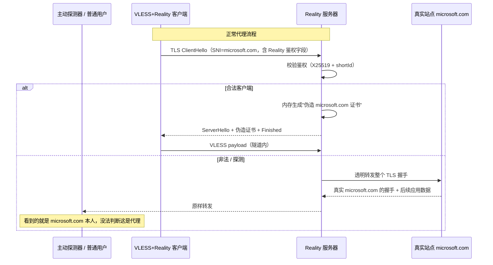

### 协议层的得与失

Reality 把抗主动探测做到了一个新高度。**借用真实大站点的 TLS 握手**让两件事同时成立：**不需要自己申请和管理证书**（证书指纹被关联这条攻击面彻底切掉），**主动探测无从下手**（探测器看到的就是 microsoft.com 真实响应，完全没法判断这是代理）。

代价是协议被"绑死"在借用的站点上。**dest 选错了整个伪装就崩**——选了个已被封锁的站，连接直接失败；选了个 ALPN / TLS 行为跟主流大站不一样的，反而暴露指纹。**dest 站点本身的稳定性也成了协议依赖**——被借用的真实站点哪天宕机或者改了 TLS 配置，所有指向它的 Reality 服务一起出问题。这是一个"用别人家的脸做伪装"的协议，伪装质量天然受限于"脸"的质量。

> ⚠️ 一个常见的认知错误需要澄清：**Reality 单独使用并不消除 TLS-in-TLS 数据层特征**。当用户用 Reality 访问 HTTPS 网站时，内层仍然有"浏览器 ↔ 目标网站"的 TLS-2 握手，Reality 的外层流量仍然会暴露上一节讲的"中-小-大-中-小"内层 TLS 握手包大小序列——Reality 解决的只是**握手层的服务端指纹**（证书指纹、ServerHello 行为等），**数据层的 TLS-in-TLS 特征必须靠 XTLS Vision 配合消除**。这就是为什么主流抗审查配置一定是 `VLESS + xtls-rprx-vision + Reality` 三件套，缺一不可。Xray 官方在 [Discussion #2166](https://github.com/XTLS/Xray-core/discussions/2166) 里也明确写过这一点：*"Reality can eliminate server TLS fingerprint characteristics. xtls-rprx-vision can eliminate TLS-in-TLS characteristics."*

## Vision + Reality：实际部署里的互补

Vision 和 Reality 解决的是 VLESS+TLS 不同层的指纹问题，**经常一起用**：

| 维度 | XTLS Vision | Reality |
|---|---|---|
| 解决什么 | 数据层 TLS-in-TLS 指纹 | 握手层主动探测 + 证书指纹 |
| 通过什么启用 | VLESS `flow = xtls-rprx-vision` | `streamSettings.security = "reality"` |
| 是否需要域名/证书 | 需要（代理服务器自己的） | 不需要（借真站） |
| 改的是哪个阶段 | 数据传输阶段 | TLS 握手阶段 |

### 四种部署方案的覆盖能力对比

从"不做特殊处理"到"全套配齐"的指纹消除能力对照：

| 部署方案 | 数据层 TLS-in-TLS | 握手层服务端指纹 | 抗主动探测 | 适用场景 |
|---|---|---|---|---|
| **Trojan / VLESS+TLS（无扩展）** | ❌ 暴露 | ❌ 暴露 | ❌ 弱 | 审查较宽松的网络，纯 HTTPS 伪装 |
| **VLESS + Vision**（只用 Vision） | ✅ 消除 | ❌ 暴露 | ❌ 弱 | 较少见，通常都会再叠 Reality |
| **VLESS + Reality**（只用 Reality） | ❌ 暴露（访问 HTTPS 时） | ✅ 消除 | ✅ 强 | 用户主要跑 HTTP/非 TLS 流量时勉强可用 |
| **VLESS + Vision + Reality**（三件套） | ✅ 消除 | ✅ 消除 | ✅ 强 | **2026 年主流抗审查节点标配** |

Reality 处理握手层（借真站、抗主动探测、不要证书），Vision 处理数据层（消除 TLS-in-TLS 指纹、绕过双重加密的性能开销）。在审查严格的网络环境下，这两层缺一不可。

到 Reality + Vision 这一步，V2Ray / Xray 家族的演化基本走到尽头：协议层退化到只做认证（VLESS），数据层避免双重加密（Vision），握手层借用真实大站点（Reality）。但 V2Ray 不是唯一一条解决"流量外观"的路——比它早三年的 Trojan 走的是另一条思路：不去搞"伪装"，直接做成真 HTTPS。

# Trojan：把代理伪装成普通 HTTPS

`Trojan` 由 trojan-gfw 团队在 2019 年提出。它的设计哲学非常直接：**不要试图搞复杂的混淆，直接做成一个真正的 HTTPS 服务**。

服务器其实就是一个普通的 HTTPS 站点，跑在 `443` 端口，证书是真的（Let's Encrypt）。客户端连上来后做正常 TLS 握手，握手后发送一个**密码哈希**：

- 哈希正确：进入代理模式
- 哈希错误：当作普通 HTTP 请求处理，回退到伪装站点（fallback）

## 工作流程

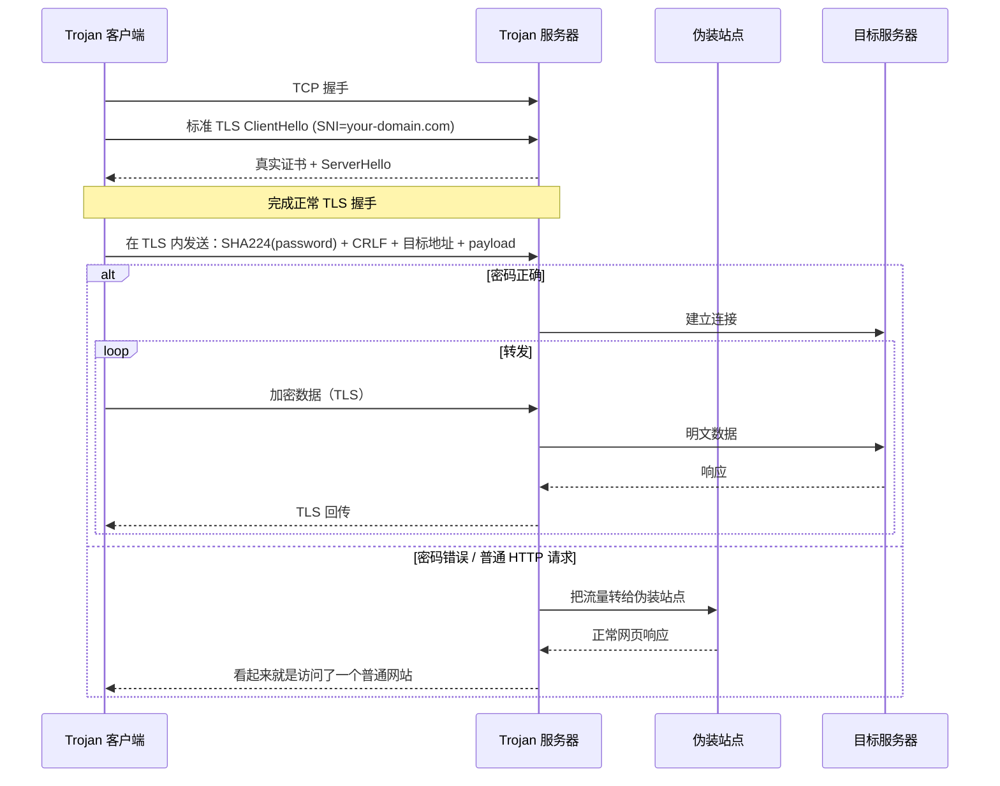

## 协议层的得与失

Trojan 的设计哲学是"不伪装，做真的"。服务器端就是一台正常的 HTTPS 服务，握手、证书、ALPN 全部合规——**主动探测自然失效**：探测器没拿到密码就被回退到 fallback 站点（一个真实的网页），跟访问任何普通 HTTPS 站点没区别。这种"协议外观即真实 HTTPS"的设计极其简洁，没有任何混淆层、没有时间戳、没有协议握手：客户端 TLS 连上来直接发 SHA224(密码) + CRLF + 目标地址，对了就转发，错了走 fallback。

但代价是 **TLS-in-TLS 指纹**绕不过去。当用户用 Trojan 访问 HTTPS 网站时，外层是 Trojan 的 TLS、内层是访问目标的 TLS——握手时序、包长分布会暴露这是"TLS 套 TLS"的代理流量。这个弱点 Trojan 协议本身没法解决，所以后期实际部署里几乎都要配合 XTLS Vision 直传，或者直接换成 VLESS + Reality。另一个本质性约束是 **域名和证书是协议的硬依赖**——不能像 SS 那样直接 IP+端口起一台，而且域名一旦被关联到代理用途，整个服务就废。

Trojan 的真 HTTPS 思路解决了"主动探测"但没解决"TLS-in-TLS"——下一节的 ShadowTLS 把这个思路再往前推一步：连证书都借真实大站点的，连握手字节都不用自己产生。

# ShadowTLS：借真实 TLS 握手做伪装

`ShadowTLS` 由 ihciah 在 2022 年提出。它的思路和 Reality 有相似之处，但更纯粹——**它只是一个传输层伪装，不绑定特定代理协议**。

核心想法：**让 TLS 握手是真实的**，握手完成后再切换成代理通道。

- v1：握手完全代理给真实站点（很容易被流量劫持识别）
- v2：加入客户端认证（challenge-response），抗主动探测
- v3：在握手帧上加 HMAC，连传输劫持都能识别

## 工作流程（v3）

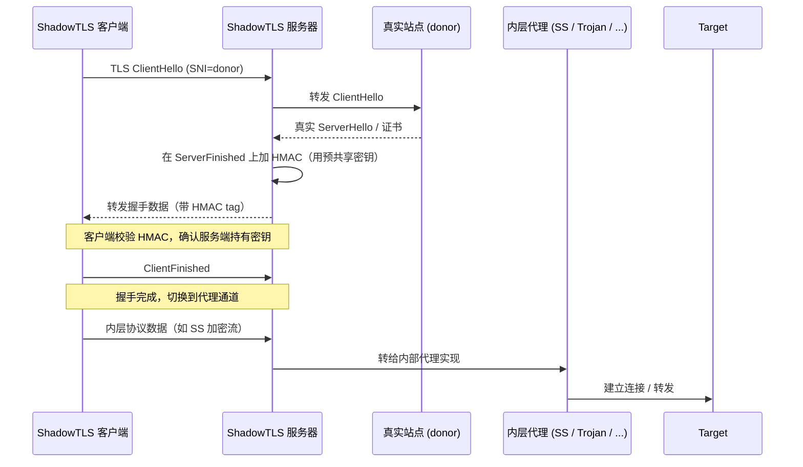

## 协议层的得与失

ShadowTLS 比 Trojan 更进一步——**连证书和握手字节都不自己产生**，TLS 握手阶段直接把客户端的 ClientHello 转发给真实大站点（donor，比如 `cloud.tencent.com`），把 donor 返回的 ServerHello、证书、ServerFinished 原样转回客户端。这意味着主动探测打过去看到的不是"我的伪造证书"，而是 **donor 真实证书 + donor 真实响应**——证书指纹完全不可疑。v3 进一步在 ServerFinished 上加 HMAC（用预共享密钥），让中间人想要劫持替换证书都做不到。

另一个有意思的设计是**协议解耦**：ShadowTLS 只负责"TLS 握手伪装"这一层，握手完成后切换出来的内层协议可以是 SS、Trojan、VLESS 任意一种——它本质上是一个**通用的 TLS 伪装外壳**，而不是绑定加密和数据封装的代理协议。这种"把伪装抽离成独立协议层"的思路很现代。

代价集中在 donor 选择上。donor 的 TLS 行为必须**可预测**——它返回多少个 NewSessionTicket、ALPN 协商哪些值、TLS 版本是 1.2 还是 1.3，这些细节会被嵌入到流量指纹里。选了个行为不稳定的 donor，每次握手长得不一样，反而成了识别特征。**donor 站点的稳定性也是协议依赖**——donor 哪天改了服务器配置或者下线，整个 ShadowTLS 服务就要重新选 donor。再加上 v3 的 ServerFinished 长度比标准多 4 字节这种残留特征，ShadowTLS 也不是完全无懈可击。

ShadowTLS 是"借用 donor"路线的极致，但反过来说也意味着**对 donor 高度依赖**。下一节的 AnyTLS 走了相反的方向：不借任何 donor，用主动填充破指纹。

# AnyTLS：TLS 包裹任意代理流量

`AnyTLS` 是 sing-box 团队在 2024 年设计的协议，定位明确——**专门解决 TLS-in-TLS 指纹问题**。

它和 ShadowTLS 不同：

- ShadowTLS 是"借用真实站点 TLS 握手 + 内层接其他协议"
- AnyTLS 是"用普通 TLS 直接包裹代理数据 + 主动加填充对抗指纹"

核心机制：

- 用标准 TLS 把代理流量包起来（不借真实站点）
- 通过**可配置的填充策略**（Padding Scheme）调整每个包的大小，破坏 TLS-in-TLS 的统计特征
- 引入**会话池**（idle session pool）：复用已经建立的 TLS 连接，避免频繁握手

## 工作流程

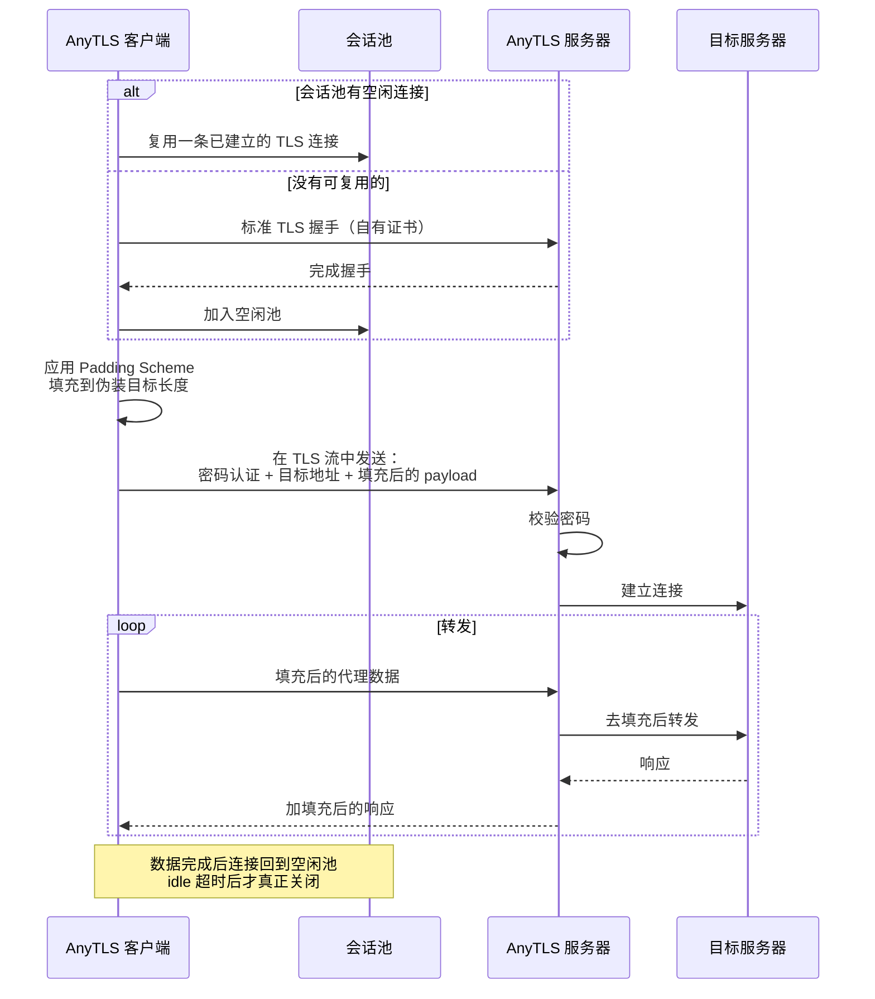

## 协议层的得与失

AnyTLS 走的是跟 ShadowTLS / Reality 完全相反的方向——**不借任何 donor，自己用普通 TLS 包裹代理流量**，但通过**可配置的填充策略（Padding Scheme）**主动调整每个 TLS 帧的大小，破坏 TLS-in-TLS 的包长统计指纹。这个思路的好处是协议自包含——抗 TLS-in-TLS 的能力是协议层主动构造的，不依赖外部站点行为。再加上**会话池**（idle session pool）复用已建立的 TLS 连接，握手开销摊薄到多次连接里。又因为它不用 QUIC，**在 UDP 被封锁的网络（伊朗、某些国内 ISP 跨境段）仍然可用**。

但填充本身就是代价——**带宽和 CPU 都会有开销**，每个数据包都要按填充策略加额外字节，传输效率不如 VLESS+Reality 这种"直传"方案。另一个隐性问题是**填充策略本身可能成为指纹**——如果某种填充模式只有 AnyTLS 在用，那这个模式本身就成了识别特征。AnyTLS 协议规范留了填充策略可配置的接口，但识别方反过来也可以基于"填充策略的统计特征"来识别——这是一场长期攻防。

AnyTLS 代表了 TLS 系协议的另一种思路：**主动构造而非借用**。到这里，TCP + TLS 路线的演化基本走完——下一步是完全不同的赛道：把代理跑到 UDP + QUIC 上，换一套整体架构。

# Hysteria / TUIC：基于 QUIC 的代理协议

前面讲的几乎所有协议都跑在 TCP 上。但 TCP 在丢包率高、跨境长距离的网络上表现并不好——拥塞控制保守、队头阻塞严重。

`Hysteria`（2021）和 `TUIC`（2022）都基于 `QUIC`（UDP 之上的现代传输协议）。QUIC 自带 TLS 1.3 加密、多路复用、连接迁移。

- **Hysteria** 重点是高丢包网络优化，用了类似 BBR 的拥塞控制 + 自定义带宽参数，可以在高丢包下"暴力"塞满带宽。
- **TUIC** 走 QUIC native 路线，强调低延迟和原生 0-RTT。

## 工作流程

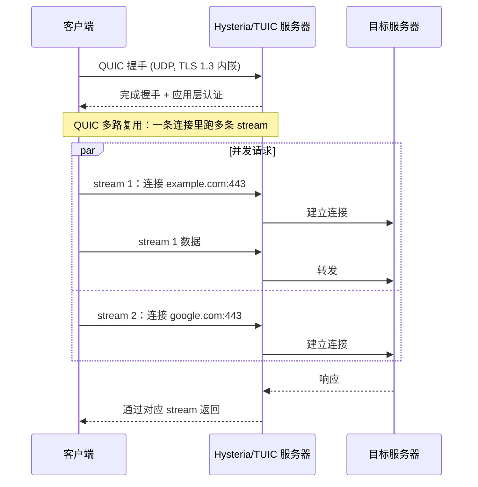

## 协议层的得与失

Hysteria 和 TUIC 选择 QUIC 作为传输层，是另一种取舍。QUIC 自带 TLS 1.3 加密 + 多路复用 + 连接迁移 + 0-RTT/1-RTT 快速握手，**协议设计天然继承了所有这些优势**——一条 QUIC 连接里可以并发跑多条 stream（不用每个目标都新建连接），网络切换（WiFi 切 4G）时连接不中断，外观就是标准的 HTTP/3。Hysteria 在 QUIC 之上叠了**激进的拥塞控制**（类 BBR + 用户可手动指定带宽），让它在 5% ~ 30% 高丢包率下仍能跑出可观吞吐——这是 TCP 系协议（包括 VLESS+Reality）天然做不到的，因为 TCP 拥塞控制会在丢包面前直接退让。

代价是 **UDP 依赖**——QUIC 跑在 UDP 上，而中国大量运营商对跨境 UDP 做了严重 QoS 限速甚至直接丢弃，部分网络环境下 QUIC 完全不可用。再加上 **QUIC 握手本身是有指纹的**（Hysteria v1 早期特征明显，v2 做了优化但仍不如 TLS 路线隐蔽），**握手阶段没有"借用真实站点"的能力**——Reality 那套对抗主动探测的玩法在 QUIC 路线上没有等价物。Hysteria 的暴力拥塞控制对服务器带宽也是真实开销，机场层面 Hysteria 节点的成本明显高于 VMess / VLESS 节点。

QUIC 系协议的位置很清楚：**追求高吞吐和低延迟时是首选，追求隐蔽性和稳定可用性时不如 TLS 系**。两条路线在 2026 年的实际部署里互补——机场常见的配置是"Hysteria2 节点跑视频/下载，VLESS+Reality 节点跑日常浏览和稳定链路"。

# 学术界 vs 审查方的攻防节奏

通读整篇文章会发现一个有意思的规律——**每一代协议都在解决上一代被识别的问题，而每一篇 USENIX/IMC 论文都给出了下一代要解决的题目**：

| 论文 | 打掉了哪一代 | 推动了哪一代 |
|---|---|---|
| **IMC 2020**：How China Detects and Blocks Shadowsocks<sup>[\[1\]](#ref-1)</sup> | 原版 SS——通过 7 种主动探测识别身份 | 推动 SS-2022 修密码学 + SSR `protocol` 层防探测 + V2Ray 系协议往 TLS 路线靠 |
| **USENIX 2023**：How the Great Firewall of China Detects and Blocks Fully Encrypted Traffic<sup>[\[2\]](#ref-2)</sup> | SS / SS-2022 / 裸 VMess / 裸 Hysteria——前 N 字节高熵随机 | 推动"加密协议必须套外层伪装"成为共识（SS-2022 + ShadowTLS、VMess + WS+TLS、Trojan 真 HTTPS 全部走这条） |
| **USENIX 2024**：Fingerprinting Encapsulated TLS Handshakes<sup>[\[3\]](#ref-3)</sup> | Trojan / VLESS+TLS / SS+v2ray-plugin——TLS-in-TLS 包大小指纹 | 推动 XTLS Vision 流量整形 + Reality 借真站握手成为主流 |

这是一场**学术界 ↔ 审查方 ↔ 抗审查社区**的三方持续博弈，每过 2-3 年就会换一次主流防御技术，直到下一篇论文出来。当前（2026）的主流抗审查方案 `VLESS + xtls-rprx-vision + Reality` 解决的是 USENIX 2024 那批问题，但下一篇论文很可能已经在路上——比如基于流量行为模式（浏览节奏、上下行比例、长连接特征）的更高维识别。这条路远没走完。

# 总结对比

| 协议 | 出现时间 | 设计重点 | 流量外观 | 主要弱点 |
|---|---|---|---|---|
| 传统 VPN | 1990s-2000s | 加密隧道 | 协议特征明显 | 容易被识别 |
| Shadowsocks | 2012 | 轻量加密代理 | 高熵随机 | 易被统计识别 |
| SSR | 2015 | SS + 协议认证 + 混淆 | 浅层伪装 HTTP/TLS | 维护停滞、混淆已被识破 |
| V2Ray / VMess | 2015 | 多协议框架 | 取决于传输层 | VMess 本身有指纹 |
| Trojan | 2019 | 真 HTTPS 站点 | 完全像 HTTPS | TLS-in-TLS 指纹 |
| VLESS | 2020 | 简化 VMess | 取决于外层 | 需依赖外层加密 |
| Hysteria / TUIC | 2021-2022 | QUIC 高性能 | HTTP/3 | UDP 被封即失效 |
| ShadowTLS | 2022 | 借真实 TLS 握手 | 像访问 donor 站点 | 仍有细微握手特征 |
| SS-2022 | 2022 | 现代化 SS 加密 | 高熵随机 | 没有伪装层 |
| XTLS Vision | 2022 | 消除数据层 TLS-in-TLS 指纹 | 取决于外层 TLS / Reality | 仅解决数据层 |
| Reality | 2023 | 借真站握手 + 不要证书 | 像目标真站点 | 依赖 dest 站点稳定性 |
| AnyTLS | 2024 | TLS 包裹 + 填充 | 像普通 HTTPS | 生态新、性能中等 |

整条演化线其实就一句话：

> **从"加密内容"，走向"伪装外观"，最后走向"借用真实身份"。**

加密早就不是问题了。今天所有还活着的代理协议，争夺的都是同一个东西：**让流量看起来不像代理**。

# 参考文献

## 学术论文

- <a id="ref-1"></a>**[1]** Alice, Bob, Carol, Beznazwy, J., & Houmansadr, A. (2020). [*How China Detects and Blocks Shadowsocks*](https://gfw.report/publications/imc20/en/). In Proceedings of the ACM Internet Measurement Conference (IMC '20). 最佳论文亚军。
- <a id="ref-2"></a>**[2]** Wu, M., Sippe, J., Sivakumar, D., et al. (2023). [*How the Great Firewall of China Detects and Blocks Fully Encrypted Traffic*](https://www.usenix.org/conference/usenixsecurity23/presentation/wu-mingshi). In USENIX Security Symposium '23. [PDF](https://www.usenix.org/system/files/usenixsecurity23-wu-mingshi.pdf)
- <a id="ref-3"></a>**[3]** Xue, D., Ramesh, R., Houmansadr, A., et al. (2024). [*Fingerprinting Obfuscated Proxy Traffic with Encapsulated TLS Handshakes*](https://www.usenix.org/system/files/sec24summer-prepub-465-xue.pdf). In USENIX Security Symposium '24.
- <a id="ref-4"></a>**[4]** database64128 (2022). [*Shadowsocks 2022 Edition: Strengthened Wire Format with AEAD-2022 Ciphers*](https://github.com/Shadowsocks-NET/shadowsocks-specs/blob/main/2022-1-shadowsocks-2022-edition.md). Shadowsocks-NET specs.

## 协议规范与设计文档

- Shadowsocks 官方文档：[shadowsocks.org](https://shadowsocks.org/)
- ShadowsocksR 协议插件文档：[shadowsocksrr/shadowsocks-rss](https://github.com/shadowsocksrr/shadowsocks-rss/blob/master/ssr.md)
- V2Ray / VMess 协议文档：[v2fly.org](https://www.v2fly.org/)
- VLESS 协议实现：[v2fly/v2ray-core proxy/vless](https://github.com/v2fly/v2ray-core/tree/master/proxy/vless) / [XTLS/Xray-core proxy/vless](https://github.com/XTLS/Xray-core/tree/main/proxy/vless)（字节格式一致）
- Reality 设计文档：[XTLS/REALITY](https://github.com/XTLS/REALITY)
- Trojan-killer（TLS-in-TLS 检测 PoC，30 行 Go 代码）：[XTLS/Trojan-killer](https://github.com/XTLS/Trojan-killer)
- Trojan 协议规范：[trojan-gfw/trojan](https://trojan-gfw.github.io/trojan/protocol)
- ShadowTLS v3 协议：[ihciah/shadow-tls](https://github.com/ihciah/shadow-tls/blob/master/docs/protocol-v3-en.md)
- AnyTLS 配置文档：[sing-box.sagernet.org](https://sing-box.sagernet.org/configuration/outbound/anytls/)
- Hysteria 2 文档：[v2.hysteria.network](https://v2.hysteria.network/)
- TUIC 协议规范：[EAimTY/tuic](https://github.com/EAimTY/tuic)

## V2Ray 家族关键 issue / PR

VMess 协议层缺陷与 PoC：

- [v2ray-core#2523](https://github.com/v2ray/v2ray-core/issues/2523)：VMess 协议设计和实现缺陷可导致服务器遭到主动探测特征识别（附 PoC，2020-05）
- [v2ray/discussion#704](https://github.com/v2ray/discussion/issues/704)：V2Ray 的 TLS 流量可被简单特征码匹配精准识别（附 PoC，2020-05）

VMess AEAD 与 VLESS 设计：

- [v2fly/v2fly-github-io#20](https://github.com/v2fly/v2fly-github-io/issues/20)：VMessAEAD 设计文档（2020-08）
- [v2fly/v2ray-core#940](https://github.com/v2fly/v2ray-core/pull/940)：VMess Proposal AEAD Based Packet Length（2021-04）
- [v2ray-core#2526](https://github.com/v2ray/v2ray-core/issues/2526)：VLESS 设计提案（RPRX 在 #2523 第二天提出，2020-06）
- [v2ray-core#2583](https://github.com/v2ray/v2ray-core/issues/2583)：VLESS ALPHA
- [v2ray-core#2636](https://github.com/v2ray/v2ray-core/issues/2636)：VLESS BETA

传输层伪装与工具集成：

- [v2fly/v2ray-core#2219](https://github.com/v2fly/v2ray-core/pull/2219)：Add uTLS Support into V2Ray's TCP and WebSocket transport（2022-12）

项目分叉：

- [v2ray-core#2789](https://github.com/v2ray/v2ray-core/issues/2789)：V2Ray / Xray 项目分叉相关讨论（2020-11）

## 源码参考

- shadowsocks-libev：[shadowsocks/shadowsocks-libev](https://github.com/shadowsocks/shadowsocks-libev)
- shadowsocksr-native：[ShadowsocksR-Live/shadowsocksr-native](https://github.com/ShadowsocksR-Live/shadowsocksr-native)
- overtls：[ShadowsocksR-Live/overtls](https://github.com/ShadowsocksR-Live/overtls)
- V2Fly v2ray-core：[v2fly/v2ray-core](https://github.com/v2fly/v2ray-core)
- Xray-core：[XTLS/Xray-core](https://github.com/XTLS/Xray-core)
- sing-box：[SagerNet/sing-box](https://github.com/SagerNet/sing-box)
- mihomo（Clash.Meta）：[MetaCubeX/mihomo](https://github.com/MetaCubeX/mihomo)

## 研究站点

- GFW Report：[gfw.report](https://gfw.report/)（网络审查行为追踪与论文集合）
- net4people/bbs：[github.com/net4people/bbs](https://github.com/net4people/bbs)（抗审查技术讨论）
- Lantern 论文语料库：[corpus.lantern.io](https://corpus.lantern.io/)
- TLS Fingerprint 数据库：[tlsfingerprint.io](https://tlsfingerprint.io/)（浏览器 / 客户端 TLS 指纹统计）
