+++
title = '代理协议这十几年:从加密到借真实身份'
date = 2026-05-22 11:00:00
tags = ["program"]
categories = ["program"]
+++

# 前言

> **声明**：本文为基于公开学术论文（IMC 2020、USENIX Security 2023 / 2024 等）和开源项目讨论的协议技术综述，目标是梳理各代代理协议在网络协议层的设计取舍与演化逻辑，不涉及任何具体配置教程、服务部署或工具推广，仅作网络协议技术研究学习参考。

近期复杂的网络流量规则发生了显著变化，主流代理服务频繁进行协议切换。加上最近社区里关于[VLESS 的漏洞讨论](https://github.com/Anonymous376c1d0cf28/VLESS-cracker)，这让我产生了好奇心，用代理工具十多年了，也没有仔细看过各个代理协议的具体差异。网上目前有的一些博文对协议内容本身的介绍也比较浅，在一通翻阅研究+AI 的辅助下，也是写出了本文的内容。

# 阅读前置

本文混合了**网络协议、密码学、网络攻防**三个领域，下面是全文反复出现的关键名词速查。完全不熟悉这些的话建议先看本节末尾的推荐资料系统补一下基础再回来；大致了解的可以直接跳到下一节"进化树"，遇到不确定的名词再回查这里。

## 网络与传输层

- **TCP**：有连接、可靠、有序的字节流；
- **UDP**：无连接、不保证可靠/有序；本身只是个"带端口的 IP 包"，可靠传输要由上层自己实现。
- **TLS / TLS 1.3**：跑在 TCP 上的加密层，`https` 的 `s`。本文绝大部分"伪装"都是伪装成 TLS 流量。
- **QUIC**：跑在 UDP 上的现代传输协议，自己实现握手、可靠传输、流多路复用，并把 TLS 1.3 直接内嵌进握手。HTTP/3 就是跑在 QUIC 上。
- **HTTP/2 / HTTP/3**：HTTP 的二进制版本，单连接里可以并发多个流（多路复用）。HTTP/2 跑在 TCP+TLS 上，HTTP/3 跑在 QUIC 上。
- **WebSocket / gRPC**：在 HTTP 之上把连接升级成长连接的两种常见方式；很多代理协议把流量塞进 WS / gRPC 里走，看起来就像普通 Web 应用。
- **CDN**：内容分发网络（如 Cloudflare）。
- **SOCKS5**：本地代理客户端最常用的"对应用暴露"的协议，浏览器把请求扔给本地 1080 端口就是这个。

## TLS 协议关键概念

- **ClientHello / ServerHello / Finished**：TLS 握手的几个关键消息。ClientHello / ServerHello 是明文的，里面包含 SNI、ALPN、Cipher Suites 等字段。
- **SNI**：ClientHello 里的明文字段，告诉服务器"我要访问哪个域名"。即使后续流量加密了，SNI 始终是明文。
- **ALPN**：握手时协商上层用什么应用协议（`http/1.1`、`h2`、`h3`），不同协议组合是 TLS 指纹的一部分。
- **JA3 / JA4 指纹**：把 ClientHello 里若干固定字段拼起来算的哈希，用来识别"这是哪个客户端栈发出来的握手"。Go/Python/Chrome/Firefox 各有各的 JA3。
- **TLS Record**：TLS 数据传输的最小单元——5 字节明文 header（类型 + 版本 + 长度）+ 加密 body。即使内容加密了，record 长度依然是明文可见的，所以可以通过包长序列推断里面装的是什么（这就是 TLS-in-TLS 指纹的成因）。
- **TLS-in-TLS**：用 TLS 代理访问 HTTPS 网站时形成的双层 TLS 嵌套——内层是浏览器到目标网站的 TLS、外层是代理客户端到代理服务器的 TLS。详细原理见 XTLS Vision 章节。

## 密码学基础

- **AEAD**：Authenticated Encryption with Associated Data，"带身份认证的加密"，加密 + 完整性校验一步搞定。常见实现：AES-GCM、ChaCha20-Poly1305。本文几乎所有现代代理协议的数据层都是 AEAD。
- **HMAC**：用预共享密钥算的消息认证码，没密钥伪造不出来。本文里大量用于"客户端自证身份"或"服务端给中间人没法造的签名"。
- **KDF**：密钥派生函数，从一个原始密码 / 主密钥派生出一组工作密钥。常见：HKDF（基于 HMAC）、BLAKE3。
- **nonce / IV / salt**：加密时配合密钥用的"一次性"输入；nonce 严格不能复用，一旦同密钥同 nonce 加密两条不同消息，AEAD 直接被打穿（SS-2022 修这个洞）。
- **PSK**：Pre-Shared Key，预共享密钥。客户端和服务端事先就有同一份密钥（通常就是配置里的"密码"派生出来的）。
- **熵 / 高熵随机字节**：数据"看起来有多随机"。

## 流量识别与攻防

- **DPI**：深度包检测——不只看 IP / 端口，还看包内容。
- **被动 DPI vs 主动探测**：前者只在旁路看流量、不发包；后者会主动连过去发数据"试探"服务器，根据服务器响应行为判断是不是代理。两条防线都要同时考虑，本文反复在区分这一点。
- **包长 / 时序指纹**：即使内容加密，包大小序列、发送时间间隔仍然会泄露协议特征（典型：TLS-in-TLS 的"中-小-大-中-小"序列）。
- **重放攻击**：录下一段合法流量过几小时再原样发回服务器，看服务器有没有配合。SS-2022 / VMess / SSR 都有专门防重放设计。
- **Tarpit（焦油坑）**：探测失败时故意挂着不响应、不主动断连，让探测者的连接资源被消耗。SSR `auth_chain_a`、VMess drain 模式都是这个思路。

## 推荐入门资料

- **UDP / QUIC / HTTP/3** → [HTTP/3 explained 中文版](https://http3-explained.haxx.se/zh)。
- **TLS 1.3 协议规范** → [RFC 8446](https://datatracker.ietf.org/doc/html/rfc8446)。
- **QUIC 协议规范** → [RFC 9000](https://datatracker.ietf.org/doc/html/rfc9000)。
- **TLS 指纹** → [tlsfingerprint.io](https://tlsfingerprint.io/)。

# 进化树

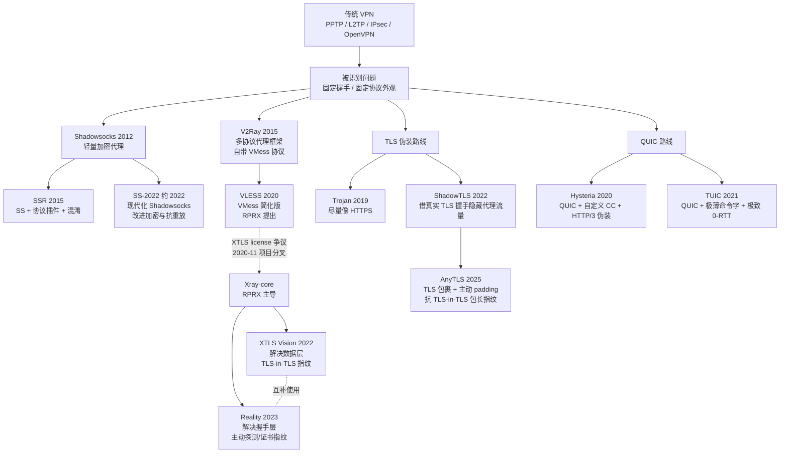

# 代理请求的通用链路

在进入具体协议之前，先建立一个统一的视角。绝大多数代理工具，链路都可以抽象成这四段：

```text
浏览器 / 应用
   |
   v
本地代理客户端（监听 SOCKS5 / HTTP / TUN 等）
   |
   v
远程代理服务器
   |
   v
目标网站
```

不同协议的差别，主要体现在**本地代理客户端到远程代理服务器的连接**长什么样：

- 是 UDP 隧道还是 TCP 流？
- 是裸的密文，还是包在 TLS 里？
- 是不是有协议握手、认证、混淆？
- 流量是不是看起来像普通 HTTPS？

接下来我们按进化树的顺序，依次看每个协议在这条链路上怎么走。

# 传统 VPN

VPN 最早不是为代理穿透设计的，它的本职是在公网上建立一条到企业内网的安全隧道。它的工作方式是在系统里创建一张虚拟网卡，把所有流量路由进加密隧道。

这里不详细描述他的工作机制了，目前不用 VPN 做代理协议的主要原因是 VPN 走单一连接 + 清晰的握手指纹（协议包头 + 固定端口），非常容易被被动 DPI 识别。

# Shadowsocks 家族

## Shadowsocks

Shadowsocks 在 2012 年发布。它回到更简单的代理形式：本地监听一个端口，把代理流量加密后转发到远程服务器。

Shadowsocks 的代理流程比较简单，通过 TCP 和代理服务器建立连接后，后续所有请求都走加密发送，相比 VPN，Shadowsocks 的核心差异在于它取消了握手环节，而且走按需连接的模式（不再是单一 TCP 长连）

### 工作流程

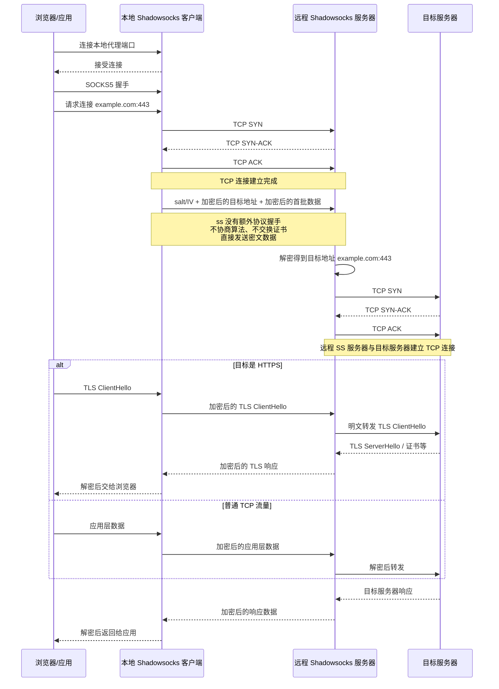

### 问题

Shadowsocks 的实现比较简单，但也因此在被动 DPI 视角下，SS 的所有报文都是一坨什么都不像的随机密文。具体来说，SS 流量在被动观察下有这些非常显眼的特征：

- **首包就是高熵随机字节**。正常的 HTTPS 首包是 TLS ClientHello，HTTP 是 `GET`/`POST`，SSH 开头有版本号字符串。SS 的首包是 `salt + 加密的目标地址`，整体看上去就是"一段没有任何结构的随机数据"。这种"什么都不像"本身就是一种特征。
- **没有任何协议握手**。没有版本号协商、没有证书交换、没有能力协商。一条 TCP 连接建立后立刻进入加密数据传输阶段，这种行为在公网上的合法应用里几乎不存在。
- **包长分布固定**。每个 AEAD chunk 是 `[2 字节长度][16 字节 tag][payload][16 字节 tag]`，连续抓几个包就能看出规律。
- **服务器对任何 TCP 连接都"愿意解密"**。探测方可以主动连过来发一段随机数据，观察服务器的响应模式（是直接关闭、还是等超时、还是回错误）来推断这是不是一个 SS 服务器——这就是**主动探测**。
- **流量汇聚**。一个境外 IP 上，长期出现来自同一个客户端的、大量"看起来不像什么"的高熵 TCP 连接。从被动观察者视角看就是一个非常异常的流量画像。

总结起来，SS 在被动 DPI 面前主要暴露了两个核心问题：

1. **被动 DPI 一眼能识别**——流量不像任何已知协议。
2. **主动探测无法防御**——服务器对任意 TCP 连接都会尝试解密，行为差异容易暴露身份。

后续的 SSR、V2Ray、Trojan、ShadowTLS 等协议，本质上都是在不同方向上解决这两个问题：是该给流量"加一层伪装"（SSR 的 obfs），还是该把流量"塞进一个真协议里"（Trojan 的真 HTTPS、ShadowTLS 的真 TLS 握手）。

## ShadowsocksR

ShadowsocksR（SSR）是 2015 年从 SS 分叉出来的版本，目标是增强抗识别能力。

SSR 的思路是在 SS 的加密代理上增加了 2 层包装，分别对应这两个问题：

```text
明文 -> protocol 包装 -> 加密 -> obfs 混淆 -> 网络
       ↑                          ↑
       抗主动探测、抗重放          骗过 DPI 的首包识别
```

### obfs：让流量看起来像别的协议

`obfs`（obfuscation 的缩写，"混淆"）解决的是 SS 暴露在**被动 DPI** 下的问题——让流量看起来像 HTTP 或 TLS，从而触发 DPI 的"这是合法 Web 流量"判断。

这里说的"装"不是加密，加密是另一回事。obfs 不动数据的安全性，只动数据的**外观字节**。常见的几种：

- `plain`：什么都不做，等同原版 SS
- `http_simple` / `http_post`：把首包伪装成 HTTP `GET` / `POST` 请求
- `tls1.2_ticket_auth`：整条连接都包在 TLS Record 里，长度还做随机化

具体的协议清单和实现见 [SSR 协议插件文档](https://github.com/shadowsocksrr/shadowsocks-rss/blob/master/ssr.md) 与 [shadowsocksr-native 源码](https://github.com/ShadowsocksR-Live/shadowsocksr-native/tree/master/src/obfs)。

但 obfs 这条路有个根本局限：**它伪装的是协议的字节外壳，不是协议的真实行为**。

以最强的 `tls1.2_ticket_auth` 为例，它是用 C 代码硬拼字节让流量"长得像"TLS，但**没有真 TLS 库在背后跑**——没有真的密钥协商、没有真证书、没有 ALPN、TLS 版本写死 1.2、ClientHello 的 cipher suites 是固定模板（导致 JA3 指纹全球独一无二）。识别方后来识别它走的就是"握手字节像 TLS、但应用层行为完全不像"。

要让流量"是" TLS 而不是"像" TLS，就得引入真 TLS 库——那是后来 Trojan 和 ShadowTLS 走的路。

### protocol：让服务器拒绝未知客户端请求

protocol 解决的是 SS 暴露的另一个核心问题——**主动探测**。

原版 SS 服务器在收到 TCP 连接后会**对任何到达的数据都尝试解密**。这种主动配合在不同输入下会表现出可观察的行为差异（关闭时机、TCP 状态等），让探测方能反向确认这是不是 SS。SSR protocol 层就是为了应对这类已经在发生的主动探测而设计的，后来 IMC 2020 论文<sup>[\[1\]](#ref-1)</sup>系统地归纳了其中 7 种探测手段（5 种重放 + 2 种随机长度），从学术上印证了原版 SS 在这条攻击面上的脆弱性。

SSR protocol 层的核心思路：**把服务器从"配合"改成"先验身份"**——客户端在数据前加一段认证头，服务器先校验认证头，校验通过才走正常处理路径，校验不过就保持沉默。

认证头里包含几个关键字段：

- **HMAC**：用预共享密码派生的密钥算，没密码算不出
- **utc_time**：防长期重放（录一年前的流量再放，时间戳早过期）
- **client_id + connection_id**：防短期重放（刚录的流量立刻回放，组合已用过）
- **uid**：用户 ID，区分同一服务器上的不同用户（机场单端口多用户的实现）

完整的认证头结构相当复杂，包括嵌套的 AES blob、三层 HMAC、随机填充等，详见源码 [src/obfs/auth.c](https://github.com/ShadowsocksR-Live/shadowsocksr-native/blob/master/src/obfs/auth.c) 和 [src/obfs/auth_chain.c](https://github.com/ShadowsocksR-Live/shadowsocksr-native/blob/master/src/obfs/auth_chain.c)。

需要强调的是，认证不是**只在首包做一次**——首包是重认证，包含 `utc_time` / `client_id` / `connection_id` / `uid` 这些全局身份信息；之后每一个数据包都有一份轻量 HMAC + 自增的 `recv_id` 序号校验，HMAC 密钥是 `user_key + recv_id`，每包都不一样。这意味着：篡改任何一字节会让当前包 HMAC 失败、丢包或重排会让 `recv_id` 对不上、录制后重放也会因为序号已经超出而失败——三种攻击都会触发跟首包认证失败一样的处理路径（按下面的协议派别有不同行为）。

值得提的一点是，不同的 protocol 协议在校验失败时的行为完全不同——这直接决定了它们对主动探测的防御能力：

| Protocol | 校验失败时行为 | 抗主动探测 |
|---|---|---|
| `auth_sha1_v4` | 立刻关闭连接 | 弱（关闭时有指纹） |
| `auth_aes128_md5` / `auth_aes128_sha1` | 降级到原版 SS 处理路径（为兼容原版客户端） | 几乎等同原版 SS |
| `auth_chain_a/b/c` | 挂连接不响应、不主动断 | 强（看起来像普通沉默端口） |

auth_chain_* 那种"挂着不响应"的处理在探测器视角看，服务器表现得像一个普通的"在 listen 但没业务"的端口。这种端口在公网多得是（防火墙后的内部服务、honey pot 等）

这种机制在网络攻防里叫 **Tarpit**（焦油坑）——故意让 TCP 连接挂在 ESTABLISHED 状态消耗探测者的资源。代价是服务端自己也得维持这些半死连接，理论上遇到大规模并发探测会更快耗尽 fd；不过实际部署中有 socket idle timeout 和 OS keepalive 兜底，正常运维不会出问题。

我感觉这也是 SSR 后期教程都推荐 `auth_chain_a` 而不是 `auth_aes128_sha1` 的主要原因（当然还有原因是 auth_chain_a 支持包长随机化和自带 RC4 加密，但和主动探测的防御比感觉还是差一些）。

### 完整流程

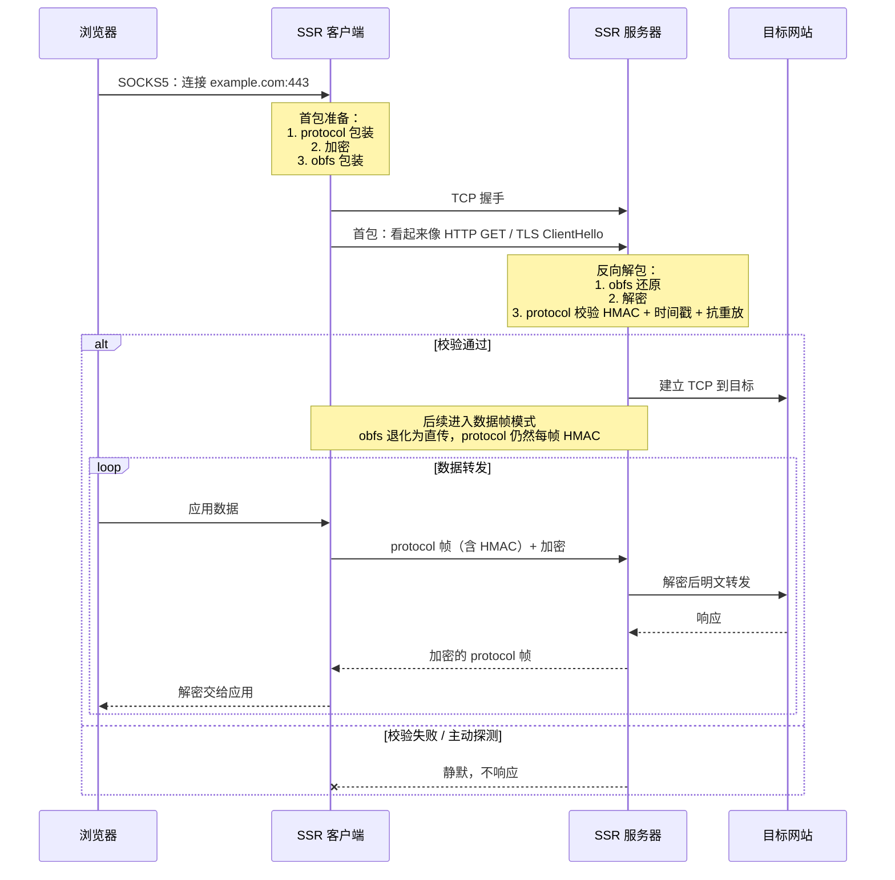

在 2026 年的现在来看，SSR 走的是 **在 SS 上打补丁** 的路线，而同时期出现的 V2Ray 走的是 **重新设计协议 + 传输层伪装** 的路线。后来的演化证明，**协议无关 + 真实 TLS 隧道** 比 **在协议里塞混淆** 更有生命力——这也是为什么 SSR 在 2020 年之后逐渐淡出主流。

SSR 社区后期也意识到这条路走不通——在原版作者破娃删库退场后，接手做 C 版重构的 [shadowsocksr-native](https://github.com/ShadowsocksR-Live/shadowsocksr-native) 维护者实验性地在项目里加了 `SSRoT`（SSR over TLS）模式：让客户端先用真 TLS 连到一个监听 443 端口的服务器，再在 TLS 隧道里跑 SSR 流量。但这个模式启用后会强制把 obfs/protocol 都关掉——因为外层真 TLS 已经替代了它们的功能。

后来同一作者干脆把这套思路抽出来做了独立项目 [overtls](https://github.com/ShadowsocksR-Live/overtls)，砍掉 SSR/SS 只保留 over-TLS。这个演化路径本身就是个有趣的注脚：**SSR 这条"贴补丁"的路最终被它自己的维护者用一个"重新设计"的项目终结了**——而 overtls 的设计思路（真 TLS 隧道 + 简化协议）跟同期的 Trojan、ShadowTLS 已经基本同构。

## Shadowsocks 2022

Shadowsocks 2022（SS-2022，对应规范 SIP022<sup>[\[4\]](#ref-4)</sup>）发布于 2022 年。它和 SSR 解决的是同一类问题——原版 SS 的密码学缺陷 + 抗探测能力差，但改进的层面完全不同：

- **SSR**: SS 协议本身一字没动，在它前后各包一层——`obfs` 在最外层套外壳骗 DPI、`protocol` 在最内层加认证头防探测。原版 SS 客户端只要不开这两层还能跟 SSR 服务器互通。
- **SS-2022**: 直接动 SS 协议格式本身——请求头结构、KDF、密钥规范全重做，跟原版 SS 客户端不再互通，但主流程（基于 PSK 的 AEAD 流式代理）完全继承自 SS。

由于 SS-2022 的主流程跟原版 SS 没什么区别（仍然是 TCP 握手 + 加密 payload 直连目标），所以不再单画图了，重点看协议层修了哪些原版的问题：

**问题 1：nonce 复用 → AEAD 崩溃**

> **问题**：原版 SS 的 AEAD nonce 从 0 递增，如果服务器重启后 RNG 熵不足、两条连接拿到相同的 salt，session key 就相同、nonce 又都从 0 开始——同密钥同 nonce 加密两条不同消息，GCM 直接被打穿。
>
> **方案**：salt 加入 60 秒去重缓存 + 用 BLAKE3 派生 session key 时绑定 salt 和 timestamp。

**问题 2：重放可被用作主动探测**

> **问题**：原版 SS 服务器对任意 TCP 流都尝试解密。录下合法流量、几小时后回放——服务器正常解密、正常响应——这本身就是 SS 服务器的强指纹。
>
> **方案**：请求头强制带 8 字节 timestamp（±30 秒窗口）+ salt 60 秒去重 + 响应必须回显 request_salt。相当于把 SSR protocol 层的三道防线集成进核心协议。

> **更进一步**：2022-05 的破坏性改动把 type + timestamp + length 移到一个独立的 fixed-length header chunk（共 27 字节，刚好 ≤ 一个 TCP segment）。**服务器一次 read 就能判断包是否合法**，不合法立刻关连接，不用像旧协议那样"无限读直到能解密"——杜绝了"一字节一字节投喂、观察服务器关连接时机"的探测攻击，顺便堵了"打开大量空连接耗尽服务器"的 DDoS。规范甚至规定了关连接要用 SO_LINGER=0 强制 RST 或 shutdown(SHUT_WR) 假装 FIN，避免暴露"读了多少字节"这个侧信道。

**问题 3：密码弱 + KDF 过时**

> **问题**：原版 password 是任意字符串，用 EVP_BytesToKey（基于 MD5、无 salt）派生密钥，但 MD5 早被打穿，弱口令直接被字典爆破。
>
> **方案**：禁用 EVP_BytesToKey，PSK 必须是 base64 编码的真随机字节。

**问题 4：请求格式不统一**

> **问题**：原版格式是 [salt][AEAD(目标地址 + payload)]，目标地址和 payload 黏一起、无显式 length、没扩展位置。
>
> **方案**：拆成 salt + fixed-length header + variable-length header + payload chunks，每段独立 AEAD 封装。新增 type 字段显式标记消息方向（防"请求当响应回放"的消息混用攻击），padding 字段强制存在（防"客户端先连后发"的首包大小指纹）。

其实可以看到 2022 最大的改动就是修了一堆的密码学问题，但流量在数据层面仍然是"高熵随机字节"，不还是能识别吗？

**是的，裸跑的 SS-2022 流量还是可以被识别的**。USENIX Security 2023 那篇 [《How the Great Firewall of China Detects and Blocks Fully Encrypted Traffic》](https://www.usenix.org/conference/usenixsecurity23/presentation/wu-mingshi)<sup>[\[2\]](#ref-2)</sup>就专门研究了这件事，论文实测的检测目标**不是某个具体协议**，而是"前 N 字节熵接近 1 的 TCP 流"，这是个**协议无关的特征**。SS、SS-2022、裸跑 Trojan、VMess、Hysteria 全部中招。

那 SS-2022 这一堆改进还有什么意义？意义在于：**SS-2022 解决的是"加密协议层"的问题，不是"流量外观层"的问题**，这是两类完全不同的问题：

| 层 | 解决什么 | SS-2022 改了什么 | 谁来解决"流量外观"？ |
|---|---|---|---|
| 加密协议层 | nonce 复用、重放探测、弱密码、消息混用、按字节探测 | ✅ 全部 | — |
| 流量外观层 | 让流量看起来像 HTTPS / Web 流量，逃过熵分析和包长统计 | ❌ 没改 | 伪装层（ShadowTLS、v2ray-plugin 等） |

所以实际部署中，SS-2022 一般不单独使用。在国内能上的机场，SS-2022 节点基本都是这样配的：

```text
┌─────────────────────────────────────────────────┐
│  ShadowTLS / v2ray-plugin (websocket-tls)        │  ← 外层伪装：真 TLS 握手 + Web 流量外观
├─────────────────────────────────────────────────┤
│              Shadowsocks 2022                    │  ← 内层加密：抗重放、抗探测、强密码学
└─────────────────────────────────────────────────┘
```

被动观察者看到的是：真 TLS 1.3 握手、合法证书、正常 Web 流量模式。内层那个"全随机字节流"根本看不到，被外层 TLS 包了一层。

这种"加密协议 + 伪装层"分离的架构思想，跟后面要讲的 V2Ray 多协议框架是同一种品味，也是 SS 家族在 2026 年的现在仍然活跃的根本原因。后面讲的 Trojan、Reality 走的是**另一条路**——协议本身就是真 HTTPS / 借用真实 TLS 服务器，不分层、一体化。两条路都活到了今天，各有适用场景。

# V2Ray / Xray 家族

在深入技术细节前，有必要先对该家族内极易混淆的项目名称与技术分支进行界定。

| 名称 | 性质 | 说明 |
|---|---|---|
| V2Ray | 软件项目 | 2015 年起步的多协议代理框架。2019 年作者退场后由 V2Fly 社区接手维护，仓库改名 [v2fly-core](https://github.com/v2fly/v2ray-core) |
| Xray | 软件项目 | 2020 年 11 月从 v2fly-core 分叉出来的项目[Xray-core](https://github.com/XTLS/Xray-core)。项目分叉源于一次[开源社区治理事件](https://github.com/v2ray/v2ray-core/issues/2789) |
| VMess | 协议 | V2Ray 自带的代理协议 |
| VLESS | 协议 | VMess 去加密简化版协议 |
| XTLS | 协议扩展 | 通过拦截内层 TLS 加密，以减少 TLS-in-TLS 的性能损耗，同时减少 TLS-in-TLS 指纹 |
| XTLS Vision / Reality | 协议扩展 | XTLS 进化版 + 借真实 TLS 握手机制（2023），这两个是真正在 Xray 项目里原生诞生的 |

V2Ray / Xray 家族真正的核心贡献不是某个具体协议，而是把"协议"和"传输层"解耦的框架式设计——这两层是**正交**的，可以任意组合：

- **协议层**（认证 + 封装目标地址 + body 字节格式）：VMess、VLESS、Shadowsocks、Trojan 等都能作为 inbound/outbound
- **传输层**（怎么把这些字节运过公网，决定被动观察者视角下的流量外观）：TCP、WebSocket、gRPC、HTTPUpgrade、xhttp、mKCP、QUIC 等可以自由组合

不同传输层在被动观察者视角下完全不一样：

| 传输层 | 被动观察者看到的样子 | 典型用法 |
|---|---|---|
| TCP（裸） | 高熵随机字节流 | 已被证实高风险，仅内网/调试 |
| WebSocket + TLS | TLS 握手 → HTTP Upgrade: websocket → 加密帧 | 经典方案，**可走 CDN**（Cloudflare 等） |
| gRPC + TLS | TLS 握手 → HTTP/2 双向流 + protobuf 帧 | 看起来像 RPC 服务，CDN 友好 |
| HTTPUpgrade | TLS 握手 → HTTP Upgrade，但不进 WS 帧协议 | WS 的轻量替代（2024 出） |
| xhttp | TLS 握手 → 多种 HTTP 模式（packet-up / stream-up / stream-one） | Xray 2024 新出，统一 HTTP 系传输 |
| mKCP | UDP + V2Ray 自有可靠传输头 | 高丢包网络，无伪装 |
| QUIC | UDP + QUIC 握手 | 现代但部分网络环境会针对性干预 |

任何"协议 × 传输层"的组合都能拼出来——常见的有：

- VMess + WS + TLS + CDN：经典机场配置
- VLESS + Reality：2023+ 主流
- VLESS + gRPC + TLS：走 HTTP/2 长流
- Trojan + TCP + TLS：最早的"伪装成 HTTPS"路线
- Shadowsocks(SS-2022) + WS + TLS：V2Ray 框架内的 SS 也能这么搭

> 因此下面 VMess / VLESS / XTLS-Reality 各小节的 工作流程 图都**只画协议层逻辑**——图里"通过 transport 发送"那一行实际上对应上表中任一种载体，差异不再展开。

家族内部的演化主线：**协议本身越做越简单（VMess → VLESS 砍掉了一大半），伪装机制越做越深（裸 TCP → WS+TLS → Reality）**——把"加密"职责交给外层 TLS、"伪装"职责交给真实大站点的握手，协议本身退化到只负责认证和路由。这跟前面 SS-2022 章节末尾讲的"加密协议 + 伪装层分离"是同一种品味，只是 V2Ray 家族走得更远。

下面分别看 VMess、VLESS、XTLS / Reality 的演化过程。

## VMess

VMess 是 V2Ray 最早的自有协议（2015），使用 UUID 作为用户标识。
由于目前在跑的 VMess 基本都是 AEAD 版，下面以 VMess AEAD 为准描述工作流程（参照 [Xray-core/proxy/vmess/aead](https://github.com/XTLS/Xray-core/tree/main/proxy/vmess/aead)）。

### 工作流程

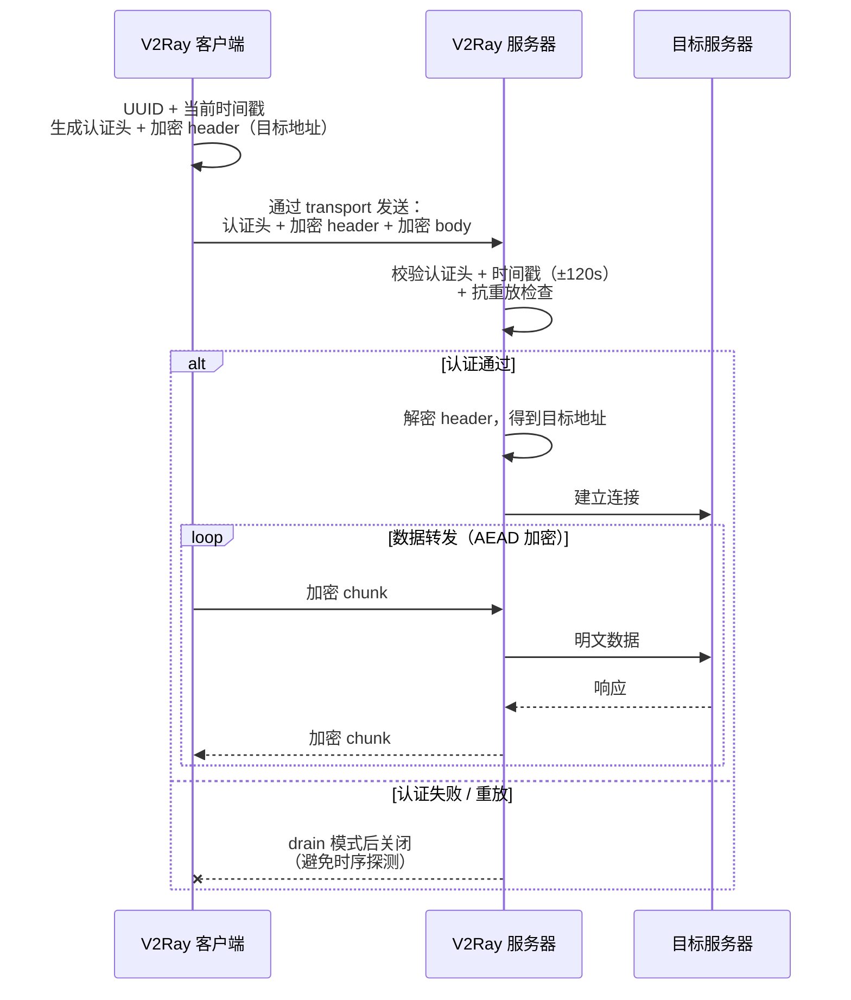

几个值得拎出来的实现细节：

- **抗重放**：除了 ±120s 时间戳窗口，还有一份长度 120 秒的 ReplayFilter，同一个 AuthID 在窗口内只能用一次，重放包直接拒绝。
- **body 加密三选一**：AES-128-GCM（默认，有 AES-NI 时性能最佳）、ChaCha20-Poly1305（ARM 嵌入式更友好）、None（明文，配合外层 TLS 时不再重复加密——这正是后来 VLESS 把"内层不加密"做成默认的思路源头）。
- **失败时不立即关连接**：服务端收到无法解开的 AuthID 时，不会立刻 RST，而是进入"drain"读完一段随机字节再关。这是为了对抗"用响应时序判断协议类型"的探测——和 SSR auth_chain_a 的 Tarpit 思路一致。

VMess 协议层做的事其实很朴素：**UUID + 时间戳的双因子认证**让一台服务器能同时服务多个用户（机场分发的基础），再把 SS 时代那种裸 AEAD payload 做得更结构化（版本号、命令字、地址类型等扩展字段）。

> 这里有一个小插曲，为什么一直说的是 VMess AEAD，而不是 VMess 原版？ 是因为原版在 2020 年 5 月被一个 PoC 直接打穿[v2ray-core#2523](https://github.com/v2ray/v2ray-core/issues/2523)，攻击者只要 16 次重放探测就能精确判定服务身份。有严重的暴露风险。

> 顺带说一个相关但不属于 VMess 协议的插曲：跟 #2523 同一周，[v2ray/discussion#704](https://github.com/v2ray/discussion/issues/704) 显示 V2Ray 实现的 TLS 库使用了一组特殊 cipher suite，一行 iptables 字符串匹配就能精准封禁所有走 TLS 的 V2Ray 流量，这意味着 VMess+WS+TLS 这种经典套路也跟着翻车。直接修复是改用 Go 标准库 `net/tls` 默认配置；真正用 utls 模拟浏览器 ClientHello 是 2022-12（[PR #2219](https://github.com/v2fly/v2ray-core/pull/2219)）才合并到主线，跨度 2 年半。

就算上面这些具体漏洞都已修上，VMess 协议层本身还有两个内在的设计取舍绕不过去：**时间戳窗口（±120 秒）** 对客户端时钟有要求，机场用户经常因为系统时间不同步连不上；**加密和伪装捆在一起做**——配合外层 TLS 时内层的 AEAD 是纯粹浪费，而单独裸跑则没有任何绕过检测能力。

后一个问题正是 VLESS 出现的直接原因——既然外层 TLS 才是绕过检测的关键，那把内层加密整个砍掉就是最自然的下一步。RPRX 在 #2523 第二天就立即提出了 [VLESS 提案（#2526）](https://github.com/v2ray/v2ray-core/issues/2526)。下面我们来看看 VLESS 的方案。

## VLESS

VLESS 是 2020 年提出的 VMess 简化版。（[#2636](https://github.com/v2ray/v2ray-core/issues/2636)），直到 2020-11 XTLS license 争议触发项目分叉，Xray-core 才从 v2ray-core 拆出来，把 VLESS 一起带走。今天 VLESS 在 [v2fly/v2ray-core](https://github.com/v2fly/v2ray-core/tree/master/proxy/vless) 和 [XTLS/Xray-core](https://github.com/XTLS/Xray-core/tree/main/proxy/vless) 两边都有实现，字节格式完全一致；只是 XTLS Vision 流控、Reality 抗探测这些后续扩展主要在 Xray 里发展。

核心理念是：**既然外层已经有 TLS，内层加密就是浪费**。VLESS 把 VMess 那套时间戳 + AuthID + ReplayFilter + AEAD 内层加密全部砍掉，协议字节结构直接简化为：

```text
[1 byte]    协议版本（目前 = 0）
[16 byte]   UUID（用户身份）
[1 byte]    Addons 长度 N
[N byte]    Addons（protobuf：Flow string + Seed bytes）
[1 byte]    命令（1=TCP / 2=UDP / 3=Mux）
[variable]  端口 + 地址
[variable]  payload
```

没有时间戳、没有认证哈希、没有 nonce、没有任何加密——身份完全靠 UUID 直接比对，加密和伪装全部交给外层 TLS。

### 工作流程

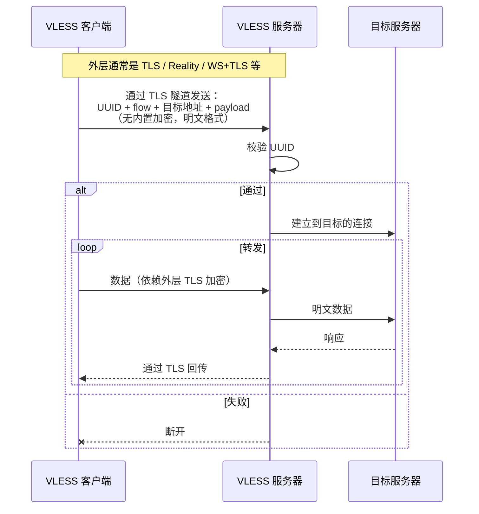

VLESS 的设计哲学是**做减法**。VMess 时代那套内层加密被全部砍掉，这带来了性能的直接提升，故障面也大幅缩窄，再也没有客户端时钟差 120 秒导致连不上这类问题。

但减法做到这种程度也意味着 **VLESS 单独裸跑就是明文** ，目标地址、UUID 全部以明文形式发送在网络上。它必须依赖外层（TLS / Reality / WS+TLS 等）提供加密和伪装，协议本身完全可被拦截发现，全部责任甩给传输层。

## XTLS / Vision

VLESS 把加密和伪装全部交给外层 TLS，但只有外层 TLS 还不够。理解这一点要先看知道一个具体场景，也就是 TLS in TLS 是什么。

### TLS-in-TLS 是什么

**当用户用 VLESS+TLS 访问 HTTPS 网站时，流量天然就是两层 TLS**，这里关键点是：浏览器并不知道中间有代理，它仍然在和目标地址（比如 example.com ）做端到端的 TLS 握手（这层叫 TLS-2），用的是 example.com 的真证书；而代理客户端把这条 TLS-2 字节流发送给代理服务器的时候，**自己又包了一层 TLS（这层叫 TLS-1）**，用的是代理服务器自己的证书（通常 Let's Encrypt）。

下面这张图里，**外框就是这层 TLS 的覆盖范围**：

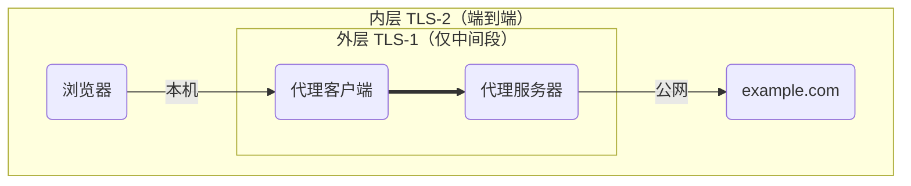

- **外层大框 = 内层 TLS-2**：用 example.com 的真证书加密，是浏览器和 example.com **端到端**的，跨越整条链路（浏览器以为自己在直接访问 example.com）
- **内层小框 = 外层 TLS-1**：用代理服务器自己的证书加密（通常 Let's Encrypt），**只覆盖中间一段**（代理客户端 ↔ 代理服务器）

在这种模式下，数据在公网上就会在内部形成**两层 TLS 嵌套**的结构：

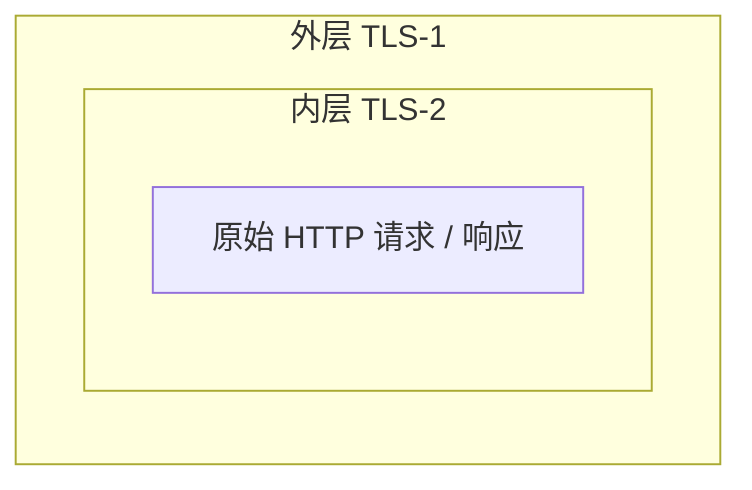

代理服务器只持有自己的私钥，它能拆掉外层 TLS-1，但拆掉后里面还套着一层 TLS-2——它解不开，只能把这层字节原样转发给真正的 example.com。

如果把上面那个嵌套结构展开时序，在"代理客户端 ↔ 代理服务器"这一段抓包看到的请求是这样的：

```text
[TCP 三次握手]
[TLS-1 ClientHello → 代理服务器]    ← 外层 TLS 握手
[TLS-1 ServerHello + Certificate]
[TLS-1 Finished]
─── 外层握手完成，进入数据传输 ───
[TLS-1 Application Data #1]  ← 里面包着 [TLS-2 ClientHello → example.com]
[TLS-1 Application Data #2]  ← 里面包着 [TLS-2 ServerHello + Certificate]
[TLS-1 Application Data #3]  ← 里面包着 [TLS-2 Finished]
[TLS-1 Application Data #4]  ← 里面包着 HTTPS 请求
...
```

注意第二段——**外层 TLS 数据传输的前几个包，内容正好是另一份完整的 TLS 握手**。这就是 "TLS-in-TLS"。

### 为什么 TLS-in-TLS 有指纹

TLS 加密只是把内层数据 + 16 字节 GCM tag 包起来，几乎不改变包大小。这意味着中间人虽然解不出 TLS-1 的明文，但能从外层包大小直接推断内层结构。

内层 TLS-2 握手各个消息的典型大小：

| TLS-2 消息 | 典型大小 |
|---|---|
| ClientHello | 200-500 字节 |
| ServerHello | 100-200 字节 |
| Certificate（真证书） | 1500-4000+ 字节（常被 TCP 分片成多个包） |
| ServerKeyExchange | 200-400 字节 |
| Finished | 50-100 字节 |

外层 TLS-1 加密后包大小只多 16 字节 tag——所以在数据层面看到的外层包大小序列就是：

```text
[~250B]        [~150B]        [~3000B 分片]   [~300B]   [~80B] ...
   ↑             ↑               ↑             ↑        ↑
ClientHello  ServerHello      Certificate       KeyEx  Finished
```

这个 **"中-小-大-中-小" 的包大小序列就是 TLS 握手的特征**——理论上，任何"在加密流的前几个包里出现这种序列"的连接，都可以被判定"这里面套着另一份 TLS"。

真实的 HTTPS 浏览（不通过代理）只有一层 TLS 握手序列，代理流量是**外层 TLS-1 握手序列 + 紧接着内层 TLS-2 握手序列**——两次握手在同一个 TCP 流里相隔很近，这是真实流量从来不会出现的特征。

这条特征被工程社区和学术界分别验证过：

工程社区里，RPRX 2022 年写过一个 30 行 Go 代码的 PoC [Trojan-killer](https://github.com/XTLS/Trojan-killer)<sup>[\[7\]](#ref-7)</sup>，只看 TLS ChangeCipherSpec 之后的上下行字节区间就能从 Trojan 流量里精准识别；

学术侧 USENIX Security 2024 的论文<sup>[\[3\]](#ref-3)</sup>更系统地用机器学习做到 >99% 准确率，覆盖 Trojan / Naive / VLESS+TLS / SS+v2ray-plugin / HTTP-CONNECT-proxy+TLS 等多种协议。

所以 TLS-in-TLS 不是理论问题——它是被工程 PoC 和学术论文双重验证、且已经在真实网络上观察到部分部署的攻击面。这正是 XTLS Vision 这个协议存在的原因。

### XTLS 怎么解决

XTLS 是 RPRX 2020 年提出的对抗 TLS-in-TLS 的协议扩展，通过 VLESS 的 flow 字段启用。它有几代演进：

| Flow 值 | 时间 | 状态 |
|---|---|---|
| `xtls-rprx-origin` | 2020 | 最早版本，已弃用 |
| `xtls-rprx-direct` | 2020-2022 | 曾是主流，后来发现仍有指纹，已弃用 |
| `xtls-rprx-splice` | Linux 专属 | 用 `splice()` 做零拷贝，已弃用 |
| **`xtls-rprx-vision`** | 2022，RPRX 重新设计 | **当前主流，前面那些都不再推荐** |

**Vision 的核心思路是：握手阶段正常做 TLS-1，握手完成后，数据传输阶段尽量不再叠加外层加密**。完整流程参照 [Xray 官方 Discussion #1295](https://github.com/XTLS/Xray-core/discussions/1295)<sup>[\[6\]](#ref-6)</sup>，归纳成五步：

1. **建立真实的外层 TLS-1 链接**: 握手的 ClientHello / ServerHello 字节有 JA3/JA4 指纹，骗不过去，这一步必须真按 TLS 标准跑
2. **在加密隧道里跟踪内层流量是不是 TLS 1.3**: 看内层初始字节是不是 `0x16` TLS Handshake record
3. **对内层握手的关键包做针对性填充**: 由于 TLS 1.3 握手的前 5 个标志包长度特征非常明显，Vision 把每个短握手包的长度填充到 900 - 1400 字节这个区间，使其混入正常数据包大小分布，有针对性的进行包整形
4. **客户端在第一个内层 application_data 包里嵌入 UUID 作为切换信号**: 服务端验证 UUID 通过后才切换到直传模式
5. **从第二个内层 application_data 包起，进入 raw bytes 直传**: XTLS 不再对数据包做任何处理,只是字节级单纯拷贝


外层 TLS-1 握手完成后，三个阶段（握手包整形 → UUID 切换信号 → raw 直传）在网络上的数据包长这样：

```text
阶段 ①：内层 TLS-2 握手字节（ClientHello / ServerHello / Certificate / Finished）
       [外层 TLS-1 header] + [外层 AEAD(内层握手字节 + padding)]
       每个短包 padding 到 900-1400 字节，破坏"中-小-大-中-小"特征
       ←—— 普通 AEAD 模式，body 是高熵随机字节


阶段 ②：内层握手完成后的"切换信号包"（一次性）
       [外层 TLS-1 header] + [外层 AEAD(内层 application_data 起始 + UUID + padding)]
                                                       ↑
                                             UUID 嵌入在这个包的 padding 里
       服务端解外层 AEAD 拿到 UUID，验证通过 → 切换到直传模式


阶段 ③：之后所有内层 application_data（占 99% 的代理流量）
       [外层 TLS-1 header (5B 明文)] [完整内层 TLS-2 record 字节]
                                            ↑
                                  外层不再 AEAD，直接放内层 record
       服务端 raw bytes 转发给 example.com（走 proxy.CopyRawConnIfExist，
       Linux 下早期版本可走 splice() 系统调用零拷贝）
```

> RPRX 团队的赌注是：审查方会用机器学习提取统计学特征（包大小、方向、时序），而不会做"深度内容检测"去逐字节解析每条 application_data。在这个假设下，剩下 1% 的握手包被填充到 900-1400 字节区间足以混入正常分布。这个判断到 2026 年仍然成立。但严格来说，**直传模式下外层 record body 前几字节确实是 `0x17 0x03 0x03 ??`** 这种合法 TLS record header 字节模式——理论上可被深度包检测识别，只是工程开销和误杀代价让审查方目前没动力部署。

Vision 解决的是 VLESS+TLS 在**数据层的 TLS-in-TLS 指纹问题**——通过内层 TLS 检测、外层不再加密、流量整形三步，让外层包大小序列上看不到"中-小-大-中-小"这种内层 TLS 握手特征。性能上还顺带消除了双重 AEAD 加解密的 CPU 开销。

但 Vision 解决不了握手层的问题，就是外层 TLS-1 用的还是代理服务器自己的证书，证书指纹仍可被关联，主动探测仍能看到"这台服务器在跑某个不一定像主流网站的 TLS 服务"。所以 Vision 通常不单独裸跑，需要配合一层伪装——常见组合是 Reality 或自有证书 TLS（已有域名/CDN 场景），各自有适用范围。

## Reality

Vision 解决了数据层的指纹，但**握手层**还有两个问题没解决：

1. **证书指纹**：代理服务器需要自己申请证书（Let's Encrypt 或自签），证书的颁发者、有效期、SAN 列表会被收集成指纹，一旦关联到代理用途整个证书就废了
2. **主动探测**：探测器主动连代理服务器的 443 端口，看到的是代理服务器自己的 TLS 响应——只要它跟"普通公网 HTTPS 站点"在 ALPN 协商、密码套件偏好、ServerHello 长度等任何一处行为不同，就是指纹

Reality 是 2023 年在 Xray 里推出的协议扩展，从根源上解决这两个问题——**不让代理服务器自己产生 TLS 握手，而是借用真实大网站的 TLS 握手**。

核心机制：

- 部署 Reality 时配置一个 dest（借用的目标，比如 `www.microsoft.com:443`）
- 客户端 ClientHello 的 SNI 写成 `microsoft.com`，在 ClientHello 的特定字段（SessionId 等）里夹带 Reality 鉴权材料（X25519 公钥 + 时间戳 + shortId）
- 服务器收到后**先校验鉴权字段**：
  - **合法客户端**：服务器在内存里生成一份"伪造的 microsoft.com 证书"——Subject、SAN、有效期等元数据从真实 microsoft.com 证书复制，但用代理服务器的临时私钥重签——完成 TLS 握手后切到代理模式
  - **非法 / 探测**：服务器**透明转发**整个 TLS 握手给真实的 microsoft.com，把对方返回的字节原样转回给客户端——探测器看到的就是 microsoft.com 本人

普通浏览器看到那张"伪造的 microsoft.com 证书"会判定证书不可信，但 Reality 客户端**不做证书验证**——它通过预共享的 publicKey 和 X25519 密钥交换里的鉴权字段验证身份，证书只是让 TLS 握手字节流"看起来正常"用的。

Reality 到这里很容易引申问出两个问题。

**Q1: SNI 写 `microsoft.com` 但流量去到一个普通 VPS，不会发现 IP 异常吗？**

答案是不会。单 IP 多 SNI 是 HTTPS 共享托管的基础，Cloudflare 一个 IP 后面挂着上百万个域名，Nginx 反代一台 VPS 上挂十几个域名，企业网关 / 教育网入口 / 镜像站全都是非官方 IP 上的 microsoft.com 流量。

而且就算主动连过来探测，看到的也是 microsoft.com 本人，因为 Reality 服务器对没带 X25519 鉴权的请求会**透明转发**到真 microsoft.com，对方返回的真证书 + 真响应原样回流。探测者得到的结论只能是：这个 IP 上跑着一个 microsoft.com 反向代理，这种东西公网上太常见，不构成异常。

**Q2: ClientHello 是明文，SessionId 里塞鉴权材料不会暴露吗？**

不暴露。**TLS 1.3 的 SessionId 字段本来就是 32 字节真随机字节**——RFC 8446 明确规定客户端必须在这个字段填 32 字节由系统 RNG 生成的随机数。所以正常浏览器发出的 ClientHello，SessionId 看起来就是 32 字节高熵随机。

Reality 把鉴权材料（X25519 公钥 + 时间戳 + shortId）经过 AES 加密后填进 SessionId 里——AES 加密后的输出在统计学上跟真随机字节**完全无法区分**。


### 工作流程

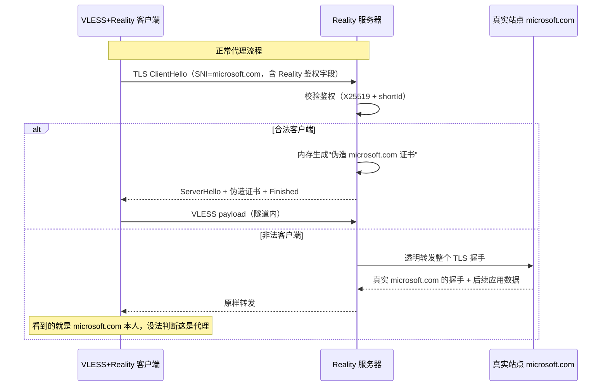

Reality 把抗主动探测做到了一个新高度。**借用真实大站点的 TLS 握手**让两件事同时成立：**不需要自己申请和管理证书**（证书指纹被关联这条攻击面彻底切掉），**主动探测无从下手**（看到的就是 microsoft.com 真实响应，完全没法判断这是代理）。

代价是协议被"绑死"在借用的站点上。**dest 选错了整个伪装就崩**——选了个已被封锁的站，连接直接失败；选了个 ALPN / TLS 行为跟主流大站不一样的，反而暴露指纹。**dest 站点本身的稳定性也成了协议依赖**——被借用的真实站点哪天宕机或者改了 TLS 配置，所有指向它的 Reality 服务一起出问题。这是一个"用别人家的脸做伪装"的协议，伪装质量天然受限于"脸"的质量。

> ⚠️ 一个常见的认知点需要澄清：**Reality 单独使用并不消除 TLS-in-TLS 数据层特征**。当用户用 Reality 访问 HTTPS 网站时，内层仍然有"浏览器 ↔ 目标网站"的 TLS-2 握手，Reality 的外层流量仍然会暴露上一节讲的"中-小-大-中-小"内层 TLS 握手包大小序列——Reality 解决的只是**握手层的服务端指纹**（证书指纹、ServerHello 行为等），**数据层的 TLS-in-TLS 特征需要 XTLS Vision 配合才能消除**。Xray 官方在 [Discussion #2166](https://github.com/XTLS/Xray-core/discussions/2166) 里也明确写过：*"Reality can eliminate server TLS fingerprint characteristics. xtls-rprx-vision can eliminate TLS-in-TLS characteristics."* 因此追求最高安全性的配置是 `VLESS + xtls-rprx-vision + Reality` 三件套；但实际部署中也有**只用 Reality（不带 Vision）**的轻量配置，TLS-in-TLS 数据层特征虽然存在但目前没被大规模封锁，仍能用。

# TLS 伪装家族

跟 V2Ray / Xray 家族的"协议层 + 传输层正交组合"思路不同，**Trojan、ShadowTLS、AnyTLS 这三个协议走的是另一条路**——协议层和伪装层一体化，整个协议**就是基于真实 TLS 来伪装**。它们解决的核心问题都是同一个：**让代理流量在线缆上看起来就是普通 HTTPS**。

三种思路代表了"借真实 TLS"的三代演化：

| 协议 | 年份 | 核心思路 | 一句话总结 |
|---|---|---|---|
| **Trojan** | 2019 | 服务器端就是真 HTTPS 服务，握手用自己的真证书，密码错了走 fallback 站点 | "不伪装，做真的" |
| **ShadowTLS** | 2022 | 连握手字节都不自己生成——把客户端 ClientHello 转发给真实站点（donor），把 donor 返回的字节原样回流 | "借别人的脸" |
| **AnyTLS** | 2025 | 不借任何 donor，自己用普通 TLS 包裹 + 主动 padding 整形破坏 TLS-in-TLS 包长指纹 | "用主动构造对抗识别" |

注意 V2Ray / Xray 家族里讲过的 **Reality**（2023）也是"借真实站点 TLS 握手"思路的代表——它和 ShadowTLS 在哲学上同源，只是 Reality 绑定 VLESS 协议、ShadowTLS 跟内层协议解耦，所以分别归在两个家族里。

下面分别看 Trojan、ShadowTLS、AnyTLS 三个协议。

## Trojan

Trojan 在 2019 年提出。它的设计哲学非常直接：**不要试图搞复杂的混淆，直接做成一个真正的 HTTPS 服务**。

服务器其实就是一个普通的 HTTPS 站点，跑在 `443` 端口，证书是真的（Let's Encrypt）。客户端连上来后做正常 TLS 握手，握手后发送一个密码哈希：

- 哈希正确：进入代理模式
- 哈希错误：当作普通 HTTP 请求处理，回退到伪装站点（fallback）

但做真 HTTPS 反过来也意味着部署成本显著提升了，**必须有合法域名**、**必须有真实 TLS 证书**、还**必须配置一个真实的站点**。

### 工作流程

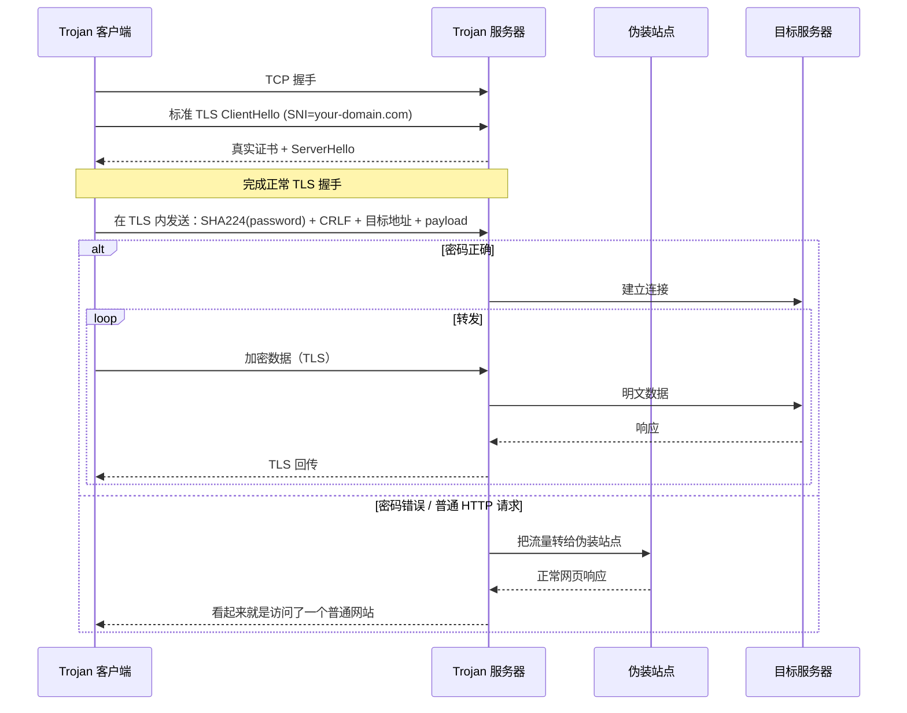

Trojan 的设计哲学是"不伪装，做真的"。服务器端就是一台正常的 HTTPS 服务，握手、证书、ALPN 全部合规，主动探测自然失效，没拿到密码就被回退到 fallback 站点（一个真实的网页），跟访问任何普通 HTTPS 站点没区别。这种"协议外观即真实 HTTPS"的设计极其简洁，没有任何混淆层、没有时间戳、没有协议握手：客户端 TLS 连上来直接发 SHA224(密码) + CRLF + 目标地址，对了就转发，错了走 fallback。

但代价是 **TLS-in-TLS 指纹**绕不过去。当用户用 Trojan 访问 HTTPS 网站时，外层是 Trojan 的 TLS、内层是访问目标的 TLS。前面 Vision 章节讲过的 [Trojan-killer](https://github.com/XTLS/Trojan-killer)<sup>[\[7\]](#ref-7)</sup>就是这个攻击面的可复现演示。

Trojan 的真 HTTPS 思路解决了"主动探测"但没解决"TLS-in-TLS"——下一节的 ShadowTLS 把这个思路再往前推一步：连证书都借真实大站点的，连握手字节都不用自己产生。

## ShadowTLS

ShadowTLS 由 ihciah 在 2022 年提出。它的思路和 Reality 有相似之处，但更纯粹——**它只是一个传输层伪装壳，不绑定特定代理协议**。

核心想法：让对外暴露的 TLS 握手是真实的——直接把客户端的 ClientHello 转发给真实大站点（项目里叫 **handshake server**，握手服务器，例如 microsoft.com；下文我们简记为 **donor**），donor 返回的 ServerHello、证书、Finished 原样回传。握手完成后再切换成代理通道。

### 工作流程

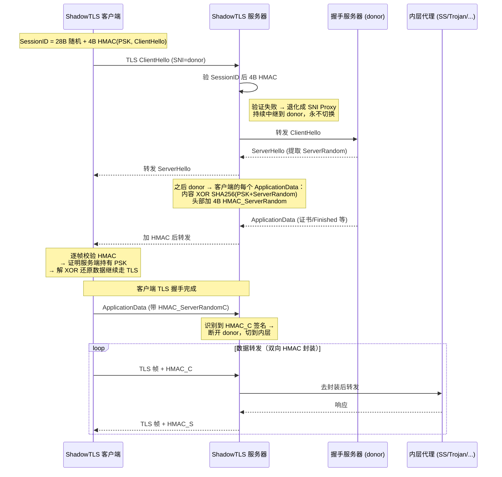

ShadowTLS 比 Trojan 更进一步——连证书和握手字节都不自己产生，TLS 握手阶段直接把客户端的 ClientHello 转发给 donor，donor 返回的 ServerHello、证书、Finished 全部原样回传。这意味着主动探测打过去看到的不是伪造证书，而是 **donor 的真实证书 + 真实响应**，证书指纹完全可信。

最新版本里 ShadowTLS 把"防主动探测+防中间人劫持"都做到了协议层，有三个关键设计点<sup>[\[5\]](#ref-5)</sup>：

- **客户端先证明身份**：ClientHello 的 SessionID 末 4 字节藏一个 PSK 派生的 HMAC。服务端验不过 → 把流量持续转给 donor、自己变成真 SNI Proxy——主动探测者看到的就是真站点。
- **服务端逐帧证明自己**：从 donor 转给客户端的每个数据帧，服务端都加 4 字节 HMAC。中间人没有 PSK 就伪造不出来，劫持或篡改会立刻被客户端识破。
- **切换由客户端说了算**：客户端发出第一个带"切换签名"的帧，服务端识别到就断开 donor、切到内层代理。服务端**完全不感知 TLS**，只看 HMAC 字节——所以实现根本不需要 TLS 库。

另一个有意思的设计是**协议解耦**：ShadowTLS 只负责"TLS 握手伪装"这一层，握手完成后切换出来的内层协议可以是 SS、Trojan、VLESS 任意一种——它本质上是一个**通用的 TLS 伪装外壳**，而不是绑定加密和数据封装的代理协议。

如果把 ShadowTLS 拆成"握手期 + 数据期"两段看，会发现一个有意思的事实——**握手后的行为，在思想上跟 SSR 当年的 tls1.2_ticket_auth 是同构的**：都是"穿 TLS 外衣的私有协议"，TLS record header 是明文壳，里面装的根本不是真 TLS 加密的数据。客户端跟 donor 协商出的真密钥在握手完成那一刻就被丢弃了，后续帧用的是 PSK 派生的 HMAC + 内层协议自带的加密。

但 ShadowTLS 工程上把 SSR `tls1.2_ticket_auth` 当年被打掉的破绽全补上了：

| 特性 | SSR `tls1.2_ticket_auth`（2016） | ShadowTLS v3（2023） |
|---|---|---|
| 数据期外形 | TLS record 包装 | TLS record 包装 |
| 前置握手 | ❌ 自己伪造（自签证书 / 假 ServerRandom） | ✅ 真握手（donor 真证书，真私钥签的） |
| 帧级身份验证 | ❌ 无 | ✅ 每帧 4B HMAC（PSK+ServerRandom 派生） |
| 探测失败行为 | 异常断开 / 时序异常，反而暴露 | 退化成真 SNI Proxy，持续转给 donor |

也就是说，SSR obfs 当年的设计直觉是对的，只是护城河不够深——前置握手是假的、帧没认证、失败行为暴露。ShadowTLS 用"真 TLS 握手 + 帧 HMAC + 降级保护"把这些洞全堵上了。

还有一个容易踩的坑：**ShadowTLS 本身只做"伪装外壳 + 身份认证"，不提供数据加密**。TLS record payload 里的 `data` 字段是直接透传给内层协议的——

```text
┌─────────────────┬──────────┬─────────────────────────┐
│ 5B TLS record   │ 4B HMAC  │ data （透传给内层）      │
│ header (明文)    │ _C / _S  │ ← ShadowTLS 不加密这里   │
└─────────────────┴──────────┴─────────────────────────┘
```

所以内层协议必须自带加密。**官方部署示例里反复出现的就是 ShadowTLS + Shadowsocks 同机双进程**，server 侧 ShadowTLS 监听公网端口、转发数据给本机 shadowsocks-server，client 侧反过来。但这并不是协议层强制，sing-box / mihomo 把 ShadowTLS 做成了**通用 outbound 类型**，理论上内层换成 VMess、Trojan 也能跑，只是社区里这种组合非常少见。如果硬把 **VLESS**（协议本身明文）接进来，出去的就是"伪 TLS 外壳 + HMAC + 明文 VLESS 数据"，UUID 和目标地址全部裸奔——伪装外壳就完全失去意义了。

ShadowTLS 是"借用 donor"路线的极致，但反过来说也意味着**对 donor 高度依赖**。下一节的 AnyTLS 走了相反的方向：不借任何 donor，用主动填充破指纹。

## AnyTLS

AnyTLS 是 2025 年初提出的代理协议（[anytls/anytls-go](https://github.com/anytls/anytls-go) 仓库 2025-02 创建），后被 sing-box / mihomo / Shadowrocket 集成。核心目标是**缓解 TLS-in-TLS 嵌套握手指纹问题**。

它走的路跟前面 ShadowTLS / Reality 完全相反：

- ShadowTLS / Reality：**借真站点的 TLS 握手**做掩护
- AnyTLS：**用自己的 TLS 证书 + 主动整形流量特征**

为此 AnyTLS 在协议层做了三件事<sup>[\[8\]](#ref-8)</sup>：

- **主动改包大小，扰乱包长特征**：握手后客户端对前几个数据包做分包和填充。
- **填充方案可被服务器随时换掉**：这是 AnyTLS 最大的差异化设计。指纹本身变成了可热更新的协议参数。
- **多个代理请求共享一条 TLS 连接**：类似 HTTP/2 的多路复用，单条 TLS 流量看起来更像"用户在浏览一个网站"，而不是"代理在中转一堆请求"。顺便也摊薄了 TLS 握手开销。

### 工作流程

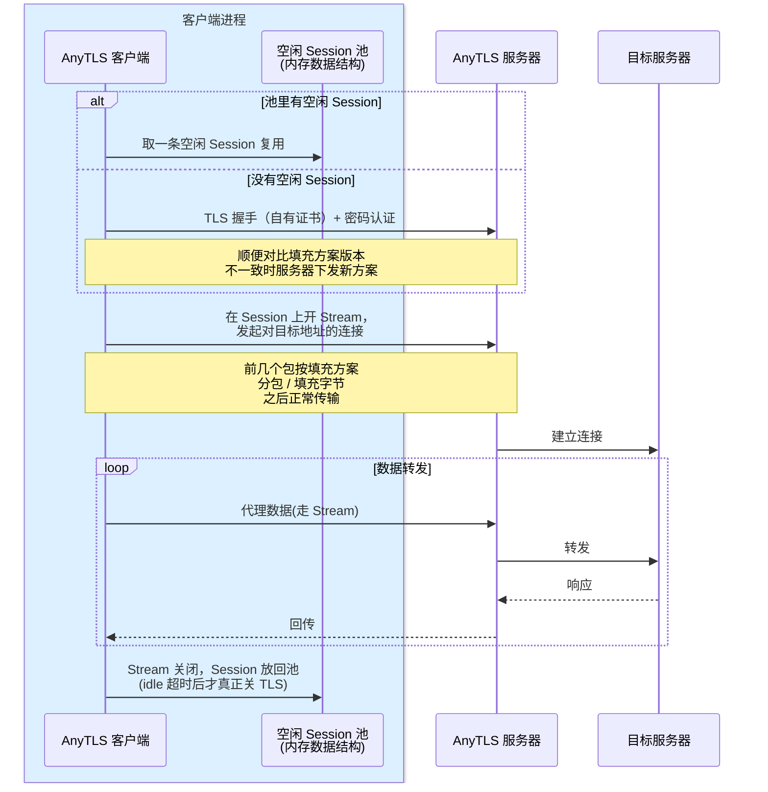

代价主要是三条：

- **padding 本身要付钱**——带宽和 CPU 都有开销，所以默认只整形前 8 个包
- **填充方案本身可能成为指纹**——即使能热更新，每个推下去的 scheme 都可能被采集进识别库；
- **TCP 层队头阻塞（HoL）**——多个 Stream 共享一条 TCP，丢一个包整条连接所有 Stream 一起卡（比如后台大文件下载产生的丢包，会同步卡住同 Session 上的网页小请求）。这是所有 TCP+TLS mux 方案的共同代价，跟 HTTP/2 当年被吐槽的痛点一模一样

### 跟 Trojan 的对比

两者都用"自有真 TLS 证书"做伪装，但路线截然不同：

| 维度 | Trojan | AnyTLS |
|---|---|---|
| 防主动探测 | 错密码 fallback 到真网页 | 错密码直接断开（或 fallback） |
| 部署门槛 | 必须域名 + 真证书 + fallback 站点 | 自签证书也能跑 |
| 抗 TLS-in-TLS | 无主动防御 | padding + 多路复用 |
| 流量结构 | 浏览器 TCP × N → 代理 TCP × N | 浏览器 TCP × N → 1 条 TLS |
| 演化能力 | 协议固定 | 服务端可热更新填充方案 |

一句话：**Trojan 押注"做一个真实的 HTTPS 站点"，AnyTLS 押注"做一条不像代理的 TLS 长连接"**

到这里 TCP + TLS 路线的演化基本走完。但 HoL 这个代价让 TCP 系协议在跨境高丢包场景天然有上限——下一步的赛道就是来解决它的：换 UDP + QUIC，从根本上消除 HoL。

# UDP 家族

前面讲的所有协议都跑在 TCP 上。但 TCP 在丢包率高、跨境长距离的网络上表现并不好，拥塞控制保守、队头阻塞严重。**UDP 家族**直接换协议栈跑在 QUIC（UDP 之上的现代传输协议）上，把 TCP 路线的两大老问题一并解决：

- **流级 ARQ 消除队头阻塞**——不同 Stream 在 QUIC 层独立丢包重传，互不影响
- **TLS 1.3 / 多路复用 / 连接迁移 / 0-RTT 全部内置**——协议设计直接继承 QUIC 原生能力

代价是 UDP 依赖，部分网络环境对 UDP 做了严重 QoS 限速甚至直接丢弃，QUIC 在这些网络下基本不可用。

UDP 家族里有两个主要协议：Hysteria 和 TUIC，都基于 QUIC，但设计哲学截然相反：

| 对比项 | Hysteria（v2） | TUIC（v5） |
|---|---|---|
| 整体风格 | 装得像个真 HTTP/3 网站，自己管控速，还能加混淆 | 裸 QUIC 上薄薄一层命令字，几乎不伪装 |
| 看起来像什么 | 标准 HTTP/3 网站（认证就是发个 `POST /auth` 请求） | 裸 QUIC 流量 |
| 怎么控速 | 用户在客户端配好上下行带宽，丢包也不让步 | 不管，直接用 QUIC 默认那套 BBR / CUBIC |
| 第一次发数据要不要等服务端 | 要——客户端先发"我要连 example.com"，等服务端回"OK 连上了"再开始传 | 不等——发完"我要连 example.com"立刻就开始传，服务端连"OK"都不回 |
| 自带混淆 | 有两层可选开关（包级异或 + 握手包打散） | 没有 |
| 跨境高丢包下吞吐 | 好（代价是带宽硬扛） | 一般（吃 BBR 的上限） |
| 服务器带宽成本 | 高 | 低 |

工作流程框架两者很接近——QUIC 握手（内嵌 TLS 1.3）→ 应用层认证 → 在 QUIC 连接里开多条 stream 跑代理流量：

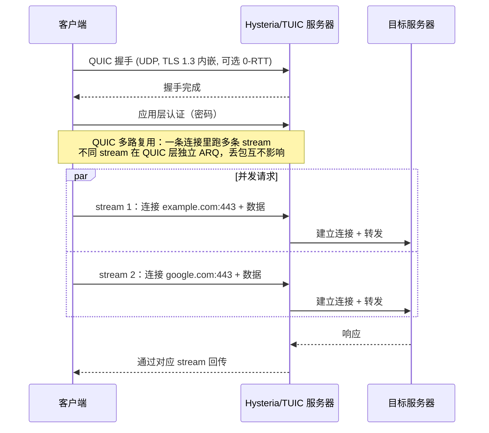

下面分别看 Hysteria 和 TUIC——它们在这个共同框架上塞进去的"私货"完全不同。

## Hysteria

Hysteria 由 apernet 团队 2020 年开源（v0.1.0 发布于 2020-04），2022-02 发布 v1.0，2023-09 发布 v2.0，目前 v2 是主流。**核心目标：把跨境高丢包网络的可用带宽榨干**。

它在 QUIC 通用框架上叠了三件事（[Hysteria 2 协议规范](https://v2.hysteria.network/docs/developers/Protocol/)）：

- **真 HTTP/3 应用层伪装**——服务端就是一个标准 HTTP/3 服务器（RFC 9114）。客户端的"认证"实际是发了一个 `POST /auth` HTTP/3 请求，认证字段 `Hysteria-Auth`、带宽协商字段 `Hysteria-CC-RX`、随机填充 `Hysteria-Padding` 全部走标准 HTTP header；服务端验证通过后回 `233 HyOK`，**验证失败时按普通 HTTP/3 服务器响应或反向代理到真实站点**——这是 QUIC 路线上的 Trojan 风格 fallback。
- **Brutal Congestion Control**——客户端通过 `Hysteria-CC-RX` 头告诉服务端自己想接收的速率，服务端就**死扛这个速率不退让**，丢的包让 QUIC ARQ 自己重传。这跟 BBR/CUBIC"看到丢包就退让"的标准 CC 完全相反，所以在跨境高丢包网络下能直接吃满用户指定带宽。注意 Brutal 是协议**允许**的 CC 模式而不是强制——客户端如果发 `0` 表示不知道自己速率，服务端就会回退用 BBR/CUBIC。
- **可选叠混淆层**——Salamander（用 BLAKE2b 派生 keystream 把每个 QUIC 包 XOR 一遍）和 Gecko（把 QUIC 长头握手包随机分片成 2-8 段套上随机 padding）这两个混淆层都是协议规范里直接定义的，开了之后连 QUIC 握手指纹都被破坏。

它优势非常明确：**跨境高丢包场景下吞吐最好**——这是 Hysteria 的核心卖点，也是它在视频流、跨境大文件下载场景里能打的根本原因。

但这也有一定的代价

- **服务器实际出口流量更大**——Brutal CC 不退让 + 让 QUIC ARQ 重传换吞吐，意味着同样的"用户感知速率"下，服务端打出去的真实流量比 BBR/CUBIC 高一截，丢包率越高放大越明显。这一条理论上会让 Hysteria 节点的运营成本高于走标准 CC 的 VLESS / Trojan。
- **协议层 TCP relay 多一个来回**——客户端发完连接请求要等服务端回"OK"才能开始传数据，比 TUIC 慢一个 RTT
- **UDP 被封时整条线挂掉**——这是 UDP 家族的共同代价

## TUIC

TUIC 由 EAimTY 在 2021 年底开源（仓库创建于 2021-12），2022 年发布 v4，2023-06 发布 v5（协议大改 + 项目完全重构）成为当前主流。设计哲学跟 Hysteria 完全相反，他的核心设计是**最小化协议层包装，把 QUIC 的原生能力直接暴露给代理使用**。

整个协议层只压成了 5 条命令——认证、建 TCP 连接、传 UDP 包、关闭 UDP 会话、心跳保活，除此之外什么都不做（[TUIC v5 SPEC](https://github.com/EAimTY/tuic/blob/a299ef02d9f4ab5a0edbf58b9998f41bf768b332/SPEC.md)）。"**0-RTT 用得最彻底**"也不是靠 QUIC session ticket，而是协议层硬把"等服务端确认"这一步砍掉了：

- **建 TCP 连接不等服务端**：客户端发完"我要连 example.com"**立刻就开始传数据，服务端永远不会回话**（协议规范原文 "server will never respond, actually"）——这跟 Hysteria"等服务端回 OK 再传"形成最尖锐的对比。
- **认证跟代理流量并行**：认证走独立通道，不阻塞代理流量；认证还没完的时候新连接已经能开始发了。

拥塞控制方面 SPEC 里没有任何相关定义，**直接用 QUIC 默认 CC**（BBR / CUBIC）。

TUIC 的优势是**协议简单 + 实现轻量 + 0-RTT 极致低延迟**，服务器开销低，适合**并发轻请求场景**（浏览网页、API 调用）。

但代价也很明显：

- **跨境高丢包场景下吞吐不如 Hysteria**——不做激进 CC，吃标准 BBR 的能力上限
- **QUIC 流量本身有指纹**——TUIC 几乎不做应用层伪装，QUIC fingerprinting 越成熟它越容易被识别
- **UDP 被封时整条线挂掉**——同样的家族代价

## 与 TCP 系的总结

QUIC 系协议的位置很清楚：**追求高吞吐和低延迟时是首选，追求隐蔽性和稳定可用性时不如 TLS 系**。两条路线在 2026 年的实际部署里互补——机场常见的配置是"Hysteria2 节点跑视频/下载，VLESS+Reality 节点跑日常浏览和稳定链路"。


# 总结对比

| 协议 | 时间 | 主要解决什么 | 协议层代价 |
|---|---|---|---|
| 传统 VPN | 1990s | 公网上建加密隧道（企业内网接入） | 固定握手指纹 + 固定端口，被动 DPI 一眼识别 |
| Shadowsocks | 2012 | 轻量加密代理穿透 | 整条流量是高熵随机字节，公网上就是异常特征 |
| SSR | 2015 | 在 SS 上加 obfs 反 DPI + protocol 反主动探测 | 伪 TLS 握手有指纹，项目维护停滞 |
| V2Ray / VMess | 2015 | "协议层 × 传输层"解耦的多协议代理框架 | VMess AEAD 之前曾被 PoC 打穿，认证对客户端时钟敏感 |
| Trojan | 2019 | 服务端就是真 HTTPS 站点，密码错了 fallback 到真网页 | TLS-in-TLS 数据层有包长指纹 |
| VLESS | 2020 | 砍掉 VMess 内层加密 | 单独裸跑就是明文 |
| Hysteria | 2020 / v2: 2023 | 跨境高丢包下榨干带宽 + 真 HTTP/3 伪装 | 服务端出口流量大；UDP 被封即挂 |
| XTLS Vision | 2022 | 消除 TLS-in-TLS 的数据层包长指纹 | 只解决数据层，握手层指纹要别的协议配合 |
| ShadowTLS | 2022 | 借真实站点的 TLS 握手做掩护（与内层协议解耦） | 强依赖 donor 站点，donor 选错或挂了就崩 |
| SS-2022 | 2022 | 修 SS 的密码学缺陷（nonce 复用 / 弱 KDF / 抗重放） | 没改"流量外观"，裸跑还是高熵随机 |
| TUIC | 2021 / v5: 2023 | 极薄协议层 + 极致 0-RTT 低延迟 | 不伪装，QUIC 指纹直接暴露；UDP 被封即挂 |
| Reality | 2023 | 借真站点的 TLS 握手 + 不要自己的证书 | 强依赖 dest 站点；不消除 TLS-in-TLS（要 Vision 配合） |
| AnyTLS | 2025 | 主动 padding 整形对抗 TLS-in-TLS 包长识别 | padding 开销；填充方案本身可被采集；TCP 队头阻塞 |

整条演化的主旋律可以一句话概括：**从"加密内容"，走向"伪装外观"，最后走向"借用真实身份"**——今天所有还活着的代理协议，争夺的都是同一件事：让流量看起来不像代理。

但有几点要单独提一下

**演化时间不代表协议的高下，不同协议侧重解决的问题域是不一样的**

**没有"最强协议"，只有"最适合当前场景的协议"**

**老协议没死,新协议没赢** 

代理协议的世界不是软件版本的"v1 → v2 → v3",而是协议之间**功能正交**——加密、伪装、传输层各做各的事,在不同网络环境下重新组合。这也是为什么本文一直强调"协议层 × 传输层 × 内外层组合"这个视角——单看一个协议的好坏没有意义,**组合起来在你具体网络环境下实测能不能跑、跑多稳,才是唯一标准**。

# 参考文献

## 编号引用文献

正文中以 <sup>\[N\]</sup> 形式引用的核心文献。前 4 条是学术论文与 RFC 风格协议规范，后 3 条是被正文多处引用的项目设计文档与开源 PoC。

**学术论文**

- <a id="ref-1"></a>**[1]** Alice, Bob, Carol, Beznazwy, J., & Houmansadr, A. (2020). [*How China Detects and Blocks Shadowsocks*](https://gfw.report/publications/imc20/en/). In Proceedings of the ACM Internet Measurement Conference (IMC '20). 最佳论文亚军。
- <a id="ref-2"></a>**[2]** Wu, M., Sippe, J., Sivakumar, D., et al. (2023). [*How the Great Firewall of China Detects and Blocks Fully Encrypted Traffic*](https://www.usenix.org/conference/usenixsecurity23/presentation/wu-mingshi). In USENIX Security Symposium '23. [PDF](https://www.usenix.org/system/files/usenixsecurity23-wu-mingshi.pdf)
- <a id="ref-3"></a>**[3]** Xue, D., Ramesh, R., Houmansadr, A., et al. (2024). [*Fingerprinting Obfuscated Proxy Traffic with Encapsulated TLS Handshakes*](https://www.usenix.org/system/files/sec24summer-prepub-465-xue.pdf). In USENIX Security Symposium '24.

**协议规范**

- <a id="ref-4"></a>**[4]** database64128 (2022). [*Shadowsocks 2022 Edition: Strengthened Wire Format with AEAD-2022 Ciphers*](https://github.com/Shadowsocks-NET/shadowsocks-specs/blob/main/2022-1-shadowsocks-2022-edition.md). Shadowsocks-NET specs (SIP022).
- <a id="ref-5"></a>**[5]** ihciah (2022, 2023). *ShadowTLS Protocol Design*. [V1/V2 协议设计](https://github.com/ihciah/shadow-tls/blob/master/docs/protocol-zh.md)、[V3 协议设计](https://github.com/ihciah/shadow-tls/blob/master/docs/protocol-v3-zh.md)（[英文版 V3](https://github.com/ihciah/shadow-tls/blob/master/docs/protocol-v3-en.md)）。

**项目设计文档与开源 PoC**

- <a id="ref-6"></a>**[6]** yuhan6665 / RPRX (2022). [*XTLS Vision 官方设计 Discussion #1295*](https://github.com/XTLS/Xray-core/discussions/1295). Xray-core 仓库。
- <a id="ref-7"></a>**[7]** RPRX (2022). [*Trojan-killer*](https://github.com/XTLS/Trojan-killer)：30 行 Go 代码的 TLS-in-TLS 检测 PoC，可从 Trojan 流量中精准识别 TLS-in-TLS。
- <a id="ref-8"></a>**[8]** anytls (2025). [*AnyTLS Protocol Design*](https://github.com/anytls/anytls-go/blob/main/docs/protocol.md). anytls/anytls-go 仓库。

## 协议规范与项目主页

下面的资料未在正文 sup 引用，作为补充阅读材料汇总。

- Shadowsocks 官方文档：[shadowsocks.org](https://shadowsocks.org/)
- ShadowsocksR 协议插件文档：[shadowsocksrr/shadowsocks-rss](https://github.com/shadowsocksrr/shadowsocks-rss/blob/master/ssr.md)
- V2Ray / VMess 协议文档：[v2fly.org](https://www.v2fly.org/)
- VLESS 协议实现：[v2fly/v2ray-core proxy/vless](https://github.com/v2fly/v2ray-core/tree/master/proxy/vless) / [XTLS/Xray-core proxy/vless](https://github.com/XTLS/Xray-core/tree/main/proxy/vless)（字节格式一致）
- Reality 设计文档：[XTLS/REALITY](https://github.com/XTLS/REALITY)
- Trojan 协议规范：[trojan-gfw/trojan](https://trojan-gfw.github.io/trojan/protocol)
- AnyTLS 配置文档：[sing-box.sagernet.org](https://sing-box.sagernet.org/configuration/outbound/anytls/)
- Hysteria 2 协议规范：[v2.hysteria.network/docs/developers/Protocol/](https://v2.hysteria.network/docs/developers/Protocol/)
- TUIC v5 协议规范：[EAimTY/tuic SPEC.md](https://github.com/EAimTY/tuic/blob/a299ef02d9f4ab5a0edbf58b9998f41bf768b332/SPEC.md)

## 相关讨论

正文中引用、但未用 sup 编号引用的开源仓库 issue / PR / discussion，按主题分类汇总。

**VMess 协议层缺陷与 PoC**：

- [v2ray-core#2523](https://github.com/v2ray/v2ray-core/issues/2523)：VMess 协议设计和实现缺陷可导致服务器遭到主动探测特征识别（附 PoC，2020-05）
- [v2ray/discussion#704](https://github.com/v2ray/discussion/issues/704)：V2Ray 的 TLS 流量可被简单特征码匹配精准识别（附 PoC，2020-05）

**VMess AEAD 与 VLESS 设计**：

- [v2fly/v2fly-github-io#20](https://github.com/v2fly/v2fly-github-io/issues/20)：VMessAEAD 设计文档（2020-08）
- [v2fly/v2ray-core#940](https://github.com/v2fly/v2ray-core/pull/940)：VMess Proposal AEAD Based Packet Length（2021-04）
- [v2ray-core#2526](https://github.com/v2ray/v2ray-core/issues/2526)：VLESS 设计提案（RPRX 在 #2523 第二天提出，2020-06）
- [v2ray-core#2583](https://github.com/v2ray/v2ray-core/issues/2583)：VLESS ALPHA
- [v2ray-core#2636](https://github.com/v2ray/v2ray-core/issues/2636)：VLESS BETA

**XTLS / Vision / Reality**：

- [XTLS/Go#17](https://github.com/XTLS/Go/issues/17)：早期 XTLS-direct "看 0x17 0x03 0x03 切换"被滥用的漏洞讨论——Vision 改用 UUID 信号的直接动机（Vision 设计文档见 ref-6）
- [XTLS/Xray-core Discussion #2166](https://github.com/XTLS/Xray-core/discussions/2166)：Reality 与 Vision 各自职能划分的官方说明——*"Reality can eliminate server TLS fingerprint characteristics. xtls-rprx-vision can eliminate TLS-in-TLS characteristics."* 也是本文推荐 `VLESS + Vision + Reality` 三件套的依据

**传输层伪装与工具集成**：

- [v2fly/v2ray-core#2219](https://github.com/v2fly/v2ray-core/pull/2219)：Add uTLS Support into V2Ray's TCP and WebSocket transport（2022-12）

**漏洞披露**：

- [Anonymous376c1d0cf28/VLESS-cracker](https://github.com/Anonymous376c1d0cf28/VLESS-cracker)：匿名作者发布的针对 VLESS 的识别 PoC，本文写作动机之一

**项目分叉**：

- [v2ray-core#2789](https://github.com/v2ray/v2ray-core/issues/2789)：V2Ray / Xray 项目分叉相关讨论（2020-11）

## 源码参考

按文章正文协议家族顺序汇总各协议的主要开源实现。

**Shadowsocks 家族**：

- shadowsocks-libev：[shadowsocks/shadowsocks-libev](https://github.com/shadowsocks/shadowsocks-libev)
- shadowsocksr-native：[ShadowsocksR-Live/shadowsocksr-native](https://github.com/ShadowsocksR-Live/shadowsocksr-native)
- overtls（SSR 维护者后期独立项目）：[ShadowsocksR-Live/overtls](https://github.com/ShadowsocksR-Live/overtls)

**V2Ray / Xray 家族**：

- V2Fly v2ray-core：[v2fly/v2ray-core](https://github.com/v2fly/v2ray-core)
- Xray-core：[XTLS/Xray-core](https://github.com/XTLS/Xray-core)

**TLS 伪装家族**：

- Trojan：[trojan-gfw/trojan](https://github.com/trojan-gfw/trojan)
- ShadowTLS：[ihciah/shadow-tls](https://github.com/ihciah/shadow-tls)
- AnyTLS：[anytls/anytls-go](https://github.com/anytls/anytls-go)

**UDP 家族**：

- Hysteria：[apernet/hysteria](https://github.com/apernet/hysteria)
- TUIC：[tuic-protocol/tuic](https://github.com/tuic-protocol/tuic)（原 `EAimTY/tuic`，2024 年迁移至 tuic-protocol 组织）

**通用客户端 / 多协议框架**：

- sing-box：[SagerNet/sing-box](https://github.com/SagerNet/sing-box)
- mihomo（Clash.Meta）：[MetaCubeX/mihomo](https://github.com/MetaCubeX/mihomo)

## 研究站点

- GFW Report：[gfw.report](https://gfw.report/)（网络审查行为追踪与论文集合）
- net4people/bbs：[github.com/net4people/bbs](https://github.com/net4people/bbs)（抗审查技术讨论）
- Lantern 论文语料库：[corpus.lantern.io](https://corpus.lantern.io/)
- TLS Fingerprint 数据库：[tlsfingerprint.io](https://tlsfingerprint.io/)（浏览器 / 客户端 TLS 指纹统计）
